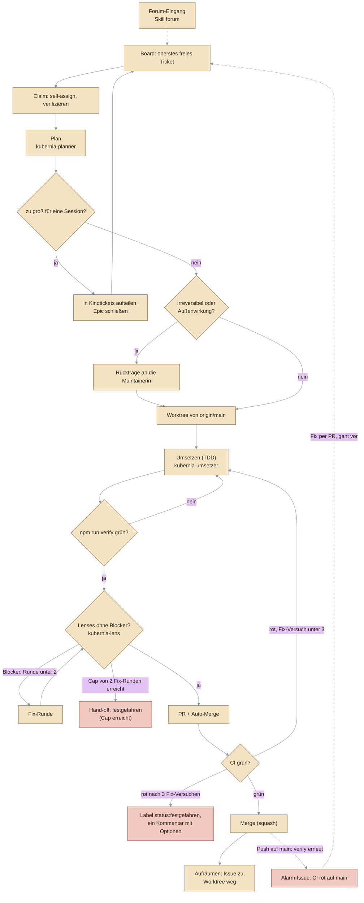

# ⚓ Kubernia – Das Hafen-Abenteuer

[](https://github.com/fluffels/kubernia/actions/workflows/ci.yml)
[](https://github.com/fluffels/kubernia/pulls?q=is%3Apr+is%3Amerged)
[](https://github.com/fluffels/kubernia/issues?q=is%3Aissue+is%3Aclosed)

> **🚧 Work in Progress** – Kubernia ist in aktiver Entwicklung. Bugs und unfertige Ecken sind möglich.
> Hast du etwas gefunden oder eine Idee? Meld dich gern in den **[GitHub Discussions](https://github.com/fluffels/kubernia/discussions)** – einfach lostippen (GitHub-Login nötig).

Ein **2D-Lernspiel** (gebaut mit **Phaser 4**) für Docker, Kubernetes, Helm, Terraform und Security-Grundlagen – von „Helm? Das setzt man doch auf den Kopf?" bis zum souveränen Umgang mit den Profi-Werkzeugen. Du läufst durch die Hafenstadt **Port Kubernia**, löst Quests und schickst echte Befehle an den Cluster.

**Die Spielwelt IST der Cluster:**

- Die drei Stege am Dock = **Nodes**, jede Kiste darauf = ein **Pod** (live!)
- Pod löschen → Kiste platscht ins Wasser, der Kran stellt sofort Ersatz hin (**Self-Healing zum Zugucken**); ein StatefulSet-Pod landet mit gleichem Namen wieder auf seinem Platz (stabile Identität)
- Helm-Releases hissen **Flaggen**, Services leuchten als **Laternen**, Docker-Container stehen als **Fässer** am Dock
- `terraform apply` baut **sichtbar neues Land** ins Meer

---

## ✨ Was dieses Projekt besonders macht

Kubernia ist mehr als ein Lernspiel – es ist ein **Vorzeigeprojekt in drei Dimensionen**. Wer hier reinschaut, findet:

1. **🤖 Vollständig von KI-Coding-Agenten gebaut – und abgesichert** – der komplette Code entsteht durch autonome Agenten. Was das sicher und billig macht, sind die Leitplanken: selbstdokumentierendes Repo, Board-Workflow mit Kollisionsschutz und ein Netz aus automatischen Gates. → [Gebaut von KI-Agenten](#-gebaut-von-ki-agenten)
2. **🏛️ Architektur & Code-Qualität als Verkaufsargument** – erzwungene Schichtung, Content-as-Data, versionierte Persistenz (Save bricht nie), `strict` TypeScript ohne `any`, taktisches DDD und Fitness-Functions als CI-Gates. → [Architektur & Qualität](#-architektur--qualität)
3. **🎮 Ein echtes Lernspiel** – Docker/K8s/Helm/Terraform hands-on, mit Story, Spaced Repetition und 10 aufeinander aufbauenden Lern-Phasen. → [Das Spiel](#-das-spiel)

Die drei Abschnitte darunter erzählen jeden dieser Punkte im Detail.

---

## 🤖 Gebaut von KI-Agenten

Der komplette Code von Kubernia entsteht durch **autonome KI-Coding-Agenten** – kein Mensch tippt die Implementierung. Das ist nur deshalb sicher und billig, weil das Repo als **Harness** um die Agenten herum gebaut ist: klare Leitplanken, an denen ein Agent nicht vorbeikommt, statt Vertrauen in einen einzelnen guten Lauf. Die Badges oben (gemergte PRs, geschlossene Issues) zeigen live, in welchem Umfang das tatsächlich passiert – keine feste Zahl hier im Text, die veralten könnte. Alle Tabellen und Diagramme in diesem Abschnitt sind **generiert** und werden bei jedem PR in der CI gegen das Repo geprüft.

### Der Ticket-Lebenszyklus

<!-- GEN:agenten-ablauf START -->
<!-- Generiert von npm run docs:gen – nicht von Hand ändern. -->



<!-- GEN:agenten-ablauf END -->

Ein Agent nimmt **genau ein** Ticket vom Board und bringt es bis zum Merge. Dabei arbeiten mehrere Rollen zusammen: der Hauptchat wählt das Ticket und klärt Rückfragen, ein **Planer** entwirft den Umsetzungsplan, ein **Umsetzer** baut, testet und mergt in einem eigenen Worktree, und drei unabhängige **Kritiker** (Lenses) prüfen den Diff, bevor er in den PR geht. Drei Rückkopplungsschleifen führen zurück zum **Umsetzen**-Schritt, nie zu einem neuen Ticket: die lokalen Gates, die Lenses (höchstens zwei Fix-Runden, danach Hand-off) und die CI (nach drei Fix-Versuchen „festgefahren“). Wer wann welchen Subagenten ruft, zeigt [Wer macht was](docs/agent-harness.md#wer-macht-was), welche Leitplanke eine Bitte und welche eine Mauer ist, [Leitplanken-Schichten](docs/agent-harness.md#leitplanken-schichten-bitte-und-mauer).

### Die Bausteine

- **📖 Selbstdokumentierendes Repo.** Ein Agent findet alles im Repo selbst, auch in einem frischen Clone. [AGENTS.md](AGENTS.md) ist die einzige Quelle der harten Regeln und wird von Claude Code nativ geladen (eine `CLAUDE.md` gibt es bewusst nicht); alles andere liegt on-demand unter [`docs/`](docs/referenz/anlaufstellen.md), damit der Kontext klein bleibt.
- **🗂️ Board, ein Ticket je Agent, Kollisionsschutz.** Der Backlog sind GitHub Issues im Project-Board, die [Auswahl](docs/ticket-reihenfolge.md) ist deterministisch. Parallele Agenten kommen sich nicht in die Quere: der Assignee markiert „in Arbeit", jeder arbeitet in einem eigenen `git worktree`.
- **🧠 Rollen-Agenten und Modell-Routing.** Planen, Umsetzen, Reviewen und Erkunden sind eigene Subagenten (vollständig im Inventar unten), jeweils mit dem Modell, das für die Phase reicht (günstig zum Suchen, stark zum Planen und Reviewen). Welches Modell wo läuft, zeigt das Inventar unten; die Begründung steht in [docs/model-routing.md](docs/model-routing.md).
- **🔍 Mehr-Perspektiven-Review statt Selbstbewertung.** Vor jedem PR prüfen frische Kritiker den Diff durch getrennte Brillen (Architektur, Anforderungen, Tests, bei reiner Doku die Doku). Eine begrenzte Fix-Schleife sorgt für Konvergenz, und ein Nachweis im Commit (`KQ-Plan:`, `KQ-Review:`) wird von der CI erzwungen: wer nicht reviewt hat, kommt nicht durch.
- **🛡️ Automatische Gates.** Die [Fitness-Functions unten](#-architektur--qualität) sichern die Autonomie ab: kein Schichtbruch, kein `any`, keine veraltete Doku, keine gebrochene Save-Migration schleicht sich unbemerkt ein, der Build wird rot.
- **🪝 Hooks.** Vor jedem Shell-Befehl läuft ein Dispatcher mit Wächtern (Worktree-Pflicht, Guards für `gh`), vor der Übergabe des Umsetzers ein Abschluss-Wächter: ein offener PR ist kein Ende. Beim Sitzungsstart gleicht ein Hook den Hauptcheckout ab, am Ende räumt der Stop-Hook verwaiste Worktrees auf. Der lokale pre-push-Hook bleibt ein Zusatznetz; maßgeblich sind die Required Checks auf dem PR.
- **🧩 Skills und Workflow.** Der immer gleiche Ticket-Ablauf ist als Skill kodifiziert, ebenso Review und Forum, dazu ein orchestrierter Workflow, der dieselben Phasen deterministisch fährt (vollständig im Inventar unten).
- **🔌 MCP, gezielt statt global.** Nur projektbezogene Server, etwa für Pixel-Art und die Browser-Prüfung; die vollständige Liste steht im Inventar.
- **🚧 Leitplanken ohne Freigabe-Schritt.** Auch Änderungen an Harness und Gates mergt der Agent selbst, sobald CI und Review grün sind. Die Kontrolle läuft über eine Audit-Spur: ein Audit-Kommentar nennt Was, Warum und den Revert-Weg ([ADR 0014](docs/adr/0014-leitplanken-ohne-label-riegel.md)).
- **📏 Messen mit Langfuse.** Ein Plugin erfasst jeden Agentenlauf, ein Messskript und ein wöchentlicher Takt ([ADR 0016](docs/adr/0016-langfuse-takt-woechentlich.md)) machen Kosten und Auffälligkeiten sichtbar.
- **♻️ Lebende Doku.** Zählbares und Aufzählungen stehen nicht von Hand im Text, sondern kommen aus Generatoren und werden vom Gate `check:docgen` geprüft ([ADR 0017](docs/adr/0017-lebende-doku-generierte-abschnitte.md)); wie man das in ein fremdes Repo überträgt, steht in [harness-transfer.md](docs/harness-transfer.md).
- **📐 ADRs statt nachträglicher Rechtfertigung.** Grundsatzentscheidungen werden als [Architecture Decision Record](docs/adr/) festgehalten, mit den verworfenen Alternativen; die Zeitleiste unten wird aus ihnen erzeugt.

Was davon aktuell im Repo konfiguriert ist (generiert aus den Konfigurationsdateien, daher immer aktuell):

<!-- GEN:harness-inventar START -->
<!-- Generiert von npm run docs:gen – nicht von Hand ändern. -->

| Art | Name | Konfiguration | Quelle |
|---|---|---|---|
| Subagent | `Explore` | model: haiku, effort: low | `.claude/agents/explore.md` |
| Subagent | `kubernia-lens` | model: opus, effort: high | `.claude/agents/kubernia-lens.md` |
| Subagent | `kubernia-planner` | model: opus, effort: xhigh | `.claude/agents/kubernia-planner.md` |
| Subagent | `kubernia-umsetzer` | model: sonnet, effort: medium | `.claude/agents/kubernia-umsetzer.md` |
| Skill | `forum` | model: Session-Modell | `.claude/skills/forum/SKILL.md` |
| Skill | `kubernia` | model: sonnet | `.claude/skills/kubernia/SKILL.md` |
| Skill | `kubernia-workflow` | model: Session-Modell | `.claude/skills/kubernia-workflow/SKILL.md` |
| Skill | `review-lenses` | model: Session-Modell | `.claude/skills/review-lenses/SKILL.md` |
| Workflow | `kubernia-ticket` | — | `.claude/workflows/kubernia-ticket.js` |
| Hook | `PreToolUse` | matcher: `Bash\|PowerShell\|SubagentHandback`, `node scripts/pretooluse-hook.mjs` | `.claude/settings.json` |
| Hook | `SessionStart` | matcher: `startup\|resume\|clear`, `node scripts/haupt-sync.mjs` | `.claude/settings.json` |
| Hook | `Stop` | `node scripts/stop-verify-hook.mjs` | `.claude/settings.json` |
| Hook | `SubagentStop` | matcher: `kubernia-umsetzer`, `node scripts/stop-verify-hook.mjs` | `.claude/settings.json` |
| Plugin | `langfuse-observability` | Marktplatz: langfuse-observability | `.claude/settings.json` |
| Git-Hook | `pre-push` | — | `.githooks/pre-push` |
| MCP-Server | `pixellab` | http, api.pixellab.ai | `.mcp.json` |
| MCP-Server | `playwright` | stdio, node scripts/playwright-mcp.mjs | `.mcp.json` |

<!-- GEN:harness-inventar END -->

### Wie das gewachsen ist

Der Harness war nicht von Tag 1 fertig geplant, sondern folgt einem wiederkehrenden Muster: Jede neue Leitplanke fängt als **Bitte** an – eine dokumentierte Konvention in `AGENTS.md`, ein lokaler Hook, der sich mit `--no-verify` umgehen lässt – und wird erst zur **Mauer**, sobald sie sich im Alltag bewährt hat: ein serverseitig erzwungenes CI-Gate, an dem kein Agent mehr vorbeikommt. Ganz am Anfang liefen Agenten entsprechend freier (Direkt-Push auf `main` war erlaubt, ein Pflicht-Worktree war noch keine Regel). Der Weg von diesem lockeren Start (**Vibe Coding**) hin zu einem Ablauf, in dem Mauern statt Bitten die Arbeit tragen (**Agentic Engineering**), lässt sich an den eigenen Commits und ADRs nachvollziehen, nicht nur behaupten. Die Zeitleiste ist generiert aus den ADRs und einer kleinen Meilenstein-Datei.

<details>
<summary>Zeitleiste aufklappen (generiert)</summary>

<!-- GEN:zeitleiste START -->
<!-- Generiert von npm run docs:gen – nicht von Hand ändern. -->

| Datum | Was passierte |
|---|---|
| 12.06.2026 | Projektstart: Agenten pushen frei auf `main` (Vibe Coding) |
| 15.06.2026 | `AGENTS.md` und Kollisionsschutz für parallele Agenten dokumentiert, aber noch eine **Bitte** |
| 16.06.2026 | [ADR 0002](/docs/adr/0002-kein-backend-keine-db.md): Kein Backend, keine Datenbank, keine Service-Aufteilung fürs Kern-Spiel |
| 16.06.2026 | [ADR 0003](/docs/adr/0003-multiplayer-coop-out-of-scope.md): Multiplayer/Co-op – aktuell außerhalb Scope |
| 16.06.2026 | Engine-Wahl als erstes ADR festgehalten (#84); das ADR wurde später aktualisiert, die ADR-0001-Zeile am 10.07.2026 zeigt dieses spätere Datum |
| 18.06.2026 | erste CI-Pipeline (#200), läuft aber erst nach dem Push |
| 19.06.2026 | [ADR 0004](/docs/adr/0004-skalierungs-fundament.md): Langfristige Skalierungs-Architektur – Fundament für ein großes Spiel |
| 21.06.2026 | [ADR 0006](/docs/adr/0006-backend-und-skalierung.md): Braucht Kubernia bei Stardew-Scope ein Backend? — Skalierungs-Review |
| 21.06.2026 | [ADR 0007](/docs/adr/0007-spielsystem-fundamente.md): Spielsystem-Fundamente für Content-Skalierung (Quest-Modell, Checks, Zeit) |
| 30.06.2026 | Worktree-Konvention vereinheitlicht (#382), weil paralleles Arbeiten längst Alltag war |
| 01.07.2026 | [ADR 0008](/docs/adr/0008-ki-agenten-harness.md): KI-Agenten-Harness als Entwicklungsmodell |
| 01.07.2026 | lokaler pre-push-Hook fährt `npm run verify` (#528), umgehbar, also eine **Bitte** |
| 01.07.2026 | Review-Skill mit mehreren Perspektiven (#532) |
| 03.07.2026 | [ADR 0005](/docs/adr/0005-auslieferungsform.md): Auslieferungsform bei Stardew-Scope — Web-App vs. Desktop-Download (bewusst offen gehalten) |
| 03.07.2026 | [ADR 0009](/docs/adr/0009-pr-gating-required-checks.md): PR-Gating mit Required-Checks auf `main` (statt Direkt-Push) |
| 09.07.2026 | erster Claude-Code-Hook: blockt Commit und Push außerhalb eines Worktrees (#735) |
| 10.07.2026 | [ADR 0001](/docs/adr/0001-engine-phaser.md): Engine-Wahl – Phaser (vs. Godot/Unity/MonoGame) |
| 10.07.2026 | Planungs-Subagent vor dem Code (#745) |
| 13.07.2026 | Langfuse-Plugin erfasst jeden Lauf (#825) |
| 21.07.2026 | Modell-Routing nach Phase (#910) |
| 23.07.2026 | [ADR 0010](/docs/adr/0010-karten-modell-tiled-vs-code-builder.md): Zwei Karten-Modelle bewusst nebeneinander (Tiled-Daten vs. Code-Builder) |
| 24.07.2026 | [ADR 0011](/docs/adr/0011-npc-system-fundament.md): NPC-System-Fundament — Datenmodell für lebendige NPCs (Zustand, Routinen, Beziehungen) |
| 04.08.2026 | Ticket-Ablauf zusätzlich als orchestrierter Workflow (#996) |
| 05.08.2026 | Mehr-Perspektiven-Review als Konvergenzschleife (#1012), noch eine **Bitte** |
| 28.09.2026 | [ADR 0012](/docs/adr/0012-harness-autonomie-audit-spur.md): Harness-Autonomie — Audit-Spur statt Merge-Freigabe, Fokus der Harness-Phase |
| 29.09.2026 | [ADR 0013](/docs/adr/0013-docs-als-agentengepflegtes-wiki.md): `docs/` als agentengepflegtes Wiki — kein zweiter Wissensspeicher, kein externes Brain |
| 29.09.2026 | `AGENTS.md` als einzige, nativ geladene Kontextdatei (#1087) |
| 06.10.2026 | [ADR 0014](/docs/adr/0014-leitplanken-ohne-label-riegel.md): Leitplanken ohne Label-Riegel — Audit-Kommentar und Verhaltensregel statt CI-Job |
| 06.10.2026 | Review- und Plan-Nachweis in der PR-CI erzwungen (#1270): aus der Bitte wird eine **Mauer** |
| 06.10.2026 | Umsetzung im eigenen Subagenten bis zum Merge (#1280) |
| 06.10.2026 | Browser-Verifikation über den Playwright-MCP (#1283) |
| 07.10.2026 | [ADR 0015](/docs/adr/0015-projekt-brain.md): Projekt-Brain — `docs/` nach Second-Brain-Prinzipien, token-sparsam und messbar |
| 07.10.2026 | [ADR 0016](/docs/adr/0016-langfuse-takt-woechentlich.md): Langfuse-Takt — wöchentlicher Workflow statt Board-Position |
| 07.10.2026 | [ADR 0017](/docs/adr/0017-lebende-doku-generierte-abschnitte.md): Lebende Doku — generierte Abschnitte, und ein Diagramm ist eine Regel |
| 07.10.2026 | [ADR 0018](/docs/adr/0018-content-chunks-je-datei.md): Content-Chunks je Datei — der Spielcode-Chunk wächst nicht mehr mit dem Inhalt |
| 07.10.2026 | [ADR 0019](/docs/adr/0019-langfuse-plugin-im-user-scope.md): Das Langfuse-Plugin bleibt auch im User-Scope aktiv |

<!-- GEN:zeitleiste END -->

</details>

**Warum das funktioniert:** Nicht ein einzelner cleverer Prompt macht autonome KI-Entwicklung sicher, sondern die **Leitplanken drumherum** – SSOT-Doku, ein enger Ticket-Fokus, Kollisionsschutz und ein Gate-Netz, das jeden Fehler an der Grenze abfängt. Genau diese Kombination ist selbst ein Architekturziel (siehe [arc42 §8](docs/arc42-architektur.md)).

> 📝 Die **kanonische Harness-Tiefendoku** — der KI-Agenten-Harness als System, „wie + warum" an einer Stelle — steht in **[docs/agent-harness.md](docs/agent-harness.md)**, konkrete Einzelfragen dazu in der **[Harness-FAQ](docs/agent-harness-faq.md)**. Beide sind die erklärende Gesamtsicht; die operative Arbeitsanweisung bleibt [AGENTS.md](AGENTS.md), die Referenz-Tabellen liegen unter [`docs/referenz/`](docs/referenz/anlaufstellen.md).

---

## 🏛️ Architektur & Qualität

Kubernia ist bewusst so gebaut, dass es **so groß wie Stardew Valley** werden könnte (100+ Quests, 50+ NPCs, viele Welten) – ohne dass die Struktur bricht. Das ist die **oberste Regel** über allen Einzelentscheidungen. Was das konkret heißt:

- **🧱 Erzwungene Schichtung.** Der Code ist streng geschichtet – **Präsentation → Anwendung → pure Domäne** (Importe zeigen nach unten; nur Einstieg/Assets und Präsentation dürfen sich gegenseitig anfassen, weil `assets-data` und `main` eine Schicht bilden) – damit die komplette Spiellogik (Cluster-Simulator, Wirtschaft, Content) **ohne Phaser** im Node-Test läuft. Diese Grenze ist nicht nur Konvention, sondern wird von **`dependency-cruiser`** erzwungen: importiert die Domäne versehentlich die Engine, schlägt der Build fehl. Dazu verbietet der Wächter **Import-Zyklen** und **toten Code**.

  <!-- GEN:schichten-soll START -->
  <!-- Generiert von npm run docs:gen – nicht von Hand ändern. -->

  ```mermaid
  ---
  config:
    theme: base
    look: classic
    layout: dagre
    themeVariables:
      lineColor: "#8b949e"
      primaryColor: "#f3e3c3"
      primaryTextColor: "#2b2118"
      primaryBorderColor: "#8a6a3f"
  ---
  flowchart TD
    s_einstieg["Einstieg/Assets<br/>main · assets-data"]
    s_praesentation["Präsentation · Phaser/DOM<br/>scenes · ui · sfx"]
    s_anwendung["Anwendung/Persistenz<br/>game · runtime · devpanel · store"]
    s_domaene["pure Domäne<br/>alles übrige unter src/"]
    x_phaser{{"Phaser"}}
    s_einstieg <--> s_praesentation
    s_einstieg --> s_anwendung
    s_einstieg --> s_domaene
    s_praesentation --> s_anwendung
    s_praesentation --> s_domaene
    s_anwendung --> s_domaene
    s_einstieg -.-> x_phaser
    s_praesentation -.-> x_phaser
    classDef engine fill:#d7e8c6,stroke:#4f7a3a,color:#1f2a17
    classDef extern fill:#e6e1d6,stroke:#6b6455,color:#2b2118,stroke-dasharray:4 3
    class s_praesentation engine
    class x_phaser extern
  ```

  <!-- GEN:schichten-soll END -->

  <details>
  <summary>Ist-Stand laut dependency-cruiser</summary>

  <!-- GEN:schichten-ist START -->
  <!-- Generiert von npm run docs:gen – nicht von Hand ändern. -->

  ```mermaid
  ---
  config:
    theme: base
    look: classic
    layout: dagre
    themeVariables:
      lineColor: "#8b949e"
      primaryColor: "#f3e3c3"
      primaryTextColor: "#2b2118"
      primaryBorderColor: "#8a6a3f"
  ---
  flowchart TD
    s_einstieg["Einstieg/Assets<br/>main · assets-data"]
    s_praesentation["Präsentation · Phaser/DOM<br/>scenes · ui · sfx"]
    s_anwendung["Anwendung/Persistenz<br/>game · runtime · devpanel · store"]
    s_domaene["pure Domäne<br/>alles übrige unter src/"]
    x_phaser{{"Phaser"}}
    s_einstieg <--> s_praesentation
    s_einstieg --> s_anwendung
    s_einstieg --> s_domaene
    s_praesentation --> s_anwendung
    s_praesentation --> s_domaene
    s_anwendung --> s_domaene
    s_einstieg -.-> x_phaser
    s_praesentation -.-> x_phaser
    classDef engine fill:#d7e8c6,stroke:#4f7a3a,color:#1f2a17
    classDef extern fill:#e6e1d6,stroke:#6b6455,color:#2b2118,stroke-dasharray:4 3
    class s_praesentation engine
    class x_phaser extern
  ```

  Alle 9 erlaubten Richtungen sind genutzt.

  <!-- GEN:schichten-ist END -->

  </details>
- **📦 Content-as-Data + Check-DSL.** Quests, Dialoge, NPCs und Quiz-Karten sind **Daten** (JSON), kein hartcodiertes TypeScript – pro Region/NPC eine Datei statt eines Monolithen. Quest-Bedingungen werden über eine deklarative **Check-DSL** ausgedrückt. So kostet neuer Inhalt keinen Code-Eingriff und der Build bleibt schnell.
- **💾 Versionierte Persistenz – der Save bricht nie.** Spielstände laufen über eine SaveStore-Schicht auf **IndexedDB** (kein 5-MB-localStorage-Limit mehr). Jede Formatänderung bekommt einen `version`-Bump + Migrationskette; Quest-Fortschritt persistiert per **sprechender ID**, nicht per Index, sodass eingeschobene oder umsortierte Quests keinen bestehenden Stand verschieben. „Was live geht, darf nie einen Spielstand kaputtmachen" ist eine harte Regel.
- **🔒 `strict` TypeScript, kein `any`.** Die ganze Codebasis (inkl. Tests und Build-Config) steht auf `"strict": true`; `@typescript-eslint/no-explicit-any` ist ein **Fehler**, der den Build blockt. Die wenigen bewusst nötigen Ausnahmen tragen eine begründete Disable-Zeile.
- **🎯 Taktisches DDD.** Fehlbare Konzepte werden **un-repräsentierbar** gemacht: Value Objects für Ressourcen-Namen (DNS-1123-Regel an einer Stelle) und für Dublonen (nicht-negativ + ganzzahlig by construction), dazu **Cluster-Invarianten** als SSOT für einen legalen Zustand, die der Simulator an der Aggregat-Grenze prüft.
- **✅ Fitness-Functions als CI-Gates.** Statt auf Review-Disziplin zu vertrauen, hält ein Netz aus automatischen Prüfungen die Architektur ehrlich – jede läuft lokal **und** als CI-Gate:

  <!-- GEN:gates START -->
  <!-- Generiert von npm run docs:gen – nicht von Hand ändern. -->

  | Gate | Kette | Was es sichert |
  |---|---|---|
  | `npm run typecheck` | `verify` | voll `strict`, ganzes Projekt |
  | `npm run lint` | `verify` | ESLint typbewusst, `--max-warnings 0`, `any` blockt, Komplexität je Funktion |
  | `npm run check:arch` | `verify` | Schichtung, keine Zyklen, kein toter Code (dependency-cruiser) |
  | `npm run check:size` | `verify` | God-File-Frühwarnung (Zeilen-Budget je Modul) |
  | `npm run check:contextsize` | `verify` | Größenbudget jeder AGENTS.md (Zeichen) |
  | `npm run check:anysuppress` | `verify` | Ratchet auf die Zahl begründeter `any`-Ausnahmen |
  | `npm run check:docmap` | `verify` | jede `src/`-Datei ist in einem Tiefendoc erwähnt, die Landkarte kann nicht leise veralten |
  | `npm run check:docdrift` | `verify` | dokumentierte `npm run`-Kommandos, interne Doku-Links und Anker, verify-Ketten-Kopien |
  | `npm run check:docgen` | `verify` | generierte Doku-Abschnitte (`GEN:`-Marker) stimmen mit dem Repo überein |
  | `npm run check:internalrefs` | `verify` | keine internen Bezüge im öffentlichen Repo |
  | `npm run check:lockfile` | `verify` | Lockfile passt zur `package.json` |
  | `npm run check:diffsize` | `verify` | Slice-Größe (Dateien und Zeilen gegen die Merge-Base) |
  | `npm test` | `verify` | Verhalten von Domäne, Sim, Wirtschaft und Harness-Wächtern, inkl. Negativ- und Grenzfälle (Vitest) |
  | `npm run test:coverage` | `verify:full` | Coverage-Floors je Schicht-Bucket |
  | `npm run check:diffcoverage` | `verify:full` | Abdeckung der im Slice geänderten Zeilen |
  | `npm run build` | `verify:full` | Host-Build (`dist/`) baut fehlerfrei |
  | `npm run build:offline` | `verify:full` | Offline-Einzeldatei (`dist-offline/index.html`) baut fehlerfrei |
  | `npm run check:bundle` | `verify:full` | Byte-Budget je Chunk-Art: Offline-HTML, Spielcode, Content-Chunks (je Datei), Phaser-Chunk |
  | `npm run test:smoke` | `verify:full` | Boot- und Interaktions-Smokes headless gegen Offline- und Host-Build (Playwright) |
  | `npm audit --omit=dev --audit-level=high` | CI | Security-Gate über die ausgelieferten Produktiv-Abhängigkeiten |
  | `node scripts/check-review-nachweis.mjs` | CI | Review-Nachweis (`KQ-Plan:`/`KQ-Review:`) im PR |

  <!-- GEN:gates END -->

**Mehr Tiefe:** die vollständige Architektur-Gesamtsicht nach **arc42** steht in [docs/arc42-architektur.md](docs/arc42-architektur.md); dazu laufen wiederkehrende, doku-unabhängige **iSAQB-Analysen** — [Runde 1](docs/architektur-analyse-2026-07-iSAQB.md) und [Runde 2](docs/architektur-analyse-2026-07-02-iSAQB.md) (je Schicht) sowie die breitere [Runde 3](docs/architektur-analyse-2026-07-03-iSAQB.md) (ADRs kritisch hinterfragt, DDD, Teststrategie, Harness-Regressions-Matrix). Die bewusst festgehaltenen Grundsatzentscheidungen liegen als **ADRs** unter [docs/adr/](docs/adr/) (Engine Phaser, kein Backend/DB, kein Multiplayer, Skalierungs-Fundament).

---

## 🎮 Das Spiel

### Spielstart

**Entwickeln:** einmalig `npm install`, dann `npm run dev` – startet den lokalen Vite-Server. Im Browser unter der angezeigten Adresse öffnen. CSS-Änderungen werden live übernommen; nach Code-Änderungen kurz mit **F5** neu laden (ein Toast erinnert daran, Spielstand bleibt erhalten).

**Offline spielen / weitergeben:** `npm run build:offline` erzeugt **eine einzige, in sich geschlossene Datei** `dist-offline/index.html` (Code, Grafiken und Engine sind eingebettet). Die kann man **doppelklicken** – läuft komplett offline, ohne Server.

**Hosten / auf einen Webserver legen:** `npm run build` erzeugt das normale Bündel nach `dist/` (Grafiken als eigene, einzeln cachebare Dateien). Das ist der Standard-Build zum Ausliefern über einen Server; lokal ansehen mit `npm run preview`.

Spielstand speichert automatisch im Browser.

| Taste | Aktion |
|---|---|
| WASD / Pfeile | Laufen |
| E | Reden / Benutzen |
| Leer / Enter | Im Dialog weiter (auch E) |
| ← / Backspace | Im Dialog eine Zeile zurück (nachlesen) |
| T | 💻 Terminal |
| J | 📜 Logbuch (Questlog) |
| B | 📖 Sammelalbum (Glossar) |
| Esc | Fenster schließen |

Im 📜 **Logbuch (J)** blätterst du durch alle Quests: abgeschlossene zum **Nachlesen** (Dialoge & Hinweise), deine aktuelle Quest, und noch **gesperrte** als Vorschau (kein Vorausspringen). Es wird freigeschaltet, sobald du deine erste Quest abgeschlossen hast. Eine abgeschlossene Quest kannst du dort auch **🔁 erneut spielen** – in einer Sandbox, die deinen echten Fortschritt nicht anrührt; über **„↩️ Zur aktuellen Quest“** landest du jederzeit wieder genau dort, wo du warst.

Im 📖 **Sammelalbum (B)** sammelst du wie in einem Sticker-Album alles, was du lernst: **jeden Befehl** (z.B. `docker pull`, `kubectl get`) und **jedes Wissens-Stück** aus den Quiz-Karten. Einträge starten **verdeckt** und werden freigeschaltet, sobald du sie im Spiel kennengelernt hast – mit Fortschrittsanzeige „X von Y gesammelt“, gruppiert nach Themen-Seiten (Docker, Kubernetes, Helm …). Auch das Album wird nach deiner ersten abgeschlossenen Quest frei.

Über deiner aktuellen Aufgabe zeigt die Statusleiste dein **📖 Kapitel** im Lernpfad – „Kapitel X von Y · Thema“ (z.B. „Kapitel 2 von 16 · Docker“). So siehst du jederzeit, wo im großen Ganzen du gerade stehst; die Kapitel entsprechen genau den Themen-Seiten des Sammelalbums.

### Lernen in kleinen Schritten

Jeder Befehl wird **einzeln** eingeführt und sofort geübt:

1. **🆕 Vormachen** – ein NPC erklärt EINEN neuen Befehl (kurz!)
2. **⌨️ Nachtippen** – du tippst ihn selbst im Terminal
3. **🏋️ Drills** – Zufalls-Varianten („anderes Image, anderer Name, andere Zahl") bis es sitzt
4. **🤔 Verständnisfrage** – ins Gespräch eingebaut, keine Quiz-Wände
5. **🦀 Krabbe Kralle** – tägliche Karteikarten (Spaced Repetition), falsch Beantwortetes kommt öfter; bei Befehls-Karten darfst du nach einem Fehler den Befehl **erneut eintippen** (Lösung gibt's auf Wunsch oder nach ein paar Versuchen)

Dazu kannst du **jederzeit bei jedem NPC üben** (ansprechen → „Üben") – gibt Dublonen!

**74 Quests:** Einstieg → Docker → Kubernetes-Grundlagen → YAML → Helm → Terraform → Security/Secrets → **Sturm-Saison: Troubleshooting** → **Git** → **CI/CD: Pipeline-Passage** → **Werft-Ausbau: eigenes Helm-Chart & Vorlagen-Logik** → **Hafenmauer: NetworkPolicy** → **Hafentor: Ingress/TLS** → **cert-manager: automatische TLS-Zertifikate — ClusterIssuer & Certificate, Auto-Erneuerung** → **DNS im Cluster: CoreDNS, Service-Discovery & ExternalName** → **Der Routing-Lotse: Ingress → Service-Selector → Pod-Label per Minispiel lotsen** → **Service-Endpoints-Debugging** → **Resource-Management: requests/limits & OOMKilled** → **Der Scheduler in Aktion: Pod-Packspiel — requests auf Node-Kapazität verteilen** → **GitOps-Archipel: GitOps-Prinzip → Argo CD Application & Sync → Self-Heal & Drift → Wunschzustand-Minispiel → App-of-Apps** → **Monitoring-Leuchtturm: Metriken scrapen — Prometheus & kubectl top; Grafana-Dashboard — Datasource & Panels lesen; Logs lesen — kubectl logs, -f, --previous; Alerts & PrometheusRule — feuern, verstehen, auflösen** → **Lagerhallen-Viertel: StatefulSet & stabile Identität, headless DNS pro Pod; PVC/PV & StorageClass — Speicher anfordern; Flüchtiger Speicher — emptyDir, Node-Disk & Eviction; initContainer — emptyDir vorbereiten & der Peak beim Befüllen; Backup & Restore — VolumeSnapshot, Datenverlust & Wiederherstellung; Object Storage & Buckets — wann S3 statt Volume; Backup ins Object Storage (S3) — off-cluster sichern, 3-2-1; Prod-DB im Cluster: ja oder nein? — Urteil & Trade-offs** → **Wachturm-Quartier: ServiceAccounts — Identität für Pods; RBAC — Role & RoleBinding, Least Privilege; RBAC — ClusterRole & auth can-i, cluster-weite Rechte; Der Schlüsselbund: RBAC-Least-Privilege per Minispiel üben; Pod-Security — SecurityContext & Pod Security Standards, gehärtete Pods** → **Expeditions-Flotte: Terraform-Module — wiederverwendbare Bausteine; Remote State — gemeinsames State-Backend & Locking; Provider & Cloud — Multi-Cloud mit mehreren Providern; Variablen & Outputs — Konfiguration sauber durchreichen; Provider für alles — Datenbank/Identity/Cluster statt nur Cloud; Eine Konfig, viele Umgebungen — dieselbe Logik je dev/qs/prod** → **Heimat-Werft: Meister-Abschluss — eigenen Dienst containerisieren, deployen & erreichbar machen** → **Cluster selbst aufbauen: der große Sturm zerstört Port Kubernia — Wiederaufbau-Bogen, narrativer Einstieg; Control-Plane hochziehen — kubeadm init, apiserver/etcd/scheduler/controller-manager; Worker-Knoten anschließen — kubeadm join, kubelet & Join-Token, Kapazität/Ausfallsicherheit; Dienste wieder ausbringen — kubectl apply, Pod für Pod aus geretteten Manifesten, Service als feste Adresse; Cluster als Code — Capstone: terraform apply provisioniert Control-Plane + Worker reproduzierbar, manuell ↔ als Code** → **Platform Engineering: das große Ganze — ein produktiver Cluster ist Basis + Plattform-Add-ons (Ingress, cert-manager, external-dns, Logging, Monitoring, Backups) als Charts/Operatoren; Plattform-Team baut die Grundausstattung für die App-Teams**.

Die **Hafenmauer** (bei Sturmwache Juno) führt **NetworkPolicies** ein: Kubernetes ist von Haus aus offen – jeder Pod erreicht jeden. Eine NetworkPolicy schaltet die per Label gewählten Pods auf **default-deny** und lässt nur erlaubte Quellen durch (`kubectl get/describe/apply/delete networkpolicy`). Genau so sichert man im Job z.B. Datenbanken ab.

Das **Adressbuch des Hafens** (bei Ada) führt **DNS im Cluster** ein: Pod-IPs wechseln ständig (Neustart, Self-Healing, Skalierung), darum redet man über **Namen**. **CoreDNS** löst jeden Service-Namen `<service>.<namespace>.svc.cluster.local` zur stabilen ClusterIP (headless: direkt die Pod-IPs) auf (`nslookup`), und ein **ExternalName**-Service verweist per CNAME auf einen Dienst außerhalb des Clusters.

Die **Pipeline-Passage** (bei Ada, direkt nach den Git-Quests) führt **CI/CD** ein: Eine `.gitlab-ci.yml` im Repo macht aus `git push` Automatik – ein Runner arbeitet die Stages **build → test → deploy** ab, und die deploy-Stage rollt den Dienst **ohne Handarbeit** in den Cluster (`glab ci status` zeigt das Ergebnis). Job-Bezug: genau die GitLab-CI-Deploy-Pipelines aus `roads-deployment`.

Die **Git-Quests** (bei Ada im Kartenhaus, „versioniere deine Seekarten") führen den Versionierungs-Alltag ein: `git init`/`status`/`add`/`commit`/`log` (ändern → vormerken → festhalten) und dann Zweige: `checkout -b`, `merge`, `push`. Echter Job-Bezug (Feature-Branch + Review-/Forward-Merge-Workflow) und Grundlage der späteren CI/CD-„Pipeline-Passage".

Die **Sturm-Saison** (bei Sturmwache Juno am Leuchtturm) lehrt das Debugging-Handwerk wie im echten Betrieb: `ImagePullBackOff` diagnostizieren und mit `kubectl set image` heilen, `CrashLoopBackOff` über die **Logs** verstehen und mit Secret + `rollout restart` beheben, `Pending`-Pods durch neue Nodes (Terraform!) einplanen. Das Mantra: **get pods → describe → logs.** Danach ziehen zufällige **Stürme mit Regen und Donner** auf, die live Deployments kaputtmachen – kaputte Dienste verdienen nichts, bis du sie reparierst!

### Spielsysteme

- **🪙 Hafen-Wirtschaft** – laufende Pods und Services verdienen passiv Dublonen (auch offline, gedeckelt). Gesunder Cluster = volle Kasse!
- **🏴‍☠️ Piraten-Überfälle** – Zufalls-Events: Piraten klauen Pod-Kisten, du stellst den Soll-Zustand unter Zeitdruck wieder her (Incident-Response!). Die Hafen-Kanone aus dem Shop erhöht das Kopfgeld.
- **🐙 Hacker-Krake** – schnüffelt nach Klartext-Daten; nur ein schnell angelegtes Secret vertreibt sie (Security!)
- **🎮 Bos Stapel-Spiel** – Docker-Image-Schichten in der richtigen Reihenfolge stapeln (lehrt Layer & Build-Cache)
- **🧩 Junos Pod-Packspiel** – Pods nach ihren requests auf Nodes mit begrenzter CPU-/Speicher-Kapazität verteilen (lehrt Scheduler & Bin-Packing; passt nichts mehr, ist „Pending" die richtige Antwort)
- **🔁 Argos Wunschzustand-Minispiel** – Soll-Zustand deklarieren statt Pods einzeln nachzählen; bei Drift entscheidest du zwischen Hand-Reparatur und Reconcile-Loop (lehrt Self-Healing & GitOps-Drift)
- **XP & Ränge** (Landratte → Moses → … → Admiral), Shop mit Haustieren 🐀🦇👻, Schiffsflaggen, Hinweis-Items, 🔥 Tages-Streak

Die volle Einordnung des Lernpfads (Phasen 1–10, „Von 0 zu Senior DevOps") steht weiter unten in **[Lernpfad](#lernpfad-von-0-zu-senior-devops-ehrliche-einordnung)**.

---

## Projektstruktur

Gebaut mit **Vite** + **TypeScript** (ES-Module) und **Phaser 4** (als npm-Paket, nicht mehr als Datei im Repo). `index.html` lädt nur `src/main.ts`; Vite bündelt den Rest. Es gibt zwei Build-Wege aus derselben Quelle: den Standard-Build (`npm run build` → `dist/`, gehostet, Assets als eigene Dateien) und den Offline-Export (`npm run build:offline` → self-contained `dist-offline/index.html` für den Doppelklick). Der Code ist in Schichten geordnet (pure Domäne → Anwendung → Präsentation), damit die Spiellogik ohne Phaser testbar bleibt.

Grobe Aufteilung:

```
kubernia/
├── index.html        Dev-Einstieg (lädt src/main.ts; braucht den Vite-Server)
├── style.css         UI (HUD, Dialoge, Terminal, Shop, Alarm, Minispiel)
├── src/              Spielcode
│   ├── sim.ts         Cluster-Simulator (docker, kubectl, helm, terraform, secrets, git)
│   ├── content.ts     Fassade über src/content/ (Quests, Drills, Quiz, NPCs, Minispiel …)
│   ├── game.ts        Spielstand, XP, Wirtschaft, Spaced Repetition
│   ├── scenes.ts      Phaser-Welt: Karte, Cluster-Sync, Piraten, Krake
│   └── …              ui, world, decor, clock, runtime, store, sfx, types, assets-data
├── test/             Test-Suite (Vitest) – Simulator, Inhalte, kompletter Story-Durchlauf u.a.
├── e2e/              Boot- & Interaktions-Smokes (Playwright, gegen Offline- und Host-Build)
├── assets/           PixelLab-Grafiken + Lizenzen
├── docs/             Konzept-, Architektur- & Harness-Doku (arc42, ADRs, Analysen, Reihenfolge)
├── dist/             Host-Build von `npm run build` (Multi-File, nicht eingecheckt)
└── dist-offline/     Offline-Build von `npm run build:offline` (eine self-contained index.html, nicht eingecheckt)
```

> **Repo-Landkarte** (welches Subsystem liegt wo, Schicht für Schicht) steht in **[docs/referenz/repo-landkarte.md](docs/referenz/repo-landkarte.md)**, die Module im Detail in den Tiefendocs unter **[`docs/module/`](docs/module/)**, die Agenten-Regeln & Konventionen in **[AGENTS.md](AGENTS.md)**. Diese Listen werden dort gepflegt – hier bewusst nicht doppelt.

Tests ausführen: `npm test` (Vitest). Typen prüfen: `npm run typecheck` (voll strict, ganzes Projekt).

**TS-Strenge:** Der schrittweise Strenge-Ratchet ist **abgeschlossen** – die Basis-`tsconfig.json` steht selbst auf `"strict": true` und deckt das **ganze Projekt** ab: alle `src`-Module (inkl. `scenes`, `ui`, `main`, `sfx`), die Tests und `vite.config`. Echte Parameter-/Feld-Typen statt `any`, durchgängige Null-Prüfung; die Cluster-Interfaces Pod/Deployment/Service … liegen in `src/sim.ts`. So können weder Null-/Typ- noch versteckte `any`-Fehler mehr einschleichen. `npm run typecheck` prüft das; `npm run typecheck:strict` ist nur noch ein Alias darauf (siehe `tsconfig.strict.json`).

## Lizenzen

**Kubernia selbst ist proprietär:** © 2026 [fluffels](https://github.com/fluffels) – **alle Rechte vorbehalten**. Den Quellcode hier ansehen und das Spiel über die bereitgestellten Kanäle spielen ist ausdrücklich erlaubt; Forken/Klonen zur eigenständigen Weiterführung sowie jede kommerzielle Nutzung sind **nicht** gestattet. Verbindlich ist die [`LICENSE`](LICENSE) im Repo-Root. Beiträge per Pull Request sind weiterhin willkommen – siehe [CONTRIBUTING.md](CONTRIBUTING.md).

Verwendete Fremd-Bausteine mit eigener Lizenz:

- **Phaser 4** – MIT-Lizenz (kostenlos, auch kommerziell): https://phaser.io
- **Grafiken** – mit **[PixelLab AI](https://pixellab.ai)** im Top-down-Pixel-Art-Look erzeugt. Asset-Liste, IDs & Workflow: [`assets/pixellab/README.md`](assets/pixellab/README.md).
- Sounds werden zur Laufzeit synthetisiert (WebAudio) – keine Audio-Dateien nötig.

## Spielstand

Wird **automatisch alle 5 Sekunden** im Browser gespeichert (IndexedDB). Im 📜 Logbuch (Taste J) gibt es zusätzlich **„Spielstand sichern“** (lädt eine JSON-Datei herunter) und **„Spielstand laden“** – für Backups oder den Umzug auf einen anderen Rechner/Browser.

**Mehrere Spielstände:** Im ⚓ Menü (Taste Esc) kannst du unter **„Spielstände“** mehrere Stände nebeneinander halten und zwischen ihnen wechseln – z.B. einen eigenen zum Weiterspielen und einen frischen zum Ausprobieren/Vorführen, oder pro Person ein Profil. Neue Stände anlegen, umbenennen und löschen geht dort ebenfalls; ein bereits vorhandener Einzel-Spielstand wird automatisch zum ersten Slot.

## Mitentwickeln (Entwickler:innen & KI-Agenten)

Voraussetzung: **Node ≥ 22** (siehe [`.nvmrc`](.nvmrc)). In **einem** Befehl startklar:

```
npm run setup   # prüft Node, installiert, lässt Tests + Typecheck + Architektur-Wächter einmal laufen
npm run dev     # Dev-Server – angezeigte Adresse im Browser öffnen
```

Voller Einstieg (Voraussetzungen, Alltags-Befehle, „wo finde ich was"): **[CONTRIBUTING.md](CONTRIBUTING.md)**.

- **Wo liegt was?** Repo-Landkarte: [docs/referenz/repo-landkarte.md](docs/referenz/repo-landkarte.md), Module im Detail: [`docs/module/`](docs/module/).
- **Wie wird hier gearbeitet** (Regeln, Board-Workflow, Konventionen): [AGENTS.md](AGENTS.md).
- **Wie KI-Agenten hier bauen** (der Harness): siehe [Gebaut von KI-Agenten](#-gebaut-von-ki-agenten) oben.
- **Architektur-Stand & Ticket-Auswahl** (Stardew-Scope): [docs/arc42-architektur.md](docs/arc42-architektur.md) + [docs/ticket-reihenfolge.md](docs/ticket-reihenfolge.md).

> Eine **containerisierte Dev-Umgebung** (devcontainer/`docker compose`) ist in Arbeit (#388) und macht den Einstieg künftig noch reproduzierbarer.

## Dev-/Test-Modus (nur für Entwickler:innen)

Für die Entwicklung gibt es ein **Dev-/Test-Panel**, mit dem man gezielt zu einem beliebigen Quest-/Story-Stand springen und Erststart vs. Zurücksetzen testen kann – statt sich jedes Mal von vorn durchzuspielen. Es ist **bewusst nicht für Spieler:innen gedacht** und doppelt abgesichert: Der Code fällt aus den ausgelieferten Builds (`build`/`build:offline`) komplett heraus und ist **nur im Dev-Server** vorhanden, und dort ist der Einstieg zusätzlich **passwortgeschützt**. Das Passwort liegt ausschließlich lokal (in einer nicht eingecheckten `.env`, Vorlage: [`.env.example`](.env.example)) und steht **nicht** im Repo – wer das Projekt klont, kann das Panel ohne eigenen Passwort-Eintrag nicht öffnen.

Zusätzlich gibt es einen **verteilbaren Spezial-Build** (`npm run build:devpanel` → eine self-contained `dist-devpanel/index.html`), der das Panel **mit** ausliefert – z.B. um einen Stand auf einem anderen Rechner zu testen, ohne dort den Dev-Server zu starten. Das Passwort wird dabei **zur Build-Zeit** aus der Umgebungsvariable `VITE_KQ_DEVPANEL_PW` injiziert; in der CI kommt sie aus einem GitHub-Actions-**Secret** (serverseitig, überlebt einen lokalen Rechner-Ausfall – der Wert steht weiterhin nirgends im Repo). Der normale `build`/`build:offline` enthält das Panel weiterhin **nicht**.

## Lernpfad: Von 0 zu Senior DevOps (ehrliche Einordnung)

Das Spiel deckt aktuell die **Phasen 1–10** ab – vom Fundament über Terraform im Großen bis zum Meister-Abschluss, bei dem du einen eigenen Dienst von Grund auf baust, deployst und erreichbar machst. Senior wird man durch Wissen **plus Betriebserfahrung**; das Spiel baut Wissen und Muskelgedächtnis auf, echte Projekte bauen die Erfahrung.

| Phase | Thema | Status |
|---|---|---|
| 1 | Container, Kubernetes-Basics, YAML, Helm, Terraform, Secrets | ✅ im Spiel (inkl. Warenkunde gängiger Images, eigenes Docker-Image bauen & eigenes Helm-Chart „Werft-Ausbau“) |
| 2 | Git & Branching-Workflows + CI/CD-Pipelines | ✅ im Spiel (Git bei Ada; CI/CD: „Pipeline-Passage“) |
| 3 | Ingress, DNS, TLS, NetworkPolicies | ✅ im Spiel: Ingress + TLS („verschlüsseltes Hafentor“ bei Ada) + NetworkPolicies („Hafenmauer“ bei Juno) + DNS/Service-Discovery & ExternalName („Adressbuch des Hafens“ bei Ada, CoreDNS & `nslookup`) |
| 4 | GitOps (Argo CD), App-of-Apps, Pull-Prinzip | ✅ im Spiel: Insel „GitOps-Archipel“ (Anleger/Warp per Steg) mit GitOps-Lotsin Argo – Quests: GitOps-Prinzip & Single Source of Truth → Argo-CD-Application anlegen & syncen (Pull) → Self-Heal & Drift → App-of-Apps |
| 5 | Observability: Prometheus, Grafana, Logs, Alerts | ✅ im Spiel: Klippe „Monitoring-Leuchtturm“ (Aufgang/Warp am Turmfuß, Dashboard-Tafel & Alarm-Glocke) mit Leuchtturmwärterin Lumi – Quests: Metriken scrapen (Prometheus & `kubectl top`, ServiceMonitor) → Grafana-Dashboard (Datasource & Panels lesen) → Logs lesen (`kubectl logs`, `-f`, `--previous`) → Alerts & PrometheusRule (feuern, verstehen, auflösen); dazu Observability-Drills & Quiz-Karten |
| 6 | RBAC, ServiceAccounts, Pod-Security | ✅ im Spiel: „Wachturm-Quartier“ (befestigter Hof mit Wachturm, Holz-Anleger/Warp an der Südost-Ecke des Hafenkais) mit Wachveteran **Vidar** – Quests: ServiceAccounts (Identität für Pods) → RBAC: Role & RoleBinding (Least Privilege) → RBAC: ClusterRole & auth can-i (cluster-weite Rechte) → Pod-Security: SecurityContext & Pod Security Standards (gehärtete Pods); dazu RBAC/Security-Drills & Quiz-Karten |
| 7 | StatefulSets, Volumes, Backups, Datenbanken im Cluster | ✅ im Spiel: Hafenkai „Lagerhallen-Viertel“ (Holz-Anleger am Westkai, Verladekräne, Frachtcontainer-Stapel) mit Speicher-Verwalter **Knut** – Quests: StatefulSet & stabile Identität → PVC/PV & StorageClass (Speicher anfordern) → Flüchtiger Speicher (emptyDir, Node-Disk & Eviction) → initContainer (emptyDir vorbereiten & der Peak beim Befüllen) → Backup & Restore (VolumeSnapshot, Datenverlust & Wiederherstellung) → Prod-DB im Cluster: ja oder nein? (Urteil & Trade-offs); dazu Storage-Drills & Quiz-Karten |
| 8 | Troubleshooting-Methodik (CrashLoop, ImagePull, Pending, Service-Endpoints, OOMKilled …) | ✅ im Spiel („Sturm-Saison“ + Service-Debugging + Resource-Management + Zufalls-Stürme) |
| 9 | Terraform-Module, Remote State, Cloud-Provider | ✅ im Spiel: „Expeditions-Flotte“ (Flaggschiff-Deck mit Anleger/Warp per Steg im Süden des Hafens, ringsum vertäute Flotten-Schiffe) mit Flottenkommandantin **Saga** – Quests: Terraform-Module (wiederverwendbare Bausteine) → Remote State (gemeinsames State-Backend & Locking) → Provider & Cloud (Multi-Cloud mit mehreren Providern) → Variablen & Outputs (Konfiguration sauber durchreichen) → Provider für alles (echte Provider: Datenbank/Identity/Cluster statt nur Cloud) → Eine Konfig, viele Umgebungen (Configs je dev/qs/prod, DRY); dazu Terraform-Drills & Quiz-Karten |
| 10 | Capstone-Meisterstück: eigenen Dienst containerisieren, deployen & erreichbar machen | ✅ im Spiel: „Heimat-Werft“ (eigener Werft-Hof mit Helling & Anleger/Warp) mit Werftmeisterin **Greta** – Meister-Abschluss in einer Quest, die die ganze Kette an einem Stück verlangt: Dockerfile lesen → `docker build` (eigenes Image) → `kubectl apply` (Deployment, hängt erst im ImagePullBackOff) → Image bauen & `rollout restart` → `Service` davor → `curl` bestätigt die 200; dazu Capstone-Drills bei Greta & Quiz-Karten |

Quests je Thema (generiert aus `src/content/data`, daher immer aktuell):

<!-- GEN:quests-je-thema START -->
<!-- Generiert von npm run docs:gen – nicht von Hand ändern. -->

| Thema | Quests | Geber |
|---|---|---|
| Einstieg | 1 | Ole |
| Docker | 8 | Bo |
| Kubernetes-Grundlagen | 4 | Ole |
| YAML & Manifeste | 2 | Ada |
| Helm | 5 | Runa |
| Terraform | 8 | Theo, Saga |
| Security & Netzwerk | 12 | Ole, Juno, Ada, Vidar |
| Troubleshooting | 6 | Juno |
| Git | 3 | Ada |
| CI/CD | 1 | Ada |
| GitOps | 5 | Argo |
| Observability | 4 | Lumi |
| Storage | 8 | Knut |
| Meister-Abschluss: Eigener Dienst | 1 | Greta |
| Cluster selbst aufbauen | 5 | Ole |
| Platform Engineering | 1 | Ole |
| **Gesamt** | **74** |  |

<!-- GEN:quests-je-thema END -->

## Roadmap (nächste Ausbaustufen)

- Weitere Lernpfad-Inseln (siehe Tabelle oben) – die nächsten Ausbaustufen jenseits der bisherigen Phasen 1–10, je Insel eigene NPCs, Quests und Drills
- Mehr Grafik: weitere CC0-Packs, z.B. Innenräume für betretbare Gebäude
</content>
