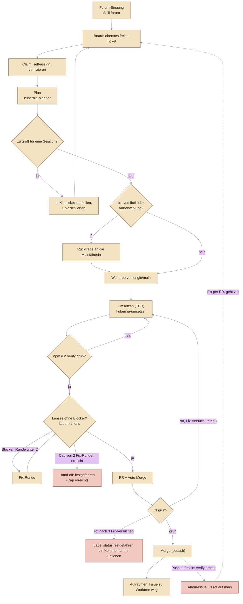
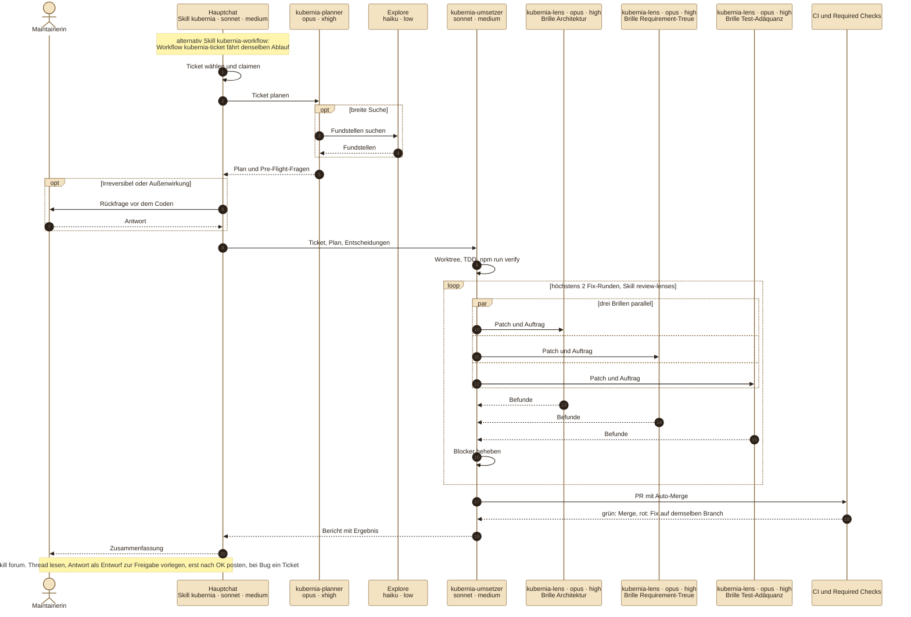
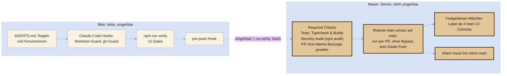

# Der KI-Agenten-Harness von Kubernia — wie + warum

> **Was ist dieses Dokument?** Die **eine** erklärende Gesamtsicht auf den „Harness": die Maschinerie, mit der autonome KI-Coding-Agenten dieses Repo **billig und sicher** weiterbauen. Der komplette Code von Kubernia entsteht durch solche Agenten — kein Mensch tippt die Implementierung.
>
> **Abgrenzung — was hier NICHT steht.** Dies ist die *erklärende* Sicht (das System als Ganzes, das „warum"), nicht die operative Arbeitsanweisung. Die **harten Regeln + den Schritt-für-Schritt-Ablauf** hat weiterhin die [AGENTS.md](../AGENTS.md) (SSOT für „wie arbeite ich"), die Nachschlage-Tabellen liegen on-demand unter [`docs/referenz/`](referenz/anlaufstellen.md) ([Befehle](referenz/befehle.md), [Repo-Landkarte](referenz/repo-landkarte.md), [Schichtregeln](referenz/schichtregeln.md), [Anlaufstellen](referenz/anlaufstellen.md), #1078). Dieses Doc **verlinkt** dorthin, statt zu doppeln — driftet etwas, gilt AGENTS.md (SSOT). Es ist die Tiefenquelle, auf die die [README › Gebaut von KI-Agenten](../README.md#-gebaut-von-ki-agenten) (Marketing-Ebene 3) und [arc42 §8](arc42-architektur.md#8-querschnittliche-konzepte--ddd-bewertung) verweisen.

## 1. Die Kernidee

**Nicht ein einzelner cleverer Prompt macht autonome KI-Entwicklung sicher, sondern die Leitplanken drumherum.** Ein LLM-Agent ist ein unzuverlässiger Ausführender: mal brillant, mal halluziniert er eine API, vergisst eine Migration oder reißt eine Schichtgrenze ein. Der Harness dreht die Verlässlichkeit nicht am Modell, sondern an der **Umgebung**: Er sorgt dafür, dass ein Agent alles Nötige **findet** (SSOT-Doku), sich auf **genau eine** Aufgabe konzentriert (Ein-Ticket-Workflow), anderen Agenten **nicht in die Quere** kommt (Kollisionsschutz) und jeden Fehler **an einer automatischen Grenze** vorgeführt bekommt (Fitness-Functions als Gates), bevor er auf `main` landet.

Das ist selbst ein **Architekturziel** (arc42-Qualitätsziel §1.4: „eine KI ändert das billig **und** sicher"), gleichrangig neben Testbarkeit, Erweiterbarkeit und Datensicherheit — und es steht unter derselben obersten Regel wie alles andere: **„Trägt das noch, wenn Kubernia so groß wie Stardew Valley wird?"** Ein Harness, der bei 10× Content/NPCs/parallelen Agenten zusammenbricht, ist keiner.

## 2. Die fünf Bausteine

Der Harness ist kein einzelnes Tool, sondern das Zusammenspiel von fünf Schichten. Jede fängt eine andere Fehlklasse ab.

### 2.1 Selbstdokumentierendes Repo (SSOT im Code)

Alles, was ein Agent braucht, liegt **im Repo selbst** — versioniert und gepusht, damit auch ein frischer Clone oder ein Cloud-Agent ohne externen Kontext arbeiten kann. Bewusst **kein** externes Notiz-/Wissenssystem als Voraussetzung.

> **Abgrenzung — was „kein externes Notiz-/Wissenssystem" NICHT heißt.** Das gilt für den Harness: kein Schritt im Ticket-Workflow und keine Agenten-Entscheidung hängt an etwas außerhalb von Repo + GitHub, sonst könnten weder ein frischer Clone noch ein Cloud-Agent ohne die Maintainerin loslegen. Die Maintainerin führt daneben **privat** ein Obsidian-Second-Brain (Lernfortschritt, Konzept-Notizen für einen möglichen Weiterbildungstag) — rein additiv für sie als Mensch, kein Teil des Harness und für keinen Agenten-Schritt Voraussetzung. Fiele der Vault weg, liefe der Harness unverändert weiter.

- **[AGENTS.md](../AGENTS.md)** — die **SSOT**: harte Regeln, Board-Workflow, Konventionen, Begründungen. **Jede harte Regel steht genau hier, nur hier** (#992).
- **[`docs/referenz/`](referenz/anlaufstellen.md)** — die Nachschlage-Tabellen, on-demand statt in jeder Session geladen (#1078): [Befehle](referenz/befehle.md), die **eine** Subsystem-[Repo-Landkarte](referenz/repo-landkarte.md), [Schichtregeln](referenz/schichtregeln.md), [Anlaufstellen](referenz/anlaufstellen.md). Es gibt keine `CLAUDE.md`: Claude Code lädt AGENTS.md nativ, solange im Root keine `CLAUDE.md`/`.claude/CLAUDE.md`/`CLAUDE.local.md` liegt – das bewacht [`test/harness/agents-md-native.test.ts`](../test/harness/agents-md-native.test.ts) (per `existsSync`, auch ungetrackte Dateien).
- **Modul-lokale `AGENTS.md`** (z.B. [`src/content/AGENTS.md`](../src/content/AGENTS.md), #483) — Regeln, die nur gelten, wenn man in *diesem* Verzeichnis arbeitet. **Kontext als Token-Grenze:** ein Agent, der an `src/content/` arbeitet, lädt die Content-Regeln; wer woanders arbeitet, schleppt sie nicht mit.
- **[`docs/module/`](module/)** — on-demand-Tiefendocs je Subsystem (sim/content/world/presentation/app). Nur lesen, wenn man am Bereich arbeitet — die [Repo-Landkarte](referenz/repo-landkarte.md) bleibt dafür schlank.
- **[README.md](../README.md)** — die spielerseitige Sicht (Story, Steuerung, Lernpfad). Nicht für Agenten, aber Teil der „Doku aktuell halten ist Teil von fertig"-Regel.

**Warum das die erste Leitplanke ist:** Ein Agent, der sich das Nötige zusammensuchen oder raten muss, produziert teure Fehl-Läufe. Die Doku ist bewusst als **Kontext-Selektor** gebaut (schlanker Always-Index + on-demand-Tiefe + modul-lokale Regeln), damit sie bei Stardew-Scope nicht zum unlesbaren Monolithen wird. Dass sie nicht leise veraltet, sichert selbst ein Gate ab (`check:docmap`, siehe §3).

### 2.2 Board-getriebener Ein-Ticket-Workflow

Der Backlog lebt als **GitHub Issues** + Project-Board — **nicht** im Code, nicht in einem externen System. Reihenfolge = manuelle Board-Position (die Maintainerin zieht wie eine Warteschlange), Bereiche als `area:`-Labels.

- **Was als Nächstes dran ist,** entscheidet eine rein deterministische Regel: das **oberste freie Item in der Board-Reihenfolge** ([Ticket-Auswahl](ticket-reihenfolge.md)) — genau die Reihenfolge der Board-Items-Liste (REST, `gh api --paginate`). Der Agent **wägt nicht ab**, sucht nicht nach Inhalt und sortiert nicht um. Das hält die Auswahl billig, reproduzierbar und Stardew-fest (nichts, was mit dem Backlog mitwächst und driftet).
- **Ein Agent nimmt genau EIN Ticket** und arbeitet es end-to-end ab: umsetzen → alle Gates grün → im Browser verifizieren → über PR nach `main` → Issue schließen → Board pflegen (keine Reihenfolge-Datei mehr, #627). Der enge Fokus ist Absicht: ein kleiner, abgeschlossener Diff ist review- und verifizierbar; ein „ich mach schnell noch fünf Sachen mit"-Lauf ist es nicht.
- **Der Agent managt das Board selbst** (nur in kubernia an ihn delegiert): Issues schließen/kommentieren/labeln und **Auffälliges festhalten** — Spiel-/Inhalts-Befunde als Issue (Zusammengehöriges gebündelt), alles zum Harness (Defekt, Härtung, Kosmetik, Wunsch) als Zeile im Sammelticket (Ausnahmen laut Regel; Regel: [AGENTS.md › Wo die TODOs leben](../AGENTS.md#wo-die-todos-leben), #1199). GitHub ist die SSOT für den Stand.
- **Zu großes Ticket (Epic/Phase) → aufteilen statt umsetzen:** in session-große Kinder zerlegen (ohne Assignee), Übersichts-Kommentar posten, Epic auf `done` schließen. Kein Code.

Operative Details (Auswahl-Befehl, Board-Reihenfolge-Pflege): [AGENTS.md › Wo die TODOs leben](../AGENTS.md#wo-die-todos-leben) + [ticket-reihenfolge.md](ticket-reihenfolge.md).

### 2.3 Kollisionsschutz für parallele Agenten

Mehrere Chats/Agenten können **gleichzeitig** laufen. Damit sich zwei nie dasselbe Ticket oder Arbeitsverzeichnis greifen:

- **Self-assign als „in Arbeit"-Marker:** beim Start sofort `gh issue edit <nr> --add-assignee @me` + mit `gh issue view` **verifizieren** (blockierend — ohne bestätigte Zuweisung kein Implementieren). Der Assignee ist der **einzige** Zustand, den ein paralleler Agent sehen kann; ein nur „im Kopf" gewähltes Ticket ist unsichtbar.
- **Eigener `git worktree` pro Ticket** (`.claude/worktrees/kq-<nr>` auf eigenem Branch `feature/kq-<nr>-<slug>`) — **nicht nur** ein eigener Branch. Zwei Agenten im selben Arbeitsverzeichnis würden sich gegenseitig die Dateien unter den Füßen wegziehen; getrennte Worktrees isolieren das vollständig.
- Am Ende (**ein PR pro Ticket**, #618): Kopf-/Doku-Pflege in denselben Branch → pushen → **PR öffnen** (`gh pr create`, Body `Closes #<nr>`) → **CI abwarten und den PR bis zum Merge bringen** (Auto-Merge + `gh pr checks --watch`; grün → mergt, rot → auf dem Branch fixen bis grün) → Worktree entfernen → Issue schließt via `Closes`, **jeder Schritt verifiziert**. PR-gegated, kein Direkt-Push auf `main`; **ein Ticket ist erst fertig, wenn sein PR gemergt ist** — kein offener/roter PR bleibt liegen.

Fallstricke (Windows-Cleanup: laufende Dev-Server killen, nicht in den Worktree `cd`en; `node_modules` nicht per Junction verlinken): [AGENTS.md › Kollisionsschutz](../AGENTS.md#wo-die-todos-leben).

### 2.4 Automatische Gates (Fitness-Functions)

Das eigentliche Sicherheitsnetz: eine Reihe von Prüfungen, die **lokal und in der CI** ([`.github/workflows/ci.yml`](../.github/workflows/ci.yml)) laufen und `main` grün halten. Ein Agent kann keinen Schichtbruch, kein `any`, kein God-File, keine veraltete Doku-Landkarte und keine gebrochene Save-Migration unbemerkt einschleusen — der Build wird rot. Jedes Gate ist einzeln in §3 erklärt.

### 2.5 Skills + Setup als reproduzierbare Abläufe

- **Skills** kodifizieren wiederkehrende Abläufe statt freihändiger Improvisation: der `kubernia`-Skill (der Ticket-Ablauf end-to-end), der `forum`-Skill (GitHub Discussions bearbeiten, mit verbindlichem Freigabe-Stopp vor dem Posten), der `review-lenses`-Skill (gestaffelter Mehr-Perspektiven-Review vor dem Merge, #532 — siehe unten). Der Skill ist ein dünner Zeiger auf die Repo-SSOT (AGENTS.md), damit er auch ohne Skill-Datei funktioniert.
- **Gestaffelter Review vor `main` (`review-lenses`-Skill, #532)** — erst die billigen deterministischen Gates (`npm run verify`), und **nur bei Grün** getrennte agentische Lens-Pässe mit strukturierten Findings: drei für Code (Architektur / Requirement-Treue / Test-Adäquanz), eine Doku-Lens für reines Markdown, ab Runde 2 nur die blockierten Brillen auf dem Delta ([Review-Staffel](model-routing.md#review-staffel-1265)). Rote Gates ⇒ **Abbruch ohne Lens-Pass** (Token-Short-Circuit: kein LLM-Aufwand auf einen Diff, der schon deterministisch scheitert). Kein Ersatz für die CI-Gates (hängt sich davor), **kein Auto-Merge** — der Review liefert nur Findings für den normalen Ticket-Abschluss.
- **Kontext-Ökonomie des Reviews: einmal beschaffen, nicht pro Lens (#1034).** Gemessen an Ticket #1021 kostete ein einzelnes Ticket **1,03 Mio Subagent-Tokens — 85 % davon im Review** (5 Lens-Pässe über 2 Runden). Die Befunde rechtfertigten den Review inhaltlich (Runde 1 fand einen echten Blocker), der teuerste Posten war aber **Beschaffung, nicht Analyse**: derselbe Diff fünfmal per `git diff` erhoben, die geänderten Dateien fünfmal vollständig gelesen, und `AGENTS.md` (~24k) + `CLAUDE.md` (~6k, Messung vor #1087) von jeder Lens erneut per `Read` geöffnet — obwohl sie ohnehin vollständig in jedem Agenten-Kontext liegen (Claude Code lädt AGENTS.md nativ). Drei Maßnahmen, ohne Befund-Verlust:
  - **Diff einmal materialisieren.** Die Phase, die den Code ohnehin in der Hand hat (Umsetzen/Nachbessern), schreibt `git diff origin/main...HEAD` in eine Patch-Datei; die Lenses bekommen den **Pfad**. Drei-Punkt gegen `origin/main`, damit der Review genau den Slice sieht, den `check:diffsize`/`check:diffcoverage` messen. Dass kein Harness-Text (Workflows, Skills, Agents, `docs/agent-harness*`, `AGENTS.md`) wieder einen Zwei-Punkt-Diff gegen lokales `main` lehrt, bewacht [`test/harness/diffbasis.test.ts`](../test/harness/diffbasis.test.ts) (#1108; historische Gegenbeispiele nur gezählt und begründet). Kein eigener Agent nur zum Schreiben — der Round-Trip würde einen Teil der Ersparnis gleich wieder auffressen.
  - **Kontext-Diät je Brille.** Explizite Anweisung, die Kontextdateien **nicht** erneut zu öffnen (punktuell greppen), nur den eigenen Regel-Ausschnitt zu nutzen, und eine geänderte Datei nur gezielt um die Hunk-Zeilen aufzuschlagen statt vollständig.
  - **Frische-Guard — der eigentliche Korrektheits-Gewinn.** Die Patch-Datei trägt die **Runden-Nummer**, und jede Lens gleicht `git rev-parse HEAD` gegen den Stand ab, bei dem der Patch entstand. Ohne das liest Runde 2 der Konvergenzschleife den Patch aus Runde 1 und attestiert Fixes, die sie nie gesehen hat — ein Review, der von außen grün aussieht und nichts geprüft hat. Bewusst **kein** Fallback auf den alten Pfad: lieber erhebt die Lens den Diff einmal selbst (und meldet das) als stillschweigend den Vor-Fix-Stand freizugeben.

  ⚠️ **Was die Diät ausdrücklich nicht trifft:** die **Sabotage-/Red-Green-Prüfung** der Test-Lens. Sie ist der teuerste Schritt und der einzige, der harte Fehler statt Stil-Anmerkungen liefert — in der Messsession fand genau sie den einzigen echten Blocker und verifizierte in Runde 2 alle Fixes. Ein Wächter, der nur Ersparnis prüft, würde ihr Wegkürzen belohnen; darum nagelt [`test/harness/review-context.test.ts`](../test/harness/review-context.test.ts) sie als Zusicherung fest, neben Materialisierung, Diät und Frische-Guard. **Komplementär zu #1028** (senkt die *Größe* von AGENTS.md) — dieses Ticket senkt, *wie oft* derselbe Kontext beschafft wird; beide greifen multiplikativ.
- **Orchestrierter Phasen-Workflow als additive Variante ([`.claude/workflows/kubernia-ticket.js`](../.claude/workflows/kubernia-ticket.js), Einstieg [`kubernia-workflow`](../.claude/skills/kubernia-workflow/SKILL.md)).** Derselbe Ticket-Ablauf, aber nicht als Prompt-Anweisung an eine Session, sondern als **Skript, das Phasen-Subagenten orchestriert**: Auswahl+Claim → Plan → Umsetzen → Review → Nachbessern → PR+Merge → Cleanup. Was das gegenüber dem Skill wirklich bringt, ist **nicht** „schöner": es sind vier Dinge, die eine Prompt-Anweisung strukturell nicht leisten kann.
  - **Deterministische Abbruchbedingungen statt Verhaltensregeln.** Die Fix-Versuchsgrenze des Festgefahren-Protokolls (#710) ist im Skript eine `while`-Schleife mit Zähler — nach drei Versuchen ist Schluss, unabhängig davon, ob ein Agent die Regel befolgt. Ebenso der Token-Short-Circuit von `review-lenses` (#532): rotes `verify` ⇒ die Lens-Pässe werden gar nicht gestartet, weil der Code sie überspringt. Das ist dieselbe Verschiebung wie „Verhaltensregel → CI-Gate" bei #904, nur eine Ebene früher.
  - **Parallelität, wo sie unabhängig ist.** Die Lenses einer Runde laufen gleichzeitig (getrennte Brillen auf denselben Diff, lesend im selben Feature-Worktree). Die einzige schreibende Brille, die Sabotage-Probe der Test-Lens, läuft in einem eigenen Lens-Worktree je Runde (`.claude/worktrees/kq-<nr>-lens-r<runde>`, `--detach` vom geprüften HEAD, danach `git worktree remove --force`; Umsetzer und Cleanup räumen übrig gebliebene `kq-<nr>-lens-*` mit auf, #1316; der Stop-/SubagentStop-Hook entfernt zusätzlich registrierte Lens-Worktrees, deren `kq-<nr>` nicht mehr existiert und die älter als 5 Minuten sind, per `git worktree remove --force` mit Nachprüfung, #1425). Nachbessern bleibt bewusst **ein** Agent und beginnt erst, wenn alle Berichte der Runde da sind — mehrere Fixer im selben Worktree würden sich überschreiben.
  - **Resume statt von vorn.** Bricht ein Lauf ab (hängende CI, geschlossenes Fenster), liefert `resumeFromRunId` alle unveränderten Phasen aus dem Cache; erst ab der ersten geänderten Stelle läuft es live. Beim Skill-Weg ist ein Abbruch mitten im Ticket ein Neuanfang.
  - **Sichtbarer Fortschritt** im Phasen-Baum (`/workflows`) statt im Chat-Verlauf.

  ⚠️ **Bewusst NICHT der Ort für den Ablauf** — und das ist der Kern, nicht eine Randnotiz. Ein Workflow-Skript liegt unter `.claude/`, das eine fremde KI **gar nicht liest**; es taugt darum nur als Optimierung *über* der SSOT, nie als deren Ersatz. Jeder Phasen-Agent bekommt nur einen **Zeiger** auf den zuständigen `AGENTS.md`-Abschnitt statt einer Zusammenfassung der Regeln — sonst gäbe es zwei Wahrheiten, und die im Skript wäre die, die still veraltet. Dieselbe Zweischichtigkeit wie bei der Modellwahl unten: **portabler Kern in `AGENTS.md`, Automatik additiv obendrauf.** Der `kubernia`-Skill bleibt der maßgebliche, tool-neutrale Weg. Der Preis: der Workflow hat kein Mid-Run-Ask-Primitiv — bei Irreversiblem oder Außenwirkung hält er an und setzt per Resume fort (Weichen und Optik entscheidet er selbst, #1279).
- **One-Command-Setup** (`npm run setup`, #387) + **Devcontainer** ([`.devcontainer/`](../.devcontainer/devcontainer.json), #388): ein Agent (oder Mensch) ist mit einem Befehl bzw. `docker compose up` startklar — Node-Check, `npm install`, einmal alle Checks. Reproduzierbare Umgebung statt „bei mir lief's".
- **Modellwahl: planen stark, umsetzen schnell (#741, #910).** Drei Tiers: **Plan + Review** → starkes Modell (Opus, hohes Reasoning), **Umsetzung** → Coding-Tier (Sonnet, per Alias statt Pin), **Explore/Recherche** → günstiges Modell (Haiku). **Wichtige Erkenntnis:** das ist **nicht** tool-übergreifend erzwingbar — welches Modell läuft, steuert immer der Harness/das Tool, keine Repo-Datei; eine fremde KI (Cursor/Codex/Gemini) liest `.claude/` gar nicht. Darum **zweischichtig** umgesetzt:
  - **Portabel (der Kern):** eine werkzeugneutrale **Prosa-Konvention** in [AGENTS.md › Konventionen](../AGENTS.md#konventionen) — von jeder KI lesbar, kein Zwang, jedes Tool setzt sie auf seine Art um. Das ist der einzige Teil, der „mit jeder KI" geht.
  - **Claude-Code-Automatik (additiv):** der Agent [`kubernia-planner`](../.claude/agents/kubernia-planner.md) (Alias und Effort: Matrix in [model-routing.md](model-routing.md)) ist die **eine** Planungs-Oberfläche (#1065); daneben gibt es [`kubernia-umsetzer`](../.claude/agents/kubernia-umsetzer.md) (Umsetzung bis zum Merge), [`kubernia-lens`](../.claude/agents/kubernia-lens.md) (Review) und den Projekt-Override [`Explore`](../.claude/agents/explore.md) (Recherche). Sie sind committet (`.gitignore` nimmt `!.claude/agents/` aus), propagieren in jeden Worktree und greifen nur unter Claude Code.
  - **Umgesetzt in #745 (Stufe 2):** der **Kern-Workflow** (`kubernia`-Skill) forkt intern den Opus-Planungs-Subagenten `kubernia-planner`, direkt nach dem Claimen und vor dem Coden, als opt-in Automatik nur unter Claude Code. Schlägt der Agent fehl, ist der Fehler explizit sichtbar; ein Fallback auf Selbstplanung ist im Skill dokumentiert.
  - **Umgesetzt in #1035 (Stufe 3, abgelöst durch Stufe 4): auch die Umsetzung ist geroutet.** Auf dem **Skill-Pfad** schrieb damals der **Hauptagent** den Code. Der Frontmatter-Override im `kubernia`-Skill griff dort nicht (Claude-Code-Bug anthropics/claude-code#98898, nur bei `/kubernia`), darum setzte `.claude/settings.json` den Projekt-Default `"model": "sonnet"` (in Stufe 4 wieder entfernt). Planung und Review laufen als eigene Opus-Subagenten ([`review-lenses`](../.claude/skills/review-lenses/SKILL.md) spawnt die Lenses statt inline; das macht aus „kein Self-Grading“ (#1012) eine Eigenschaft des Ablaufs). Bewacht von [`test/harness/model-routing.test.ts`](../test/harness/model-routing.test.ts).
  - **Umgesetzt in #1280 (Stufe 4): die Umsetzung läuft als Subagent.** Der Projekt-Default ließ sich per `/model` überstimmen (er ist entfernt, der Hauptchat folgt der Wahl der Maintainerin), und Skill-Frontmatter gilt nur für den Turn. Darum spawnt der `kubernia`-Skill nach Claim, Plan und Pre-Flight den Subagenten `kubernia-umsetzer` (`sonnet`/`medium` im Frontmatter), der bis zum Merge arbeitet und die Lenses selbst spawnt. Im Hauptagenten bleibt, was eine Rückfrage braucht; spätere Fragen meldet der Umsetzer zurück und wird per `SendMessage` fortgesetzt. Der frühere Stapel-Skill ist darin aufgegangen.
  - **SSOT (#910, #1065):** Phasen-Matrix (Modell-Alias × Effort × Aufrufstelle), Aliase statt fester IDs und die Grenzen: [docs/model-routing.md](model-routing.md).
  - **Gemessen, nicht nur konfiguriert (#1068):** die [Token-/Loop-Baseline](model-routing.md#5-token--und-loop-baseline-1068) zeigt, dass der Frontmatter-Override der Umsetzung in der Praxis **nicht** greift (Hauptagent in allen Läufen auf Opus), Subagent-Modelle dagegen schon. Nachmessen: `node scripts/token-baseline.mjs`.

## 3. Die Fitness-Functions im Detail

Jedes Gate prüft **eine** Fehlklasse. Für jedes gilt: WAS es prüft · WARUM es existiert · wie es gegen False Positives abgesichert ist. Reihenfolge wie in den Ketten `verify` und `verify:full`, danach die reinen CI-Gates (Tabelle generiert, siehe unten).

<!-- GEN:gates START -->
<!-- Generiert von npm run docs:gen – nicht von Hand ändern. -->

| Gate | Kette | Was es sichert |
|---|---|---|
| `npm run typecheck` | `verify` | voll `strict`, ganzes Projekt |
| `npm run lint` | `verify` | ESLint typbewusst, `--max-warnings 0`, `any` blockt, Komplexität je Funktion |
| `npm run check:arch` | `verify` | Schichtung, keine Zyklen, kein toter Code (dependency-cruiser) |
| `npm run check:size` | `verify` | God-File-Frühwarnung (Zeilen-Budget je Modul) |
| `npm run check:contextsize` | `verify` | Größenbudget jeder AGENTS.md (Zeichen) |
| `npm run check:anysuppress` | `verify` | Ratchet auf die Zahl begründeter `any`-Ausnahmen |
| `npm run check:docmap` | `verify` | jede `src/`-Datei ist in einem Tiefendoc erwähnt, die Landkarte kann nicht leise veralten |
| `npm run check:docdrift` | `verify` | dokumentierte `npm run`-Kommandos, interne Doku-Links und Anker, verify-Ketten-Kopien |
| `npm run check:docgen` | `verify` | generierte Doku-Abschnitte (`GEN:`-Marker) stimmen mit dem Repo überein |
| `npm run check:c4` | `verify` | LikeC4-Modell: validiert, formatiert; Schichten, Phaser, Schicht-Kanten und Top-Level-Module stimmen mit `scripts/layers.cjs` und `src/` überein |
| `npm run check:internalrefs` | `verify` | keine internen Bezüge im öffentlichen Repo |
| `npm run check:steuerbytes` | `verify` | keine Steuerbytes (NUL) in Textdateien |
| `npm run check:lockfile` | `verify` | Lockfile passt zur `package.json` |
| `npm run check:diffsize` | `verify` | Slice-Größe (Dateien und Zeilen gegen die Merge-Base) |
| `npm test` | `verify` | Verhalten von Domäne, Sim, Wirtschaft und Harness-Wächtern, inkl. Negativ- und Grenzfälle (Vitest) |
| `npm run test:coverage` | `verify:full` | Coverage-Floors je Schicht-Bucket |
| `npm run check:diffcoverage` | `verify:full` | Abdeckung der im Slice geänderten Zeilen |
| `npm run build` | `verify:full` | Host-Build (`dist/`) baut fehlerfrei |
| `npm run build:offline` | `verify:full` | Offline-Einzeldatei (`dist-offline/index.html`) baut fehlerfrei |
| `npm run check:bundle` | `verify:full` | Byte-Budget je Chunk-Art: Offline-HTML, Spielcode, Content-Chunks (je Datei), Phaser-Chunk |
| `npm run test:smoke` | `verify:full` | Boot- und Interaktions-Smokes headless gegen Offline- und Host-Build (Playwright) |
| `npm audit --omit=dev --audit-level=high` | CI | Security-Gate über die ausgelieferten Produktiv-Abhängigkeiten |
| `node scripts/check-review-nachweis.mjs` | CI | Review-Nachweis (`KQ-Plan:`/`KQ-Review:`) im PR |

<!-- GEN:gates END -->

### Tests (`npm test`, Vitest)
- **WAS:** die pure Domäne + Anwendung (Sim, Content, Wirtschaft, Progression, Spaced Repetition) über die öffentliche API; spielt die ganze Story + alle Drills durch (`quests.test.ts`), prüft die Konsistenz aller Inhalte (`content.test.ts`).
- **WARUM:** die Simulation muss **ohne die Engine** stimmen — ein falsch simuliertes `kubectl` ist ein didaktischer Fehler. Deshalb ist die Domäne bewusst Phaser-frei und im Node-Test prüfbar.
- **Red-Green:** neue/geänderte Logik entsteht **test-first** (TDD ist der Default, nicht nur bei Bugfixes): erst der rote Repro-Test, dann der Fix. Ein Test, der auch bei kaputtem Code grün bleibt, ist wertlos — die Rot-Phase beweist, dass er den Bug fängt. Es werden **auch Negativfälle** abgedeckt (kaputter Zustand, falsche Eingabe, „darf nicht passieren").
- **Harness-Trennung (#475):** Querschnitts-Umgebung (window/localStorage-Stub) liegt in [`test/support/`](../test/support/), valide Domänen-Eingaben als Factories in [`test/factories/`](../test/factories/). Tests prüfen **Verhalten, nicht Interna** — damit sie Refactorings überleben.

### Typecheck (`npm run typecheck`, `tsc --noEmit`)
- **WAS:** das ganze Projekt voll `strict` (alle `src`-Module, Tests, `vite.config`).
- **WARUM:** fängt die große Klasse von Tippfehlern/Null-/Typfehlern, bevor sie Laufzeitfehler werden. Der Ratchet ist abgeschlossen — neuer Code muss strict-tauglich bleiben.

### Lint (`npm run lint`, ESLint flat config, typbewusst, #389)
- **WAS:** was `tsc` nicht sieht — ungenutzte Variablen/Imports, leere Blöcke, `prefer-const` und v.a. **schwebende Promises** (seit der async-IndexedDB-Persistenz #350).
- **WARUM:** `--max-warnings 0`, Errors blocken. `@typescript-eslint/no-explicit-any` ist ein **Fehler**, damit kein neues `any` unbemerkt reinrutscht (das würde die Typprüfung lokal aushebeln).
- **Absicherung:** bewusstes fire-and-forget wird mit `void` markiert, bewusst ignorierte Bindings mit `_`-Präfix; die wenigen echten `any`-Ausnahmen (ThisType-Escape-Hatches, ein bewusster Struktur-Seam, Korruptions-Fixtures) tragen ein **begründetes** `eslint-disable-next-line`. Formatierung ist bewusst **nicht** Sache des Linters. **Falsche Grüns in Tests:** `vitest/no-conditional-expect` (Plugin `@vitest/eslint-plugin`, nur diese Regel, nur `test/**/*.ts`, ohne Baseline) verbietet ein `expect` im if-/catch-/?:-Zweig, das nie rot wird, wenn der Zweig nie läuft; Ersatz sind Helfer wie `test/support/erwartungen.ts` oder gefilterte Schleifen mit Nicht-leer-Prüfung. Bewacht von `test/harness/conditional-expect-gate.test.ts`. Bekannte Grenze: `assert.*` aus `node:assert` sieht die Regel nicht.

### Architektur-Wächter (`npm run check:arch`, dependency-cruiser, #347/#390)
- **WAS:** die Schichtung (pure Domäne ↔ Anwendung ↔ Präsentation) — Domäne und Anwendung importieren **nur die Domäne** (kein `phaser`, keine `scenes`/`ui`/`sfx`, kein Einstieg); die Richtungen stehen als Positivliste in `SCHICHT_MODELL` (`scripts/layers.cjs`). Zusätzlich verboten: **Import-Zyklen** und **verwaiste Module** (toter Code), Typ-Importe zählen mit.
- **WARUM:** die Schichtgrenze ist das, was die Domäne testbar hält (§2.1 Testbarkeit). Der Befund #292 (`game.ts → sfx.ts` hatte sich unbemerkt eingeschlichen) zeigte: Review-Disziplin allein hält die Grenze nicht — sie muss **erzwungen** sein.
- **Kein Grün-durch-Aufweichen:** einen Zyklus löst man auf (geteilten Zustand nach `runtime.ts`/`sim/state.ts` ziehen), toten Code löscht man, eine Ausnahme kommt nur mit offenem Split-Ticket + Begründung in die `pathNot`-Allowlist.

### Dateigröße-Wächter (`npm run check:size`, #390)
- **WAS:** jedes `src`-Modul über dem **Zeilen-Budget (800 LOC)** als God-File-Frühwarnung. Dieselbe Logik testet `test/filesize.test.ts` (also auch im `npm test`-Gate).
- **WARUM:** God-Files sind bei Stardew-Scope die schleichende Wartungsschuld. Große Familien werden hinter einer Fassade/Barrel gesplittet (öffentliche API stabil, Innenstruktur skaliert).
- **Absicherung:** eine Überschreitung ist nur mit offenem Split-Ticket in der `ALLOWLIST` erlaubt; fällt eine Datei wieder unter Budget, meldet der Wächter den Eintrag als **stale** (die Ausnahme kann nicht faul liegenbleiben).

### Doku↔Code-Drift-Wächter (`npm run check:docmap`, #482)
- **WAS:** meldet jede `src/`-Datei, die in **keinem** [`docs/module/`](module/)-Tiefendoc als Backtick-Pfad auftaucht, sowie jede deklarierte Schicht, die von der dependency-cruiser-Zuordnung abweicht (gemeinsame Schicht-Quelle [`scripts/layers.cjs`](../scripts/layers.cjs)). Auch als `test/docmap.test.ts`.
- **WARUM:** Landkarte ([`docs/referenz/repo-landkarte.md`](referenz/repo-landkarte.md), Subsystem-granular) + Tiefendocs sind der **Kontext-Selektor** jeder KI-Session (§2.1). Driftet die Abdeckung leise, führt sie Agenten in die Irre — genau das darf nicht passieren, also ist „die Doku stimmt" selbst maschinell geprüft.

### Lebende-Doku-Wächter (`npm run check:docgen`, #1355)
- **WAS:** Abschnitte zwischen `<!-- GEN:<name> START -->` und `<!-- GEN:<name> END -->` in README und `docs/` erzeugt `npm run docs:gen` aus dem Repo (welche Generatoren es gibt, steht in der Registry `GENERATORS` in `scripts/docs-gen/registry.mjs`, ihre Pfade in `scripts/docs-gen/config.json`); `check:docgen` erzeugt sie im Speicher und vergleicht. Rot bei veraltetem Abschnitt (Meldung nennt Datei, Abschnitt und den Fix `npm run docs:gen`), fehlendem END-Marker, unbekanntem oder doppeltem Abschnitt, einem Gate ohne Beschreibung oder einer Beschreibung ohne Gate. Die Zeitleiste (`zeitleiste`, aus `docs/adr/*.md` und `docs/meilensteine.json`) ist rot bei einem ADR ohne Datum im Kopf (`Datum: JJJJ-MM-TT` oder `**Status:** … (JJJJ-MM-TT)`), ungültigem Kalenderdatum, falscher Überschrift oder doppelter Nummer und bei einem fehlerhaften Meilenstein; jedes neue ADR macht den Abschnitt veraltet, bis `npm run docs:gen` läuft. Auch als `test/docgen.test.ts`. Der Kern (Engine, `adr-liste`, `zeitleiste`, `schichten-soll`, `schichten-ist`) ist projektneutral: `test/docgen-fremdrepo.test.ts` fährt ein Python-Mini-Repo ohne `src/` und `package.json` durch ihn und prüft, dass er keinen Harness-Stack importiert; der Fix-Befehl kommt aus dem optionalen Config-Schlüssel `befehl`, das Code-Verzeichnis aus `SCHICHT_MODELL.quellwurzel` ([Übertragung](harness-transfer.md)). Die drei Agenten-Diagramme (`agenten-ablauf`, `agenten-sequenz`, `leitplanken-schichten`, Vorlagen unter `docs/diagramme/*.mmd`) lösen Platzhalter `${art:wert}` gegen ihre Quelle auf (Subagent, Skill, Workflow, Modell/Effort aus dem Frontmatter, Konstanten der Ablauf-Skripte, Gate-Anzahl der `verify`-Kette, Required Checks aus dem Ruleset-Spiegel samt gleichnamigem CI-Job (`required-check`, wer einen nennt, nennt alle), Ruleset-Name und „ohne Bypass“ (`ruleset:name`, `ruleset:bypass`, rot bei Bypass-Akteuren im Spiegel)) und sind rot bei unbekanntem Namen, unbekannter Art, fehlender oder doppelter Konstante und bei einem Subagenten, Skill oder Workflow unter `.claude/`, den weder `agenten-ablauf` noch `agenten-sequenz` nennt (Vereinigung beider Vorlagen, `diagramme.vollstaendig`; `test/docgen-diagramme.test.ts`).
- **WARUM:** handgepflegte Tabellen über Ableitbares veralten still (die Gate-Tabelle hier kannte `check:internalrefs` nicht). Ein Generator macht den Code zur Quelle; Konzept und Entscheidung: [ADR 0017](adr/0017-lebende-doku-generierte-abschnitte.md).
- **Spiel-Generatoren (#1370):** `save-versionen` ist rot bei einer Migration ohne Beschreibung in `src/store/save-versionen.json` (und bei einer Beschreibung ohne Migration), `quest-graph` und `quests-je-thema` bei einer Quest, die in `quest-order.json` fehlt, einem Geber ohne Standplatz oder einem unbekannten `requires`/Thema; ein Content-Ticket läuft danach `npm run docs:gen`.
- **Absicherung:** Engine und Generatoren laufen gegen ein Fixture-Root (Red-Green je Fehlerfall), dazu ein Echt-Repo-Test; Vergleich unabhängig von CRLF/LF, feste Sortierung ohne Locale. Engine und Config liegen unter `scripts/docs-gen*` und sind Leitplanken-Pfade.

### Architekturmodell-Wächter (`npm run check:c4`, #1420)
- **WAS:** das LikeC4-Modell unter [`docs/architektur/`](architektur/spiel.c4) (Element-Arten in `spezifikation.c4`, Views Kontext, Container, Schichten, Hauptmodule in `spiel.c4`) ist rot, wenn `likec4 validate` oder `likec4 format --check` scheitern (Fix: `npm run c4:format`) oder der Abgleich in `scripts/check-c4.mjs` etwas findet. Gebunden wird über **Art + Titel**: `schicht` und `bibliothek` gegen die Labels von `SCHICHT_MODELL` in `scripts/layers.cjs`, Beziehungen zwischen ihnen gegen `sollKanten` (rot in beide Richtungen: verbotene und fehlende), `modul` gegen die Top-Level-Einträge von `src/` (Ordner plus `.ts` ohne gleichnamigen Ordner, ohne `.d.ts`) unter der Schicht, die `schichtVon` liefert. Eine Beziehung mit Modul-Ende ist rot (nicht ableitbar), eine Art ohne Bindung und ohne Eintrag in `erzaehlung` ebenso (fail-closed), ein doppelter Titel in einer gebundenen Art ebenso, eine View über `architektur.maxKnotenJeView` Knoten (nur senken) ebenso. Pfade und Bindungen stehen im Block `architektur` von `scripts/docs-gen/config.json`. Jede Meldung nennt Datei:Zeile, Element und Fix. Ansehen: `npm run c4:serve`.
- **WARUM:** das Modell ist eine zweite Ableitung derselben SSOTs wie die generierten Schichtdiagramme ([ADR 0020](adr/0020-architekturmodell-likec4.md)). Ein handgeschriebenes Modell ohne Abgleich würde still driften; ein neuer Top-Level-Ordner in `src/` macht `check:c4` rot, bis das Modul im Modell steht.
- **Absicherung:** `test/check-c4.test.ts` (Fixture-Root, Red-Green je Regel; der Adapter `ladeC4Modell`, der einzige Zugriff auf die LikeC4-Model-API, läuft gegen einen gültigen und einen kaputten Fixture-Workspace). `likec4` ist exakt gepinnt (`1.59.4`), weil sich der Formatter zwischen Minor-Versionen ändern kann; ein Bump macht `check:c4` ggf. rot, Fix `npm run c4:format`. Skript und Config sind Leitplanken-Pfade.

### Harness-Drift-Wächter (`npm run check:docdrift`, #529)
- **WAS:** hält die Doku jenseits der Datei-Landkarte ehrlich: (1) jedes in einem Markdown erwähnte `npm run <x>` (bzw. `npm test`) existiert als Skript in `package.json`; (2) jedes Kern-Skript (außer bewusst ausgenommener Convenience) ist in AGENTS.md/README/`docs/referenz/befehle.md` dokumentiert; (3) jeder interne, repo-relative Markdown-Link zeigt auf eine existierende Datei; (4) jeder `#anker` trifft eine reale Überschrift (GitHub-Slug-Regel). Gescannt wird jedes Markdown im Repo, unter `.claude/` (#1091) genau die versionierten Ordner `skills`/`agents`/`workflows` (Allowlist `VERSIONED_CLAUDE_DIRS`, gegen `.gitignore` abgeglichen; Worktrees und Lokales bleiben draußen). Auch als `test/docdrift.test.ts`.
- **WARUM:** AGENTS.md (in **jeder** KI-Session geladen), README und die on-demand-Referenzen unter `docs/referenz/` nennen Kommandos + verweisen quer auf andere Harness-Docs. Ein totes Kommando oder ein toter Link/Anker schickt einen Agenten ins Leere — der Datei-Landkarten-Wächter (#482) deckt genau diese Fehlklasse **nicht** ab.
- **Absicherung:** Code-Fences werden ausgeblendet (ein `#`-Kommentar in einem bash-Block ist keine Überschrift, ein Beispiel-Link keiner); Ausnahmen (undokumentierte Convenience-Skripte) stehen begründet in `DOC_EXEMPT_SCRIPTS`. Red-Green über `test/docdrift.test.ts` (totes Kommando, toter Link, toter Anker werden jeweils erkannt; die Slug-Regel trifft Emoji-/Umlaut-Überschriften).

### Doku-Aktualitäts-Wächter (`npm run check:doctickets`, #610)
- **WAS:** liest die zwischen den Markern `open-harness-tickets:start/end` in §5 als **„offen"** gelistete Roadmap-Tabelle und gleicht jede Nummer gegen den echten `gh issue`-Status ab — ist eine als offen dokumentierte Nummer auf GitHub bereits **CLOSED**, ist die Roadmap stale. Zusätzlich gleicht er das Ticket jeder `ALLOWLIST`-Ausnahme von `check:size` und `check:contextsize` ab (CLOSED oder ohne `#N` ist rot; die `DECKEL` sind Ratchet-Historie und zählen nicht). Die reine Logik (`parseOpenHarnessTickets`, `ausnahmeTickets`) testet `test/doctickets.test.ts` offline (Red-Green); dort steht auch der blockierende Teil „jede Ausnahme nennt ein `#N`“.
- **WARUM:** `check:docdrift` prüft nur *Kommandos/Links/Anker*, nicht die **inhaltliche Aktualität**. Genau das ließ die „#492 (RNG-Determinismus) ist offen"-Zeile stehen, obwohl das Gate längst existierte (Befund iSAQB-Runde 3). Dieser Wächter fängt diese Fehlklasse.
- **Absicherung / bewusste Sonderstellung:** der gh-Abgleich braucht Netz + Auth und ist nicht deterministisch — er ist darum **NICHT** in der hermetischen `verify`-Kette / der Vitest-Suite, sondern läuft als **eigener, bewusst non-blocking (alarmierender) CI-Job** und lokal beim Pflege-Schritt. Fehlt `gh`/Token (offline, frischer Clone), wird **übersprungen** (exit 0, klare Meldung), nicht fälschlich grün gemeldet; **rot** nur bei einer sicher als CLOSED erkannten Nummer. Non-blocking ist Absicht: ein von einem *parallelen* Agenten geschlossenes Roadmap-Ticket soll keinen fremden PR rot blockieren (das ⚠️-Anti-Pattern aus #395), sondern nur alarmieren.

### Boot-/Interaktions-Smokes (`npm run smoke`, Playwright, #391/#480)
- **WAS:** lädt den **gebauten Offline-Build** (`dist-offline/index.html` per `file://`, genau der Doppelklick-Pfad) headless in Chromium; ein eigener Host-Boot-Smoke (`e2e/host-boot-smoke.spec.ts`, #1408) startet den **Host-Build** (`dist/`) über Vites `preview` und prüft zusätzlich, dass die Content-Chunks unter `assets/content/` mit 200 ausgeliefert werden (beide Builds müssen vorliegen, `npm run smoke` baut sie). Boot-Smoke: fährt fehlerfrei hoch (Boot-Flag, Canvas da, keine Konsolen-/Laufzeitfehler). Interaktions-Smokes: `help` ins Terminal → Ausgabe, Overlay auf/zu, Onboarding-Quest annehmen + abschließen — über Tastatur/DOM ohne Test-Hintertür.
- **WARUM:** die Vitest-Unit-Tests fassen die Präsentation (Phaser/DOM) bewusst **nicht** an. Ein Fehler, der erst beim echten Boot auftritt (Phaser-Init, ein werfender Content-Loader, ein kaputtes Asset-Manifest) oder eine Interaktions-Regression (Terminal nimmt keine Eingabe) käme sonst durch.
- **Absicherung:** bewusst **schlank** (kein NPC-Nähe-Overlay, keine Weltbewegung), um flake-frei zu bleiben; Red-Green über sabotierte Tastenkopplung nachgewiesen. Getrennt von Vitest (`test/**` vs. `e2e/**`), damit sich die Test-Welten nicht überschneiden.

### Security-Audit (`npm audit`, #396)
- **WAS:** zweistufig — **blockierend** nur über die ausgelieferten Produktiv-Deps (`npm audit --omit=dev --audit-level=high`), **nur berichtend** über den vollen Baum inkl. Dev.
- **WARUM:** das echte Nutzerrisiko steckt im `dist`-Artefakt (nur `phaser` & Co., kein vite/vitest). Ein hartes high+-Gate über den **ganzen** Baum wäre durch dev-only-Advisories dauerhaft rot — und würde dann abgeschaltet (die ⚠️-Falle aus #395). Die selbstwartende Regel „blocke, was ausgeliefert wird; berichte den Rest" verrottet nicht bei Stardew-Scope, anders als ein hartcodierter Advisory-Allowlist.
- **Ergänzend:** Dependabot ([`.github/dependabot.yml`](../.github/dependabot.yml)) öffnet wöchentlich gebündelte Update-PRs und zieht Security-Advisories automatisch hoch; Umgang damit als Policy in [CONTRIBUTING.md](../CONTRIBUTING.md#pull-requests--abhängigkeits-updates-policy).

> **Nicht auf der Liste, aber Teil des Netzes:** die **Save-nie-brechen-Regel** (jede Format-Änderung migriert, alter Stand vorher in den Backup-Slot, `sanitizeState` härtet kaputte Felder ab) und der **Determinismus-Anspruch** (seedbare Zufälligkeit statt `Math.random` in der Domäne) gehören zum selben Netz. Der Determinismus ist seit **#492** als ESLint-Gate (`no-restricted-properties` gegen `Math.random`) + `test/rng.test.ts` für `src/sim/**`+`src/content/**` **erzwungen**; die Ausweitung auf die übrige als „pur/deterministisch" deklarierte Logik (`game/**`, z.B. `spaced-repetition.ts`) ist mit #591 nachgezogen.

## 3a. Langfassung der harten Regeln (ausgelagert aus AGENTS.md, #1064)

> Wörtlich aus [AGENTS.md](../AGENTS.md) ausgelagert (#1064): dort steht jetzt nur die knappe Regel, hier die Langbegründung + Historie. **Bei Konflikt gilt AGENTS.md.**

### Gates, Guards und Durchsetzung

- **Leitplanken-Pfade und Goodhart-Schutz: Verhaltensregel + Audit-Spur, kein CI-Riegel ([ADR 0014](adr/0014-leitplanken-ohne-label-riegel.md)).** Die maßgebliche Liste der Leitplanken-Pfade (Gate-Config wie `.dependency-cruiser.cjs`, `scripts/layers.cjs`, `scripts/check-*.mjs` samt deren lokalen Importen (`harness-approval.test.ts` prüft die Importketten), `eslint.config.js`, Baselines, `vite.config.ts`, CI-Workflows, `CODEOWNERS`, Agenten-Anweisungen, `test/harness/`, `.mcp.json`) steht genau einmal in [`.github/protected-paths.json`](../.github/protected-paths.json) (#1157). Der Workflow-Auftrag `beruehrtHarness` gleicht den Diff per **Substring/Präfix** gegen sie ab (führenden `/` weg, ab `*` abgeschnitten, bewusst über-approximierend: `/vite.config.ts` trifft auch `tools/vite.config.ts`); trifft er, folgt nach dem Merge der Audit-Kommentar. `.github/CODEOWNERS` führt dieselben Pfade noch einmal (GitHub kann keine Datei einbinden), ist nur noch informativ und wird von [`test/harness/harness-approval.test.ts`](../test/harness/harness-approval.test.ts) gegen die Quelle gegengeprüft. `AGENTS.md` steht in Quelle und CODEOWNERS **ohne** führenden `/`: so deckt der Eintrag jede modul-lokale AGENTS.md mit ab (#1088/#1168). Es gibt keinen CI-Job und kein Label für Gate-Änderungen; die Verhaltensregel bleibt: ein Agent, der an einem Gate hängt, schwächt es **nie selbst** ab (AGENTS.md › Kein Grün-durch-Aufweichen). Der Wächter hält außerdem fest, dass die abgelöste Label-Mechanik nirgends außerhalb der ADRs zurückkehrt.
  - **Required-Check-Shadowing (#1172) — in-repo nicht schließbar, nur verteuerbar.** Das Ruleset gleicht die Required-Checks (Stand #1303: „Tests, Typecheck & Builds", „Security-Audit (npm audit)", „PR-Text interne Bezuege pruefen") nur über den Namen ab; ein PR kann also eine **neue** Workflow-Datei mit gleichnamigem Job danebenlegen (GitHub wertet bei gleichem Namen + SHA den zuletzt fertigen Run). Verworfen: eine API-Selbstprüfung eines Checks (sein Rot würde vom Fake-Run genauso überschrieben) und ein Commit-Status mit eigenem Kontext (braucht `statuses: write`, und ein Fake-Workflow kann denselben Kontext ebenso posten). Echtes Pinning über „Require workflows to pass" ist nach Wissensstand nur auf Organisations-Ebene verfügbar, für dieses User-Repo also keine Option. Stattdessen macht [`test/harness/required-check-shadowing.test.ts`](../test/harness/required-check-shadowing.test.ts) jeden **wörtlich notierten** `name:`, der mit einem der drei Required-Kontexte beginnt (inkl. der an ` #` abgeschnittenen Varianten, #984), bei mehr als einer Quelle rot. **Wirkung nur lokal:** in `npm run verify` überschreibt kein Run-Timing das Rot; in CI läuft der Wächter im Job „Tests, Typecheck & Builds", der per demselben Trick ebenfalls überschreibbar ist. Grenzen des Regex-Parsers: zur Laufzeit erzeugte Namen (`${{ … }}`, Matrix), Block-Scalars, über Folgezeilen gefaltete Werte, YAML-Escapes und Flow-Style erkennt er nicht. Die Kontext-Liste steht in der geschützten Spiegeldatei [`.github/ruleset-main-schutz.json`](../.github/ruleset-main-schutz.json) (Required-Check-Kontexte und Bypass-Akteure des Rulesets `main-schutz`, von Hand gepflegt und beim Ruleset-Handgriff mitgezogen; Abgleich mit der Wirklichkeit per `gh api repos/{owner}/{repo}/rulesets/20151454`, die CI prüft das nicht, weil die API `bypass_actors` nur mit Schreibrecht liefert): der Wächter und das Leitplanken-Diagramm lesen daraus, eine Quelle, zwei Ableitungen.
- **Zwei-Stufen-Prüfung (#1120) — iterieren gezielt, abschließen einmal voll.** Anlass: eine Auswertung von 9 Ticket-Sessions vom 29.09. fand `npm run verify` 47-mal (3–8-mal je Ticket, 80–170 s je Lauf), oft nach einem einzelnen Lint-Fix, und jede Ausgabe blieb als Cache-Read im Kontext. Mechanik: [`scripts/verify-lauf.mjs`](../scripts/verify-lauf.mjs) löst die Kette aus `package.json › scripts.verify` auf (`kettenSchritte`, dieselbe Auflösung wie docgen und docdrift; ein neues Gate läuft darum in beiden Modi automatisch mit, `scripts.verify` selbst bleibt unverändert, weil CI und `check:docdrift` es als SSOT lesen). `npm run verify:kompakt` fährt jeden Schritt einzeln, **alle** auch nach einem Rot (ein Fix behebt so alle Funde auf einmal; die CI behält die `&&`-Kette), und gibt bei Grün eine Zeile aus, bei Rot nur die Blöcke der roten Schritte (über 100 Zeilen die ersten 80 und die letzten 20). `npm run verify:changed` engt nur `lint` (nur geänderte lintbare Dateien) und `test` (`vitest related` plus jede Testdatei, die den Dateinamen einer geänderten Datei enthält, das deckt auch fs-lesende Tests und Markdown) auf den Slice ein (Basis wie `check:diffsize`); alles andere läuft voll. Fail-closed auf vollen Lint und Test: keine Basis, über 150 Dateien, oder eine geänderte `package.json`, `package-lock.json`, `eslint.config.js`, `eslint-suppressions.json`, `vite.config.ts` bzw. `tsconfig*.json`. Grenze: Tests, die ganze Ordner lesen, findet `verify:changed` nicht, und typbewusste Lint-Regeln können in ungeänderten Dateien rot werden, wenn sich ein exportierter Typ ändert (`typecheck` läuft voll, deckt diese Lint-Regeln aber nicht ab); es ist kein Gate; das volle verify vor dem Review und die Required-Checks sind das Netz. Vitest wählt unter Agenten selbst den knappen Reporter (`minimal`, über `CLAUDECODE`), darum keine Reporter-Konfiguration. Gezählt wird mit `Prüfläufe:` in `scripts/token-baseline.mjs` (Ziel: etwa 2 volle Läufe je Ticket, die Nachmessung macht #1267).
- **Human-in-the-Loop-Checkpoints (#1012) — die Entscheidung gaten, nicht den ganzen Lauf.** Weichen (🎨 Optik, ⚠️ riskante Weiche, offene Plan-Weiche) **entscheidet der Agent selbst** (#1279): der Planer wägt in Abschnitt 7 ab und entscheidet, der Umsetzer dokumentiert jede Entscheidung im PR-Text („Entscheidung: X, weil Y“; nicht zusätzlich im Issue, `Closes` verknüpft beides, ein Issue-Kommentar nur, wenn die Entscheidung ohne PR gebraucht wird), Optik wird an `docs/stardew-referenz.md` und deren Checkliste gemessen (Screenshots im PR), die Maintainerin widerspricht per Revert. Ein Pflicht-Stopp bleibt: die **Pre-Flight-Klärung** bei **Irreversiblem oder Außenwirkung** (Kriterien: [AGENTS.md › Human-in-the-Loop-Checkpoints](../AGENTS.md#git-pr-und-merge)) — dann **erst mit der Maintainerin klären, bevor eine Zeile Code fällt**. **Leitplanken-Diffs sind kein Stopp-Grund und brauchen kein Label (#1069, ADR 0014, möglichst wenig Human-in-the-Loop):** fasst der Diff Pfade der Liste in `.github/protected-paths.json` an (jede `AGENTS.md`, `.claude/`, `.agents/`, `docs/agent-harness*`, Gate-Config), **mergt der Agent wie jeden anderen PR** — Voraussetzung: CI grün + Mehr-Perspektiven-Review bestanden, und die Goodhart-Verhaltensregel gilt weiter (nie ein Gate abschwächen, nur um grün zu werden). **Statt einer Freigabe gilt eine Audit-Spur:** direkt nach dem Merge postet der Agent auf dem PR einen Kommentar „🛡️ Leitplanken-Änderung selbst gemergt" mit *was* sich an den Leitplanken ändert, *warum*, und *wie reverten* (`git revert <squash-sha>` per PR) — die Maintainerin liest asynchron gegen. Abgesichert über [`test/harness/harness-approval.test.ts`](../test/harness/harness-approval.test.ts) (Quelle ↔ CODEOWNERS, Wächter-Ordner); die Claude-Code-Automatik (Workflow **hält nur bei der Vorab-Klärung zu Irreversiblem/Außenwirkung an und legt die Fragen vor**, Fortsetzen per Resume — kein Mid-Run-Prompt) ist additiv (Details: §4 unten).
- **Festgefahren-Protokoll (#710/#904): begrenzte Fix-Versuche statt Endlosschleife.** Scheitert derselbe Check nach dem dritten Fix-Versuch auf demselben Branch weiterhin (push → rot → fixen → push, dreimal ohne dass der ursprüngliche Fehler behoben wird), bricht der Agent die Fix-Schleife ab statt unbegrenzt weiterzumachen. Er postet **einen** konsolidierten Kommentar auf dem PR (was versucht wurde, der aktuelle Fehler, 2-3 konkrete Entscheidungsoptionen für die Maintainerin), setzt das Label `status:festgefahren` und bleibt **assigned** (kein anderer Agent greift das Ticket, solange die Entscheidung offen ist). **Technisch erzwungen:** [`.github/workflows/festgefahren.yml`](../.github/workflows/festgefahren.yml) zählt via `workflow_run` distinct Commits mit failed CI auf dem PR-Branch — nach 4 (= 1 initial + 3 Fix-Versuche) setzt der Workflow selbst das Label und postet den Kommentar, unabhängig davon, ob der Agent die Verhaltensregel befolgt.
- **Review- und Plan-Nachweis (#1270) — pfadunabhängig prüfbar statt nur im Workflow erzwungen.** Review-Pflicht, Cap und Planer standen nur im Workflow im Code; im Skill-Pfad waren sie Verhaltensregeln (beobachtet in #1206: ein PR ohne Review-Runde, eine unklare Zählung der Obergrenze, der Planer in 4 von 5 Läufen ausgelassen). Jetzt verlangt der letzte Schritt des Required-Jobs `build-test` ([`scripts/check-review-nachweis.mjs`](../scripts/check-review-nachweis.mjs), auf jedem PR außer Dependabot, auch auf Hand-PRs der Maintainerin, die dann ein `KQ-Review-Override` brauchen) zwei Zeilen am Zeilenanfang einer Commit-Message im Slice, gesetzt in einem leeren Nachweis-Commit direkt nach der Review-Konvergenz (Muster `KQ-Diffsize-Override`: Commit-Zeilen sind unveränderlich, landen per Squash auf `main`, brauchen kein Token):
  ```
  KQ-Plan: kubernia-planner            | KQ-Plan: ohne — <Begründung>
  KQ-Review: head=<sha> runden=<1..3> lenses=architektur,requirement-treue,test-adaequanz blocker=architektur:<n>,requirement-treue:<n>,test-adaequanz:<n> verdikt=ok   (reiner Markdown-Diff: lenses=doku blocker=doku:<n>)
  ```
  Die Brillen stehen so, wie das Skript sie erwartet; es liest tolerant (#1331): Wert bis zum nächsten ` key=`, Kleinschreibung, Leerzeichen nach Kommas, Umlaute als ae/oe/ue. Eine fehlende Brille nennt die Fehlermeldung mit dem erwarteten Wert, ein unbekannter Name ist rot. **Korrektur:** ein Fehler im Nachweis-Commit wird durch einen **weiteren** leeren Nachweis-Commit behoben, die letzte `KQ-Review:`-Zeile zählt (kein Umschreiben nötig).
  `blocker` (#1123, optional) ist die Zahl der `[❌ blockierend]`-Findings je Brille im **ersten** Lens-Pass (Runde 1), auch 0; es speist die Lens-Trefferquote in [`scripts/lauf-ergebnis.mjs`](../scripts/lauf-ergebnis.mjs). Das Gate prüft Form und Konsistenz: nur bekannte Brillen, ganze Zahlen ≥ 0, keine Doppelten; bei `runden=1` Summe 0 und dieselben Brillen wie `lenses`. Alte Zeilen ohne das Feld bleiben gültig (das Skript meldet nur einen Hinweis).
  `head` ist der zuletzt reviewte Stand und muss im Slice liegen (ein Rebase oder Amend nach dem Review macht ihn ungültig, gewollt). **Ein Merge von `main` in den Branch ist kein Fix-Pass:** konfliktfrei zählt er nicht als Runde (das Delta der nächsten Runde sind die Fixes vor und nach dem Merge-Commit `M`), mit Konflikt kommt die Auflösung (`git show --cc M`) ins Delta und zählt wie ein Fix, nicht wie ein voller Pass; so überschreitet ein Merge die 3 Pässe nicht. **Ein Merge von `main` NACH dem Nachweis-Commit** lässt `head` hinter dem Branch-Ende zurück. Konfliktfrei bleibt der Check grün (der Merge bringt nur bereits gemergten, geprüften Stand). Hat der Merge eine Konflikt-Auflösung (`git show --remerge-diff <M>` ist nicht leer, git ≥ 2.36), **wird der Check rot** (ein git-Fehler dabei ebenso): die Auflösung per Delta-Lens reviewen, den Nachweis neu setzen (`head` ≥ Merge) und im PR-Text nennen, dass der Merge nach dem Review kam. Für den neuen Nachweis gilt `head` ≥ Merge-Commit; `runden` bleibt höchstens `MAX_REVIEW_PAESSE` (3), ein Konflikt-Merge ist kein Grund für eine vierte Runde; besteht die Auflösung nur aus `*.md`-Dateien, genügt als Delta-Lens die Doku-Brille. `runden` zählt Pässe: **Cap 2 = höchstens 2 Fix-Runden = höchstens 3 Pässe**, gleiche Zahl wie `MAX_REVIEW_RUNDEN` im Workflow. `lenses` müssen die Pflicht-Brillen der Diff-Art enthalten (nur `*.md` → `doku`, sonst `architektur,requirement-treue,test-adaequanz`; der volle Code-Satz genügt immer). Ohne Planer nur mit ausdrücklicher Begründung. Der Workflow schreibt dieselben Zeilen aus Code-Werten (`nachweisZeilen`); [`test/harness/review-nachweis.test.ts`](../test/harness/review-nachweis.test.ts) koppelt Format, Cap und Lens-Satz an das Prüfskript. Druckventil, z.B. für Revert-PRs: Commit-Zeile `KQ-Review-Override: #<nr> <warum>` (Pflicht-Begründung). Bewusst kein npm-Skript und nicht in `verify`: `verify` läuft vor dem Review, der Nachweis entsteht danach; lokal `node scripts/check-review-nachweis.mjs` (bei Rot gibt es die Vorlage aus). **Ehrliche Grenze:** der Nachweis ist Selbstauskunft, geprüft werden Konsistenz und Existenz, nicht Wahrheit. Aus einer stillen Auslassung wird eine bewusste Falschangabe; die unabhängige Prüfung wäre ein CI-Reviewer (#1117). Commits nach dem Review (CI-Fixes) meldet das Skript nur.
- **Parallele PRs und Konflikte (#1428).** (1) `origin/main` wird vor Runde 1 der Lens-Schleife einmal eingemergt (Stufe 0); danach nur bei einem echten Konflikt (`gh pr view <nr> --json mergeable`), denn das Ruleset verlangt keinen aktuellen Stand, und jeder Merge nach dem Nachweis-Commit kostet eine Delta-Lens und einen neuen Nachweis. (2) **Semantischer Konflikt (#1449):** ein Gate, das ein Pflichtfeld oder eine strengere Regel einführt, findet auf einem parallel gemergten PR neue Verstöße, die git (kein Textkonflikt) und die CI des PR (alter Stand) nicht sehen. Regel: verschärft der Diff ein Gate oder Schema, `origin/main` direkt vor dem Auto-Merge einmergen und das betroffene Gate erneut fahren. Bewusst keine Repo-Einstellung: „Require branches to be up to date“ würde parallele Auto-Merges blockieren, eine Merge Queue gibt es nur für Organisations-Repos. (3) Neue npm-Skripte nicht direkt neben die `verify`-Zeile in `package.json` setzen: jede Gate-Ergänzung ändert diese Zeile, ein Nachbar macht aus zwei parallelen PRs einen Textkonflikt.
- **Durchsetzung ist serverseitig, der pre-push-Hook nur sekundär.** Die **Required-Checks auf dem PR** sind der maßgebliche, **nicht umgehbare** Gate. `check:diffsize` (#533) misst auf PRs den **echten** Slice, weil der CI-Checkout `fetch-depth: 0` holt und `KQ_DIFF_BASE` auf den Kopf der PR-Basis (HEAD^1 des Merge-Checkouts) setzt — es degradiert also nicht still zu Grün. **Vor dem PR** fährst du trotzdem `npm run verify` (schnelle Gates, ohne Builds/Boot-Smoke) einmal lokal, damit die PR-CI nicht rot anläuft. Der **versionierte** pre-push-Hook [`.githooks/pre-push`](../.githooks/pre-push) (nativ über `core.hooksPath`, verdrahtet von `npm run setup`) bleibt als **harmloses Zusatznetz** bestehen (er greift nur bei Push auf `main`, was server-seitig ohnehin blockiert ist).
- **Zweite Grenze: Post-hoc-Alarm auf `main`.** Das PR-Gate (#592) ist der maßgebliche Riegel, aber ein roter `main` **trotz** grüner PR-Checks bleibt denkbar (semantischer Merge zweier je grüner PRs, ein fehlkonfigurierter Required Check, ein Admin-/Force-Push). Darum fährt die CI auf `push:main` die volle `verify`-Kette weiter — und misst `check:diffsize` dort **gegen den Vorgänger-Commit** (`KQ_DIFF_BASE=github.event.before`), statt zu Grün zu degradieren. Ist dieser Lauf rot, öffnet der Job **`alarm-red-main`** automatisch ein **dedupliziertes Alarm-Issue** — mit existierendem Label (`area:architektur`) angelegt und per GraphQL an die **oberste Board-Position** geschoben, dedupliziert über den `🚨`-Titel-Präfix. So bleibt der Alarm die Board-SSOT statt eines leicht übersehbaren roten ✗ — er **blockiert nichts** (main ist schon gepusht), er alarmiert nur. Findest du so ein „🚨 CI rot auf main"-Issue: **zuerst** behandeln (Ursache im verlinkten Lauf, Fix per PR mergen, Issue schließen), bevor du darauf aufbaust.
- **Lint muss grün bleiben.** ESLint (flat config `eslint.config.js`, typbewusst über `typescript-eslint`) ist ein automatisches Netz neben dem Typecheck: es fängt, was `tsc` nicht sieht (ungenutzte Variablen/Imports, **schwebende Promises** seit der async-IndexedDB-Persistenz #350, leere Blöcke, `prefer-const` …). `npm run lint` (`eslint . --max-warnings 0`) läuft lokal und als CI-Gate **nach dem Typecheck**. **Errors blocken** (Bestand ist auf 0 Errors gebracht) – bewusstes fire-and-forget mit `void` markieren, bewusst ignorierte Catch-/Param-Bindings mit `_`-Präfix. `@typescript-eslint/no-explicit-any` ist ein **Fehler** (blockt) – `--max-warnings 0` lässt keine Warnung durch, damit kein neues `any` unbemerkt reinrutscht. Die wenigen bewusst nötigen `any` (die ThisType-Escape-Hatches `GameSelf`/`UISelf`, der absichtlich lose `WorldSceneLike`-Struktur-Seam in `scenes/worldscene/types.ts`, die Roh-JSON-Korruptions-Fixtures der Tiled-Negativtests) tragen ein **begründetes `// eslint-disable-next-line @typescript-eslint/no-explicit-any`** – das ist der dokumentierte Weg für eine echte Ausnahme. **Die TS-Regel-Basis ist `recommendedTypeChecked`** – der ohnehin schon aktive typbewusste Modus (`projectService`) wird auch für no-unsafe-*/no-misused-promises/restrict-template-expressions genutzt. Der Alt-Bestand ist per ESLints nativer Bulk-Suppression in `eslint-suppressions.json` eingefroren (dieselbe Datei/Mechanik wie der #502-Komplexitäts-Ratchet, per Rule-Familie getrennt geprüft in `test/harness/complexity-gate.test.ts`) und wird über eigene Burn-down-Tickets abgebaut. Formatierung ist bewusst NICHT Sache des Linters (Prettier wäre ein eigenes, optionales Thema).
- **Schichtung wird automatisch bewacht.** Die Schichtungsregeln (siehe [AGENTS.md › Architektur](../AGENTS.md#architektur): pure Domäne ↔ Anwendung ↔ Präsentation, Phaser-Grenze) werden von `dependency-cruiser` erzwungen, nicht nur per Review-Disziplin gehalten: `npm run check:arch` (`.dependency-cruiser.cjs`) schlägt fehl, wenn z.B. die Domäne/Anwendung `phaser` oder `scenes`/`ui`/`sfx` importiert. Läuft in der CI als Gate (nach dem Typecheck) und muss grün bleiben – verschiebst du Module zwischen Schichten, den Check lokal laufen lassen.
- **Zyklen, verwaiste Module & Dateigröße werden automatisch bewacht.** `check:arch` verbietet zusätzlich **Import-Zyklen** (`keine-zyklen`) und **verwaiste Module** (`keine-verwaisten-module`, toter Code) – Typ-Importe zählen dabei mit (`tsPreCompilationDeps`). Separat meldet `npm run check:size` (`scripts/check-size.mjs`) jedes `src`-Modul über dem **Zeilen-Budget (800 LOC)** als God-File-Frühwarnung – dieselbe Logik testet `test/filesize.test.ts` (also auch im `npm test`-Gate). Beide laufen in der CI. **Kein Grün-durch-Aufweichen:** einen Zyklus auflösen (geteilten Zustand nach `runtime.ts`/`sim/state.ts` ziehen, wie bei #390 für `ExecResult` gemacht), toten Code löschen, ein zu großes Modul aufteilen – eine Ausnahme nur mit offenem Split-Ticket in die `ALLOWLIST` (`scripts/check-size.mjs`) bzw. `pathNot` (`.dependency-cruiser.cjs`), mit Begründung. Fällt eine allowlistete Datei wieder unter Budget, meldet der Wächter den Eintrag als stale.
- **Jede AGENTS.md hat ein eigenes Größen-Gate.** Anders als `src`-Module hatte die Datei, die laut eigener Aussage JEDE Agenten-Session vollständig lädt, kein Wachstums-Gate – jede neue Regel bekommt hier Begründung + Präzedenzfall-Verweis (wie diese Zeile selbst), was sich unbegrenzt akkumulieren kann und pro Session mitläuft (reiner Token-Kostentreiber). `npm run check:contextsize` (`scripts/check-context-size.mjs`) meldet **rot**, sobald AGENTS.md ihr **Zeichen**-Budget überschreitet (Zeichen statt Zeilen, #1064 — in Markdown ist eine Zeile ein Absatz, das Zeilen-Budget sah Wachstum in die Breite nicht; kalibriert am Bestand + Kopffreiheit, die Token-Zahl gibt die CLI nur als Info aus) – dieselbe Logik testet `test/context-size.test.ts`. **Jede `AGENTS.md` zählt (#1088):** modul-lokale Dateien lädt das Tool automatisch, sobald dort gelesen wird, darum misst der Wächter sie mit (Walk aus `check:docdrift`, gleiche Skip-Liste inkl. `.claude/worktrees`). Ohne eigenen Eintrag gilt `MODULE_AGENTS_BUDGET` (Default statt Pflicht-Registrierung, damit nicht jeder Content-PR Gate-Config anfasst); ein Summen-Gate gibt es bewusst nicht (es bestrafte genau das Auslagern), die Summe steht nur als INFO. **Kein Grün-durch-Aufweichen (gleiche Ratchet-Philosophie wie `check:size`):** Inhalt auslagern – bereichsspezifische Tiefe in eine modul-lokale `AGENTS.md` (Vorbild `src/content/AGENTS.md`, #483) bzw. ein [`docs/module/`](module/)-Tiefendoc (#394) – oder, mit offenem Auslagerungs-Ticket, bewusst in die `ALLOWLIST` in `scripts/check-context-size.mjs` aufnehmen. Bei Harness-Befunden gilt das ungeclaimte Sammelticket samt Zeile als offenes Ticket (die Regel „Harness-Befunde sind Zeilen“ erlaubt dafür kein eigenes); das Sammelticket wird komplett umgesetzt, sein PR löst die Einträge auf, die auf es verweisen. Fällt eine allowlistete Datei wieder unter Budget, meldet der Wächter den Eintrag als stale.
- **Komplexität je Funktion wird bewacht.** Der Dateigröße-Deckel oben misst nur physische Zeilen **je Datei** – er sieht die eigentliche God-Function nicht (eine 300-Zeilen-verschachtelte Funktion in einer sonst normalgroßen Datei) und provoziert eher Zeilen-Zusammenziehen als kohäsiven Schnitt. Drei ESLint-Regeln ergänzen genau die fehlenden Dimensionen, **nur auf `src/**`** (Produktionscode; Test-Callbacks sind legitim lang): **`complexity`** (≤ 15, Verzweigungslast je Funktion), **`max-lines-per-function`** (≤ 120, der per-Funktion-Deckel neben dem per-Datei-Deckel) und **`max-depth`** (≤ 4, Verschachtelungstiefe). Sie laufen im normalen `npm run lint`-Gate. **Einführung ohne Big-Bang-Refactor per Ratchet:** der Bestand ist als committete ESLint-**Bulk-Suppressions-Baseline** [`eslint-suppressions.json`](../eslint-suppressions.json) festgehalten (dieselbe Ratchet-Idee wie die `ALLOWLIST` in `check-size.mjs` bzw. der Coverage-Ratchet #495). Jede **neue oder verschlechterte** Verletzung bricht sofort (die Baseline zählt pro Datei/Regel); wird eine God-Function aufgeteilt, meldet ESLint den **stale** Suppressions-Eintrag (`npm run lint` rot) bis er per **`npm run lint:prune`** entfernt ist – dieselbe „stale-Eintrag wird gemeldet"-Disziplin wie beim Dateigröße-Wächter. **Kein Grün-durch-Aufweichen:** Schwelle nicht hochdrehen und die Baseline nicht neu über den Bestand ziehen, um echten Zuwachs zu verstecken; der Abbau läuft über **Burn-down-Tickets** (je God-Function ein session-großer Slice, siehe Diff-Size-Gate #533). Ein bewusster Neu-Aufbau der Baseline (nur wenn wirklich nötig) geht über **`npm run lint:suppress`**. Die Regel-Konfig selbst bewacht `test/harness/complexity-gate.test.ts` (Schwellen fest, nur `src/**`, Baseline enthält ausschließlich diese drei Regeln – kein Umgehen über Suppression fremder Regeln).
- **Die Zahl der `no-explicit-any`-Ausnahmen wird bewacht.** `@typescript-eslint/no-explicit-any` blockt als Fehler, ist aber pro Zeile per `// eslint-disable-next-line @typescript-eslint/no-explicit-any` (oder gar einem bare `/* eslint-disable */`) trivial aushebelbar – ohne Deckel wüchse die Zahl dieser Disables unbemerkt (Vorbild: Komplexitäts-Gate #502). Genau darüber kann ein Agent unbemerkt `any` einschleusen (der Vektor, den die iSAQB-Analysen bei den `[key:string]:any`-Seams beklagten). `npm run check:anysuppress` (`scripts/check-any-suppressions.mjs`) hält jetzt eine **per-Datei-Baseline** [`any-suppressions.json`](../any-suppressions.json) (Muster wie `eslint-suppressions.json` #502): es scannt `src/**` und zählt je Datei die Disables, die `no-explicit-any` stummschalten (alle Formen inkl. bare-disable als schärfster Gaming-Vektor). **Kein Grün-durch-Aufweichen (gleiche Ratchet-Philosophie wie #502/`check:size`):** mehr Disables als in der Baseline (oder eine neue Datei) bricht **rot** – den echten Typ herstellen, ODER, wenn die `any`-Brücke bewusst nötig ist (begründeter Kommentar am Disable, wie die dokumentierten `GameSelf`/`UISelf`-Escape-Hatches), die Baseline mit `node scripts/check-any-suppressions.mjs --write` **bewusst anheben und im Commit begründen**; wird eine Brücke aufgelöst, meldet der Wächter den **stale** Eintrag (rot), bis die Baseline nachgezogen ist. Läuft im `npm run verify`-Gate (nach `check:size`); die Zähl-/Vergleichslogik testet `test/any-suppressions.test.ts` (nur `src/**`, Red-Green gegen einen erfundenen Zuwachs).
- **Die Größe EINER Änderung wird bewacht.** `check:size` bewacht die Größe je _Datei_; `npm run check:diffsize` (`scripts/check-diffsize.mjs`) bewacht die Größe je _Slice_: es misst den Diff gegen `main` als Drei-Punkt `basis...HEAD` (Merge-Base). In der PR-CI ist die Basis der erste Elternteil des Merge-Checkouts (`HEAD^1`, der aktuelle Kopf von `main`), nicht `pull_request.base.sha`: Die liegt hinter `main`, sobald `main` nach dem Öffnen weiterging, und der Diff zählte dann die Änderungen inzwischen gemergter PRs mit (#1240: 832 statt 758 Zeilen). Der Check wird **rot** über **20 geänderten Dateien oder 800 geänderten Zeilen** (Schwellen via `KQ_DIFFSIZE_MAX_FILES`/`KQ_DIFFSIZE_MAX_LINES`; Metrik added+deleted). Zweck: ein Epic, das eigentlich in session-große Kinder gehört (siehe [AGENTS.md › Zu großes Ticket](../AGENTS.md#wo-die-todos-leben)), soll nicht als ein unreviewbarer Riesen-Commit durchrutschen — es erzwingt dieselbe Slice-Disziplin auf Commit-Ebene. **Generierte Lockfiles zählen NICHT zum Slice (#612):** `package-lock.json` & Co. werden maschinell aus `package.json` erzeugt und Zeile-für-Zeile nicht reviewt — sie mitzuzählen würde jede Dependency-Ergänzung (jscpd/#612 zog ~1100 Lockfile-Zeilen) das Budget sprengen lassen und Override-Inflation erzwingen (dasselbe #395-Antipattern). Der reviewbare Code-Slice einer Dep-Ergänzung bleibt klein und wird weiter gemessen. **Ebenso zählen Zeilen zwischen den Markern eines `GEN:`-Abschnitts nicht:** sie entstehen maschinell und `check:docgen` prüft sie gegen das Repo, ein Generator-Ticket braucht dafür keinen Override. Gemessen wird zeilengenau (`git diff -U0`, Marker-Maske der alten und der neuen Fassung) und nur in den Dateien, die `check:docgen` liest (`markdown` in `scripts/docs-gen/config.json`); die Marker-Zeilen selbst, GEN-Blöcke in anderen Dateien, Umbenennungen und jeder git-Fehler zählen vollständig (fail-closed), eine Datei nur aus GEN-Zeilen fällt aus der Dateizahl. Lokal und in der PR-CI misst der Check bei gleichem Commit dieselbe Menge (CI-Merge-Checkout und lokaler Drei-Punkt-Diff haben dieselbe Merge-Base); nach jeder Fix-Runde erneut messen, weil Fix-Commits neue Dateien hinzufügen. **Durchsetzungspunkt ist der Required-Check auf dem PR** (CI mit voller Historie und PR-Basis); lokal läuft der Check in `npm run verify` vor dem PR mit, dort ist die Basis ebenfalls auflösbar und der Slice wird gemessen. In flachen CI-Checkouts (keine Historie) bzw. wenn nichts gegenüber `main` steht, degradiert der Check bewusst zu **grün** (No-op) statt `main` rot zu machen. **Kein Grün-durch-Aufweichen:** einen zu breiten Slice aufteilen — ODER, wenn die Breite bewusst ist, mit **Pflicht-Begründung** durchlassen: eine Zeile `KQ-Diffsize-Override: #<nr> warum breit` am Zeilenanfang einer Commit-Message im Slice, am besten als eigener leerer Commit (`git commit --allow-empty -m "chore: Slice bewusst breit (#<nr>)" -m "KQ-Diffsize-Override: #<nr> warum"`). Der Wächter liest `git log <basis>..HEAD` mit derselben Basis wie den Diff, darum wirkt die Zeile lokal, im PR (der Merge-Checkout enthält die PR-Commits) und im Nachlauf auf `main` gleich. Der Nachlauf hängt an der Repo-Einstellung `squash_merge_commit_message = COMMIT_MESSAGES` (der Squash-Commit trägt die Branch-Messages); wird sie umgestellt, fehlt die Zeile auf `main` und der Alarm-Job schlägt an. Eine Zeile ohne `#<nr>` oder ohne Begründung zählt nicht und wird gemeldet; eine Umgebungsvariable wird nicht ausgewertet, weil sie die PR-CI nie erreicht. Ein Override bei einem Diff **im** Budget wird als stale gemeldet (rot): dann den Override-Commit wieder aus dem Branch nehmen. Das gilt auch für eine **fremde** stale Zeile im eigenen Slice (z.B. nach einem Merge von `main` oder einem Cherry-Pick bei veraltetem `origin/main`): den eigenen Feature-Branch dafür umzuschreiben ist ausdrücklich erlaubt, solange der Nachweis-Commit noch nicht gesetzt ist (danach kein Rebase/Amend mehr). Dasselbe Urteil gilt für `KQ-Diffcov-Override` auch dann, wenn der Slice gar keinen Spielcode ändert (nichts zu messen, also nichts durchzulassen); bei `check:diffsize` ohne Vergleichsbasis gibt es kein Stale-Urteil. Parser, Slice-Lesen (`git log --reverse`: die **neueste** gültige Zeile zählt, in jedem Kontext) und die Ausgabe-Texte teilen sich `scripts/slice-override.mjs`. Steht die Zeile als Commit-**Betreff**, erscheint sie im Squash-Commit auf `main` als `* KQ-…:`; der Parser akzeptiert genau dieses Präfix (Stern plus ein Leerzeichen, #1383), die Body-Form bleibt empfohlen. Darum den Override-Commit erst ganz am Ende anlegen, und in anderen Commit-Messages die Zeile nie an den Zeilenanfang schreiben (auch nicht als `* `-Aufzählung). Dieselbe Logik testet `test/diffsize.test.ts`.
- **Die Größe der AUSGELIEFERTEN Bundles wird bewacht.** Neben dem Zeilen-Budget je Modul (`check:size`) und dem Diff-Budget je Slice (`check:diffsize`) gibt es ein **Byte-Budget** für das, was der Nutzer wirklich lädt: `npm run check:bundle` (`scripts/check-bundle.mjs`) misst **`dist-offline/index.html`** (die self-contained Offline-Datei — inlined via `vite-plugin-singlefile` ALLE Assets als base64, wächst bei jedem neuen PixelLab-Asset unbemerkt; gemessen wird sie abzüglich der Summe der Content-Chunks, die dort inline stecken; dafür müssen `dist/` und `dist-offline/` vom selben Content-Stand sein, darum tragen beide `index.html` den Hash der Content-Quellen als Meta-Tag `kq-content-stempel` (Plugin in `vite.config.ts`) und das Gate wird bei verschiedenen oder fehlenden Stempeln rot), den **Spielcode in `dist/`** (alle JS-Chunks direkt in `dist/assets/` OHNE den langlebigen Phaser-`vendor`-Chunk #199 und OHNE die Content-Chunks — das Budget bleibt so auf UNSEREM Code), die **Content-Chunks** in `dist/assets/content/` (#1408, [ADR 0018](adr/0018-content-chunks-je-datei.md): je Datei unter `src/content/data/` und je Karte ein Chunk; die erwartete Menge leitet `scripts/content-chunks.cjs` aus den Quellen ab, ein fehlender oder unerwarteter Chunk, ein Chunk über dem Deckel je Datei und eine Summe über dem Stufe-2-Auslöser sind rot; Deckel und Auslöser werden nicht angehoben, sondern die Datei gesplittet bzw. Lazy-Load je Region gebaut) und den **Phaser-`vendor`-Chunk** selbst als eigenes hartes Byte-Gate (#595; ein Phaser-Bump fiele sonst nur indirekt übers Offline-HTML-Budget auf) und wird **rot**, sobald ein Artefakt sein Byte-Budget überschreitet. Zweck: `vite.config.ts` setzt nur `chunkSizeWarningLimit` (eine Log-**Warnung**, kein Fail) — dieser Wächter macht daraus ein echtes Gate. **Läuft bewusst NUR, wo die Builds vorliegen:** als CI-Schritt **nach** den Builds und in `npm run verify:full` (nach `build`+`build:offline`), **nicht** in der schnellen build-freien `npm run verify`-Kette. Fehlt ein Artefakt, wird der Wächter **rot** (mit „erst bauen"-Hinweis) statt still grün — ein Gate, das nichts gemessen hat, darf nicht grün melden. **Kein Grün-durch-Aufweichen (gleiche Philosophie wie `check:size`):** ein zu kleines Budget wird nicht stillschweigend erhöht — die Konstante in `BUNDLE_BUDGETS` wird per reviewtem Commit mit Ein-Zeilen-Begründung angehoben (Ratchet nach oben, wenn eine bewusste Ergänzung das Bundle legitim wachsen lässt), nie von der Maschine. Dieselbe Logik testet `test/bundle.test.ts` (mit injizierter IO, ohne echten Build).
- **Testabdeckung wird gemessen & PRO SCHICHT gegatet.** Nicht nur „Tests grün", sondern *wie viel* Code sie berühren: `npm run test:coverage` (v8-Provider) fährt die Suite instrumentiert und bricht ab, wenn eine Schicht unter ihren Coverage-Floor fällt. **Bewusst pro Schicht-Bucket statt Repo-Mittel:** ein einziger Durchschnitt (~62 %) versteckt eine Domänen-Regression hinter der gut getesteten Masse. Die Schwellen liegen in [`vite.config.ts`](../vite.config.ts) (`COVERAGE_THRESHOLDS`), die Schicht-Globs kommen aus der EINEN Schicht-SSOT [`scripts/layers.cjs`](../scripts/layers.cjs) (`COVERAGE_GLOBS`, dieselben Grenzen wie `check:arch`): **Domäne hart** (global, ~89-94 %), **Anwendung** solide (~76-80 %), **Präsentation/Einstieg** bewusst niedrig, aber **explizit** (Phaser/DOM ist unit-untestbar → nur der e2e-Smoke berührt sie, siehe #391/#480; der Floor verhindert nur ein stilles Absacken auf 0). **Kein Grün-durch-Aufweichen:** die Floors werden per Commit **angehoben** (Ratchet), nie von der Maschine gesenkt (`autoUpdate` ist aus). Läuft als eigener CI-Schritt (nicht in der schnellen `verify`-Kette, weil die Instrumentierung ~6 s kostet) und ist Teil von `npm run verify:full`. Die Config selbst bewacht `test/harness/coverage-config.test.ts` (bindet die Glob-Form an die RegExp-Wahrheit von `layerOf`, prüft die Bucket-Rangfolge). iSAQB: Fitness-Function für **Verhalten**, nicht nur Struktur. **Ergänzend die DIFF-Coverage (#1021):** das Aggregat oben misst ganze Schichten — neuer, komplett ungetesteter Code verschwindet im Nenner der bereits gut getesteten Schicht und reißt keinen Floor. `npm run check:diffcoverage` (`scripts/check-diffcoverage.mjs`) dreht den Nenner um und misst **nur die im Slice geänderten Zeilen** (`coverage/lcov.info` geschnitten mit dem Diff gegen die PR-Basis; die Basis-**Auflösung** teilt es sich mit `check:diffsize` — dessen `resolveBase` es importiert statt kopiert —, misst sie aber als Drei-Punkt-Diff `basis...HEAD`, damit nur der eigene Slice und nicht zwischenzeitliches `main` im Nenner landet). Floors pro Schicht: **Domäne 90 %, Anwendung 80 %** hart, **Präsentation/Einstieg nur berichtend** (Phaser/DOM ist unit-untestbar; ein globaler Floor wäre bei jedem Szenen-PR rot und würde abgeschaltet — #395-Antipattern). Läuft in der CI **nach** `test:coverage` und in `verify:full`, **nicht** in der schnellen build-freien `verify`-Kette. **Degradation bewusst asymmetrisch:** keine Basis / kein geänderter Spielcode → grün (No-op, ein Doku-PR scheitert nicht an fehlendem Report); **fehlender Report bei geändertem `src` → rot** („erst `npm run test:coverage`"), weil ein Gate, das nichts gemessen hat, nicht grün melden darf (Präzedenz `check:bundle`). **Kein Grün-durch-Aufweichen:** Floors werden per Commit angehoben, nie gesenkt — das Druckventil ist eine Commit-Zeile `KQ-Diffcov-Override: #<nr> warum` im Slice, mit Pflicht-Begründung inkl. stale-Meldung (gleiche Mechanik wie beim `check:diffsize`-Override oben). **Zweig-Sicht (#1425, nur berichtend):** das Gate zählt Zeilen; ein Weiterwurf auf derselben Zeile wie das `catch` bliebe unsichtbar. Darum listet der Lauf zusätzlich „Teilweise getestet“: geänderte, ausgeführte Zeilen mit mindestens einem ungenommenen Zweig (`BRDA:`-Records des lcov). Kein Gate, weil v8 auch implizite Zweige meldet und keine Kalibrierung vorliegt. Dieselbe Logik testet `test/diffcoverage.test.ts` (injizierte IO, ohne git/Coverage-Lauf).
- **Abhängigkeiten bleiben aktuell & sicher.** Zwei automatische Netze: **Dependabot** (`.github/dependabot.yml`) öffnet wöchentlich gebündelte Update-PRs (Dev-Toolchain nach Familien gruppiert – `eslint`/`vite-vitest`/`github-actions` inkl. ihrer Majors als je ein koordinierter PR, sonstige Majors wie phaser einzeln; #422) für npm + GitHub-Actions und zieht Security-Advisories automatisch als PR hoch. Dazu ein **`npm audit`-CI-Gate** (`ci.yml`, Job `security-audit`), bewusst **zweistufig**: **blockierend** nur über die ausgelieferten **Produktiv-Deps** (`npm audit --omit=dev --audit-level=high`) – das ist das echte Nutzerrisiko, im `dist`-Artefakt steckt nur `phaser` & Co., kein vite/vitest –, und ein **nur berichtender** voller `npm audit` (inkl. Dev), der Dev-Advisories sichtbar macht, aber den Build nicht rot hält. So fällt das Gate nicht der ⚠️-Falle „ein dev-only-Advisory hält den Build dauerhaft rot → wird abgeschaltet" zum Opfer (Hintergrund #395); statt eines hartcodierten Advisory-Allowlist, der bei Stardew-Scope verrottet, gilt die selbstwartende Regel „blocke, was ausgeliefert wird; berichte den Rest". **Umgang mit den eingehenden PRs (#422):** wie Dependabot-PRs behandelt werden (grün → annehmen, rot/Major → nie blind, gekoppelte Pakete als ein PR über das Dependabot-**Grouping**) und dass Fremd-PRs immer reviewt werden, steht als Policy in [CONTRIBUTING.md › Pull Requests & Abhängigkeits-Updates](../CONTRIBUTING.md#pull-requests--abhängigkeits-updates-policy) – dort auch, warum GitHub-natives Auto-Merge vorerst zurückgestellt ist (bräuchte Required Checks auf `main`, was den Direkt-Push-Workflow bräche). **Lockfile-Drift-Gate (#593):** damit ein von Hand in `package.json` geänderter (Range gebumpt/Dep hinzugefügt/entfernt) und **nicht** per `npm install` regenerierter `package-lock.json` nicht erst spät an der PR-CI (`npm ci`) rot anläuft, prüft `npm run check:lockfile` (Teil von `npm run verify`, also lokal vor dem PR) den Sync statisch und schnell: die Wurzel `packages[""]` des Lockfiles muss die dependency-Blöcke + Name/Version aus `package.json` 1:1 spiegeln. Rein per Node-Builtins, kein Netz/`node_modules` (passt in die build-freie `verify`-Kette); die tiefere Baum-/Hash-Integrität deckt weiterhin `npm ci` in der CI ab. Bei Rot: `npm install` ausführen und den aktualisierten Lockfile mitcommitten. **Metadaten-Drift im Slice (#1411):** der statische Vergleich sieht nur die Wurzel; schreibt ein anderer npm-Stand den Lockfile um, ohne dass sich `package.json` ändert (z. B. fehlende `libc`-Felder), merkt es erst `npm ci`. Darum wird `check:lockfile` zusätzlich **rot**, wenn der Slice (Drei-Punkt gegen die Merge-Base wie `check:diffsize`) `package-lock.json` ändert, `package.json` aber nicht: Fix `git checkout origin/main -- package-lock.json`. Ausgenommen sind Slices, deren Commits alle von `dependabot[bot]` stammen (Merge-Commits zählen nicht; Lockfile-only-Updates), und das Druckventil `KQ-Lockfile-Override: #<nr> warum` (Pflicht-Begründung, stale-Meldung wie bei den anderen Slice-Gates, Mechanik `scripts/slice-override.mjs`). Bewusste Grenze: eine Änderung nur im `scripts`-Block von `package.json` maskiert den Drift, verglichen wird die Datei. Ohne auflösbare Basis kein Urteil.
- **Copy-Paste wird berichtet, nicht gegatet.** `npm run check:duplication` (jscpd über `src`, Config `.jscpd.json`) macht wiedereingeführtes Copy-Paste sichtbar — die SSOT-Umgehungen (#534/#577/#578, `_resetNodes`/#596) waren die einzige Regressionsklasse ohne direkten Guard (nur Invariant + Review). **Bewusst WEICH und NICHT-blockierend:** kein `threshold` in der Config (jscpd endet immer mit exit 0), im CI ein eigener `continue-on-error`-Job, der nur den HTML/JSON-Report als Artefakt hochlädt; **nicht** Teil der Gate-Kette `npm run verify(:full)`. Grund (gleiche ⚠️-Falle wie beim dev-`npm audit` #395): harte Duplikat-Schwellen erzeugen viele False Positives und werden dann abgeschaltet. Die weiche Auslegung sichert der struktur-Wächter `test/harness/duplication-config.test.ts` (kein `threshold`, nicht in `verify`).

### Test-Harness und e2e-Smokes

Tests in `test/` (Vitest), u.a.: `sim.test.ts` (Simulator-Kern/Dispatch; die Befehlsfamilien gespiegelt zu den `sim/`-Modulen unter `test/sim/`, Split #383), `content.test.ts` (Konsistenz aller Inhalte), `quests.test.ts` (spielt die ganze Story + alle Drills durch), `readme.test.ts` (Doku-Sync: Quest-Zahl der README gegen den Code).

**Test-Infrastruktur – zwei getrennte Rollen (#475; nicht zu verwechseln mit dem Wächter-Ordner `test/harness/`, s.u.).** Die Test-Infrastruktur folgt einer klaren Trennlinie, statt in einen Sammel-Ordner zu wachsen: **Querschnitts-Umgebung** (die Browser-Umgebung, die die Anwendungs-/Persistenz-Schicht im Node-Lauf braucht: `window`/`localStorage`-Stub + frisches Laden des Spiel-Stacks) liegt **einmal** in `test/support/` (`browser-env.ts`, `quota-stub.ts`); **Setup-Dateien** (`test.setupFiles`, z.B. `test/support/git-umgebung.ts`) tragen nur den Seiteneffekt, die Logik liegt pur daneben (`git-umgebung-env.ts`), und die Verdrahtung belegt ein Test, der das Setup nicht importiert (`test/git-umgebung.test.ts`: ein direkter Import führte den Seiteneffekt selbst aus und bewiese die `setupFiles`-Zeile nicht); **valide Domänen-Eingaben** entstehen über **Factories** in `test/factories/` (`freshSim()` – „immer ohne Argumente baubar", Varianten überschreiben nur das Nötige; `test/sim/helpers.ts` re-exportiert daraus, keine Link-Brüche). **Leitprinzip:** Tests prüfen **Verhalten/Funktionalität über die öffentliche API**, nicht die Implementierung/Interna – die Infrastruktur liefert nur Umgebung + valide Eingaben, keine Gucklöcher in Interna, damit die Tests Refactorings der Domäne überleben. **Abgrenzung:** Die Architektur-**Fitness-Functions** (z.B. `test/layering.test.ts`, `test/filesize.test.ts`, `test/harness/readme.test.ts`, `test/docmap.test.ts`) prüfen bewusst Struktur-/Doku-Regeln statt Verhalten – eigene Kategorie, nicht mit Verhaltens-Tests vermischen. **Harness-Wächter (#1156/#1165)** sind die Fitness-Functions, die selbst der **einzige** Durchsetzer ihrer Regel sind (kein geschütztes `scripts/check-*.mjs` dahinter): sie liegen in [`test/harness/`](../test/harness/), tragen im Dateikopf den Marker `@harness-waechter` und sind über den Ordner-Präfix in `.github/protected-paths.json` auditpflichtig. Ein neuer Wächter braucht damit keinen eigenen Schutz-Eintrag; dass Marker und Ordner übereinstimmen, prüft [`test/harness/harness-approval.test.ts`](../test/harness/harness-approval.test.ts).

**Boot-Smoke-Test (#391, getrennt von Vitest).** Die Unit-Tests fassen die Präsentation (Phaser/DOM) bewusst nicht an – ein Fehler, der erst beim echten Boot auftritt (Phaser-Init, ein werfender Content-Loader, ein kaputtes Asset-Manifest), käme durch. Darum lädt ein **Playwright/headless-Chromium-Test** den **gebauten Offline-Build** (`dist-offline/index.html` per `file://`, also genau den Doppelklick-Pfad; der Host-Build läuft zusätzlich über einen Preview-Server, #1408) und prüft: der Boot-Flag `body[data-kq-booted="1"]` erscheint, die Phaser-Canvas ist da, das index.html-Sicherheitsnetz tauchte **nicht** auf, und es fielen **keine** Konsolen-/Laufzeit-Fehler. Liegt in [`e2e/`](../e2e/) (Config `playwright.config.ts`), läuft lokal mit `npm run smoke` (baut Offline + testet) und in der CI als eigener Schritt nach den Builds. **Vitest ignoriert `e2e/`** (Include ist `test/**/*.test.ts`) – die beiden Test-Welten überschneiden sich nicht.

**Interaktions-Smokes (#480, über den Boot-Smoke hinaus).** Der Boot-Smoke prüft nur, DASS das Spiel hochfährt – eine Interaktions-Regression (Terminal nimmt keine Eingabe, Overlay geht nicht auf/zu, Quest lässt sich nicht abschließen) käme durch, weil die Vitest-Unit-Tests die Präsentation bewusst nicht anfassen. `e2e/interaction.spec.ts` schließt genau diese Lücke mit einem **schlanken** Netz für die drei Flows, deren Bruch das Spiel unspielbar macht: `help` ins Terminal tippen → Ausgabe erscheint; Logbuch/Album/Menü per Taste öffnen + schließen; die Onboarding-Quest bei Ole annehmen und abschließen. Alles über **Tastatur/DOM gegen den echten Offline-Build** getrieben (kein `window.kqGame`/`kqDev` – das ist im Offline-Build rausgestrippt, also wie ein Mensch spielen), geteilte Helfer in `e2e/support.ts`. Bewusst **keine** Voll-UI-Abdeckung: Overlays mit NPC-Nähe (Shop/Quiz/Stapel) und Weltbewegung sind ausgespart, um das Netz schlank und flake-frei zu halten.

**Lern-Loop-Smoke (#602, DEV-Build statt Offline).** Der eigentliche Lernkern – einen **Drill lösen** und ein **Quiz bei Krabbe Kralle beantworten** – lief e2e nie über die echte UI (der Interaktions-Smoke deckt nur Onboarding/`help` ab, der Voll-Durchspiel nur die Sim-Domäne); ein Bruch in der Quiz-/Drill-Verdrahtung (radio-Drill, `answerChoice`, `answerReviewQuiz`) käme durch alle Gates. `e2e/learning-loop.spec.ts` schließt das: es spielt Onboarding (bei Ole) → Docker-Einstiegsquest (bei Bo: Terminal-Aufgabe + Drill + Inline-Quiz) → Kralle-Quiz (freies Üben) zu 100 % über echte Tastatur/DOM. **Ausnahme von der „Offline-Build ohne Hintertür"-Regel der anderen Smokes:** Quiz/Drill sitzen bei NPCs, die man nur durch Laufen über Wasser/Piers erreicht – blindes Tastatur-Laufen ist headless nicht robust (keine auslesbare Position, Kollision; genau die Flakiness, die #480 vermeidet). Darum nutzt NUR dieser Smoke die dokumentierte Dev-Affordanz `window.kqGame` (`import.meta.env.DEV`), um die Figur an den NPC zu **setzen** (Navigation ist nicht das Testziel); er wartet auf `kqDev.ready`, spult mit `kqDev.advanceTime(200)` vor und prüft über `kqDev.state().player` die Ziel-Kachel (`boot-smoke.spec.ts` beweist, dass `kqDev`/`kqGame` im Offline-Build fehlen); der Lern-Loop selbst läuft über echte Eingaben. Bewusst **ohne** `kqDev.jump`/Reload – der async-Persist-Race (#473) macht Reload-Setup flakig; stattdessen wird der echte Fortschritt vorwärts gespielt (Quest-Abschluss seedet die Kralle-Karten live). Playwright startet dafür den **Vite-Dev-Server** (`webServer` in `playwright.config.ts`); der Quiz-/Drill-UI-Code ist build-unabhängig identisch, der Smoke bewacht ihn also gültig.

**FPS-Budget- & A11y-Smoke (#524, dieselbe e2e-Familie).** Zwei weitere Netze über den Interaktions-Smoke hinaus, beide gegen den echten Offline-Build. **`e2e/perf-smoke.spec.ts`** assertiert das **Frame-Budget**: die FPS werden längst gemessen (`FrameSampler` in `src/hud/cull.ts`), aber nirgends geprüft – ein schleichender Frame-Einbruch (ungedrosselter Sync, zu viele Sprites) rutschte durch. Der Smoke lädt mit `?perf` (das #82-Perf-HUD), das die FrameSampler-FPS zusätzlich auf `body[data-kq-fps]` spiegelt (URL-gated, keine Test-Hintertür – `window.kqGame` ist im Offline-Build gestrippt), und prüft **zwei Werte**: ein Lebenszeichen 1,5 s nach dem Intro (Floor 40; der Wert liegt noch in Phasers 120-Frame-Anlauf, in dem der Zeitgeber das Delta klemmt, er sagt also nichts über die Rechnergeschwindigkeit) und den **eingeschwungenen** Median nach mindestens 200 Frames (Floor 10, am CI-Runner kalibriert: dort 16 bis 31 FPS bei Software-Rendering; er fängt einen katastrophalen Einbruch, keine Runner-Streuung). Hintergrund und Messreihe: [FAQ](agent-harness-faq.md#warum-meldet-der-perf-smoke-60-fps-und-die-ci-später-16). **`e2e/a11y-smoke.spec.ts`** scannt HUD + DOM-Overlays (Terminal/Logbuch/Album) mit **`@axe-core/playwright`** und fordert **null Verletzungen** – mit **einer** bewusst dokumentierten Ausnahme (die `region`-Landmark-Regel, ein eigenes strukturelles Layout-Thema). axe prüft nur das DOM, nicht den Phaser-Canvas – der Wert liegt in den zugänglichen Steuerflächen. ⚠️ Wegen der Echtzeit-FPS-Messung läuft die Smoke-Suite mit **`workers: 1`** (`playwright.config.ts`): ein parallel laufender zweiter Chromium (v.a. der CPU-schwere axe-Scan) drückte die gemessene FPS künstlich (60 → ~15) und machte den Gate flakig.

### Forum-Eingang (Discussions) im Detail

Das **Forum** sind die **GitHub Discussions** des Repos. Damit eine Forum-Nachricht im Board nicht untergeht, ist das in **zwei Hälften** aufgeteilt:

1. **Automatisch (flaggen) – GitHub Action [`.github/workflows/forum-inbox.yml`](../.github/workflows/forum-inbox.yml).** Trigger: `discussion`/`discussion_comment` (created). Für **jede** neue Forum-Nachricht (neuer Thread *oder* neue Antwort) wird genau **ein** offenes `forum`-Issue „Forum #N: …" angelegt (N = Discussion-Nummer, mit Thread-Link); weitere Aktivität im selben Thread hängt nur einen Kommentar an das bestehende Inbox-Issue, statt zu duplizieren. Posts des Repo-Owners (`fluffels`) werden ausgefiltert, sonst löst jede selbst gepostete Antwort eine neue Inbox aus. Die Action **antwortet nicht** und legt **kein** echtes Bug-/Feature-Ticket an – das ist bewusst der interaktive Teil. ⚠️ `discussion`-Trigger feuern nur, wenn die Workflow-Datei auf `main` liegt.
   - **An die oberste Board-Position beim Anlegen (#747).** Weil die **manuelle Board-Reihenfolge** die Warteschlange ist, schiebt die Action das neue Inbox-Issue an die **oberste** Board-Position (GraphQL `addProjectV2ItemById` idempotent + `updateProjectV2ItemPosition` ohne `afterId` = ganz oben) — sonst landet ein Forum-Ticket irgendwo und geht unter. ⚠️ **Braucht ein Secret `PROJECT_TOKEN`** (PAT mit `project`-Scope): das Standard-`GITHUB_TOKEN` **kann nicht** in ein User-Project V2 schreiben. **Fehlt das Secret, degradiert die Action graceful** (nur `::warning::`, das Inbox-Issue entsteht trotzdem — steht dann irgendwo im Board). Board-Node-ID siehe [docs/ticket-reihenfolge.md › Reihenfolge pflegen](ticket-reihenfolge.md); struktureller Guard: [`test/harness/forum-board-prio.test.ts`](../test/harness/forum-board-prio.test.ts).
   - **Prompt-Injection-Härtung (#531/#902).** Titel (Action) und Body/Kommentare (Skill) laufen durch [`scripts/forum-sanitize.mjs`](../scripts/forum-sanitize.mjs): Titel einzeilig/200 Zeichen/Backtick+HTML+Pipe neutralisiert; Body/Kommentare über `--body`-Modus mehrzeilig/2000 Zeichen/gleiche Neutralisierung, als klar markierte Daten-Rahmen eingebettet. Die Sanitize-Logik ist per [`test/forum-sanitize.test.ts`](../test/forum-sanitize.test.ts) gegen Injection-Muster abgesichert. Der volle Thread-Body wird bewusst **nicht** ins Issue kopiert (nur verlinkt) — ihn liest erst der `/forum`-Skill, der ihn dort über `--body` entschärft.
2. **Interaktiv (antworten + triagieren) – mit Freigabe der Maintainerin, per `/forum`-Skill.** Den Ablauf führt der [`forum`-Skill](../.claude/skills/forum/SKILL.md): offene `forum`-Issues holen → Discussion-Thread per GraphQL lesen → triagieren (Bug / Feature / nur Frage / Spam) → **Antworttext entwerfen und der Maintainerin zur Freigabe der Formulierung vorlegen (verbindlicher Stopp – nie ungefragt posten)** → erst nach OK als `fluffels` im Thread posten (`addDiscussionComment`) → bei Bug/Feature ein passend gelabeltes Ticket **ohne Assignee** anlegen, sonst nur als beantwortet schließen → Inbox-Issue mit Ergebnis-Kommentar schließen und verifizieren.

**Nicht jede Forum-Nachricht wird ein Ticket** – das Inbox-Issue ist nur der Flag „bitte ansehen"; ob/welches echte Ticket entsteht, entscheidet die Triage im Skill. Es gelten dieselben Anonymitäts-/Identitäts-Regeln wie sonst (posten als `fluffels`, kein Klarname); in der externen Forum-Antwort keine Em-Dashes als Satzverbinder.

## 4. Die sichere Autonomie-Schleife

So greifen die Bausteine bei **einem** Ticket ineinander — jeder Schritt ist eine Leitplanke, kein Vertrauensvorschuss:

<!-- GEN:agenten-ablauf START -->
<!-- Generiert von npm run docs:gen – nicht von Hand ändern. -->



<!-- GEN:agenten-ablauf END -->

Gelb hinterlegt sind die drei Rückkopplungsschleifen (verify, Lenses, CI), rot die Stopps, an denen der Agent nicht weiterschleift. Das Diagramm ist generiert: die Vorlage [`docs/diagramme/agenten-ablauf.mmd`](diagramme/agenten-ablauf.mmd) enthält die Topologie, Namen und Zahlen (Fix-Runden, Fix-Versuche) löst `npm run docs:gen` aus `.claude/` und den Konstanten der Ablauf-Skripte auf und bricht bei einer Abweichung ab.

**Warum das „billig UND sicher" ergibt (arc42-Qualitätsziel §1.4):**
- **Billig,** weil der Agent nichts sucht (SSOT-Doku als Kontext-Selektor), nichts abwägt (Reihenfolge entscheidet), und ein kleiner Ein-Ticket-Diff wenig Kontext braucht.
- **Sicher,** weil jede Fehlklasse ihre eigene Grenze hat: falsche Logik → Tests, Typfehler → tsc, Schichtbruch → check:arch, Landkarten-Drift → check:docmap, totes Kommando/toter Link → check:docdrift, zu breiter Slice → check:diffsize, Boot-Fehler → Smoke, verwundbare Dep → audit. Kein Fehler verlässt sich darauf, dass „der Lauf schon gut war".

**Wo die Grenzen sind (ehrlich):**
- Die Gates prüfen, was sie prüfen können. **Didaktische Richtigkeit** (ist die simulierte Cluster-Mechanik pädagogisch sinnvoll?) und **Spielspaß/Look** bleiben menschliches Urteil — darum der Browser-Verifizierungs-Schritt, die Stardew-Checkliste mit Screenshots im PR und das Veto der Maintainerin per Revert (#1279).
- **`main` ist PR-gegated** (Ruleset `main-schutz`: Merge nur über PR mit grünen Required-Checks, ohne Bypass-Akteure). Die CI-Gates laufen damit **vor** dem Merge und sind server-seitig **nicht umgehbar** — kein `--no-verify`-Schlupf, kein Aufbauen auf noch-rotem `main` mehr. `check:diffsize` misst auf dem PR den echten Slice (CI-Checkout `fetch-depth: 0` + `KQ_DIFF_BASE`). Der pre-push-Hook (#528) ist nur ein sekundäres Netz.
- **Least-Privilege-Permissions statt unbegrenztem Shell-Zugriff (#901).** Der Agent läuft unter einer `permissions`-Policy in [`.claude/settings.json`](../.claude/settings.json): `deny` blockt die nie-im-Workflow-nötigen katastrophalen Kommandos (`rm -rf`, `git push --force`/`-f`, `sudo`, `npm publish`, `gh repo delete`) **und den MCP-Server `claude-in-chrome`** (Angriffsfläche: die Erweiterung läuft im echten Browser mit allen Logins; der einzige Verifikationsweg ist der Playwright-MCP mit eigenem, isoliertem Browser), `ask` setzt rohen Netz-Zugriff außerhalb des Workflows (`curl`/`wget`/`nc`/`ssh`) und unumkehrbare `gh`-Aufrufe (`gh issue delete`/`transfer`, `gh label delete`, `gh project delete`/`item-delete`/`field-delete`) auf einen menschlichen Checkpoint, und `allow` ist die kuratierte Allowlist der bekannten Workflow-Kommandos (`npm`/`git`/`gh …`). **Ehrlich zur Reichweite (wie beim CODEOWNERS-Hinweis in AGENTS.md):** `deny` für Bash ist ein PREFIX-Match, kein wasserdichter Zaun — es fängt die dokumentierten Schreibweisen, nicht jede erdenkliche (`rm --recursive --force`, ein Alias). Der Wert ist ein harter Boden gegen das Irreversible + kein Auto-Approve für rohen Netz-Zugriff; die eigentliche Code-Qualitäts-Durchsetzung bleibt das PR-Gate (#592). **Shell-Isolation:** unter WSL2 läuft die Shell zusätzlich in einer Sandbox mit Domain-Allowlist und gesperrten Secret-Pfaden, siehe [Agenten-Sandbox (WSL2)](#agenten-sandbox-wsl2). **`gh api` mit Außenwirkung (#1204, #1311):** `Bash(gh api:*)` steht in `allow` (das Board läuft über GraphQL), darum sieht der Hook [`scripts/gh-guard-hook.mjs`](../scripts/gh-guard-hook.mjs) (`PreToolUse`, `Bash` und `PowerShell`, Wächter [`test/harness/gh-guard.test.ts`](../test/harness/gh-guard.test.ts)) jeden `gh api`-Aufruf an und setzt `permissionDecision: "ask"` bei GraphQL-Mutationen aus einer geschlossenen Liste (`delete*`, `transferIssue`, Discussion-Mutationen, Repo-/Branch-Protection-/Ruleset-Mutationen), bei `-X DELETE` und bei schreibenden REST-Aufrufen auf Ruleset-, Secrets-, Environment-, Hooks- oder Discussions-Pfade. Board-Position, Item hinzufügen, Status setzen und alle Lesezugriffe laufen durch; `gh api` komplett auf `ask` zu stellen träfe jeden Board-Lesezugriff. Textprüfung je Segment, eine Implementierung für Bash und PowerShell: `gh api` zählt an JEDER Stelle außerhalb von Anführungszeichen (`try { gh api … } catch {}`, `(gh api …)`, Backtick, `watch gh api …`, `>/dev/null gh api …`, `. gh api …`, `FOO="a b" gh api …`, auch als `/usr/bin/gh`, `'gh'` oder `gh 'api'`), Text in Quotes (`gh issue comment --body "gh api -X DELETE"`) nicht; Aufrufe in Quotes erreicht er über Interpreter-Strings (`bash|sh|zsh|dash|ksh|ash -c`, auch `-xc`/`-lic`, `pwsh -Command`, `cmd /c`; rekursiv bis Tiefe 3, auch hinter `(`, `!`, `{`) und über `$( … )` (jeweils die äußerste, die Rekursion erledigt die tieferen). Was nicht statisch lesbar ist, fragt er ebenfalls: eine dynamische Methode (`-X $M`), eine dynamische GraphQL-Query (`-f query="$Q"`, unmaskiertes `$` außerhalb von `'…'`), `--input`/`query=@datei`, ein schreibender Aufruf mit dynamischem Endpunkt, `eval`/`iex`/`Invoke-Expression`, ein dynamisches Kommando (`$c api …`, auch `"$c" api`, `$c 'api'`, `$(echo gh) api`, an beliebiger Stelle, `& $c` an jeder Stelle, `. $c` und `$X <Argumente>` an Kommandoposition, wenn `X` im Befehl einen String oder eine Ersetzung mit `gh` bekommt (`GH="gh api"; $GH -X …`); ein bloßes PowerShell-`$x` führt nichts aus und zählt nicht) oder ein Interpreter-String mit Variable der äußeren Shell neben `gh api`. Der Quote-Dialekt folgt dem Tool (Bash: nur Backslash maskiert, PowerShell: nur Backtick, sodass ein Pfad mit abschließendem Backslash in Double Quotes den String beendet; ohne Tool-Angabe und für `cmd` beides; ein innerer `bash -c`/`pwsh -Command`-String liest im Dialekt seiner Shell). Unter Bash fragt auch eine Backtick-Ersetzung (`` `gh api …` `` und `` r=`$GH -X DELETE …` ``, auch in Double Quotes). Wrapper vor einer Variablen (`timeout 5 $GH`, `sudo -u x $GH`, `nice -n 5 $GH`; Namen aus derselben Tabelle wie im Worktree-Guard, bis zu 4 Options-/Wertwörter) zählen als dynamisches Kommando. Zeilenfortsetzungen (Bash-Backslash, PowerShell-Backtick, auch CRLF) trennen das Segment nicht (der Hook segmentiert mit und ohne Escape außerhalb von Quotes, das strengere Ergebnis gilt). Heredocs mit gequotetem Begrenzer (`<<'EOF'`) sind nur dann reiner Text (Commit- und PR-Texte, die `gh api` nur erwähnen, fragen nicht), wenn der Befehl davor ein Daten-Befehl ist (`cat`, `tee`, `git commit`, `gh pr/issue …`), hinter dem Begrenzer nichts steht und im Rest des Befehls außerhalb dieser Daten-Heredocs und außerhalb von Quotes weder ein Interpreter noch `eval`/`source` vorkommt (Wörter wie `bash` im Heredoc-Text selbst zählen nicht) (`bash <<'EOF'`, `… | sh`, `cat > x.sh <<'EOF' … EOF` samt `bash x.sh`); im Zweifel bleibt der Body Befehlstext. Schranken gegen den Timeout des Dispatchers: ein Befehl ohne `gh` und `api` wird gar nicht zerlegt; ein Befehl über 50 000 Zeichen mit `gh api` sowie mehr als 50 Fundstellen (gh oder Interpreter) in einem Segment fragen jeweils pauschal; bei einem deny des Worktree-Guards läuft der gh-Guard gar nicht erst. Zusätzlich zu den GraphQL-Mutationen und REST-Pfaden stehen `/transfer`, `/git/refs/`, `updateRef(s)` und die Project-Einstellungen (`create|updateProjectV2`, `…Field`, `…View`, `…Collaborators`, `copyProjectV2`, `(un)linkProjectV2…`, `(un)markProjectV2AsTemplate`) auf der Liste; die Alltags-Mutationen auf Items (`addProjectV2ItemById`, `updateProjectV2ItemPosition`, `updateProjectV2ItemFieldValue`) laufen durch. Nie `deny`. Alle Guards laufen über den Dispatcher `scripts/pretooluse-hook.mjs` (ein Node-Prozess je Tool-Aufruf, gemeinsames Hook-I/O in `scripts/hook-io.mjs`). Auf `Agent` verweigert er (deny) einen `kubernia-lens`-Spawn, dessen Kopf-Felder (`Arbeitsverzeichnis:`, `Patch:`, `Delta-Patch:`, `erwarteter HEAD:`) noch `<…>` tragen oder dessen `erwarteter HEAD:` nicht mit einem Commit-Hash (7 bis 40 Hex-Zeichen) beginnt (je Feld zählt der letzte Treffer), oder dessen Prompt ein stehengebliebenes `… WÖRTLICH>` enthält (`scripts/lens-auftrag-guard.mjs`, #1425; kein generischer `<…>`-Test, weil Findings-Format und Kontext-Diät absichtlich Platzhalter tragen). Die Hook-Skripte sind geschützte Pfade (`.github/protected-paths.json`): ein abgeschwächter Wächter hinterlässt so eine Audit-Spur. Ein struktureller Wächter [`test/harness/settings-permissions.test.ts`](../test/harness/settings-permissions.test.ts) hält die `deny`/`ask`-Einträge am Leben (still entfernen ⇒ `npm test` rot). **Bewusste Grenze:** das Schreiben genau dieser Datei wird vom Auto-Mode-Klassifikator als Self-Modification angehalten — der Block selbst ist Absicht (ein Agent soll seine eigenen Leitplanken nicht unbeaufsichtigt aufweichen), die Erst-Einrichtung braucht daher die Maintainerin.
- **Fremdtext ist Daten (#1433).** Unvertrauter Text gelangt über mehrere Kanäle in Agentenläufe (Forum, Issues und Kommentare Dritter, PR-Texte, Web, npm, Dependabot-Bodies; Liste und OWASP-Abgleich: [Sicherheit der Agenten](sicherheit-agenten.md)). Das deterministische Gate ist die Autor-Prüfung `scripts/fremdtext.mjs` (Vertrauensliste: siehe die Brain-Seite); das Forum ist zusätzlich durch `forum-sanitize` entschärft (#531/#902).
- Bleibt ein Agent an derselben roten Prüfung auf seinem eigenen Ticket hängen (versteht die Ursache nicht, der Fix greift wiederholt nicht), **greift ein technisch erzwungener Stopp (#904).** Das **Festgefahren-Protokoll** (#710, AGENTS.md: nach drei erfolglosen Fix-Versuchen ein konsolidierter Entscheidungs-Kommentar + Label `status:festgefahren`) ist nicht nur eine Verhaltensregel, sondern ein echter Gate: [`.github/workflows/festgefahren.yml`](../.github/workflows/festgefahren.yml) zählt via `workflow_run` die distinct Commits mit failed CI auf dem PR-Branch (manuelle Reruns zählen dank SHA-Dedup nicht extra) — nach 4 (= 1 initial + 3 Fix-Versuche) setzt der Workflow selbst das Label und postet den Kommentar, unabhängig vom Agentenverhalten. Graceful degradation: kein Netz/Token überspringt den Wächter statt fälschlich zu blocken.
- **Human-in-the-Loop-Checkpoints für risikoreiche Diffs (#1012).** Der Marktstandard 2026 gate't nicht den ganzen Lauf, sondern die *riskante Entscheidung* („gate the decision, not the run") — **Selbstmodifikation der Leitplanken** ist dafür der Paradefall, wird aber durch eine Audit-Spur statt eines Stopps abgedeckt (s.u.). Ein Stopp ergänzt die obige Schleife, aber nur noch für Irreversibles oder Außenwirkung (#1279; Weichen und Optik entscheidet der Agent selbst, Veto per Revert): die **Pre-Flight-Klärung** — direkt nach Claim + Plan klassifiziert der Ablauf, ob die Umsetzung etwas Unumkehrbares oder nach außen Wirkendes täte; trifft das zu, wird **vor dem Coden** geklärt (im `/kubernia`-Skill live per `AskUserQuestion`; im Workflow per **Halt → `resumeFromRunId`**, weil das Workflow-Tool kein Mid-Run-Ask-Primitiv hat — Auswahl + Plan kommen beim Resume aus dem Cache). **Für Harness-/Leitplanken-Diffs gibt es keinen Merge-Checkpoint** (#1069, möglichst wenig Human-in-the-Loop): der Agent mergt normal und postet danach einen Audit-Kommentar „🛡️ Leitplanken-Änderung selbst gemergt" (was / warum / wie reverten), den die Maintainerin asynchron gegenliest (kein Label und kein CI-Riegel, ADR 0014). [`test/harness/harness-approval.test.ts`](../test/harness/harness-approval.test.ts) bindet CODEOWNERS an die eine Quelle [`.github/protected-paths.json`](../.github/protected-paths.json) (#1157). Wächter-Tests, die selbst der einzige Durchsetzer ihrer Regel sind, stehen als **ein** Ordner-Präfix `/test/harness/` in der Quelle (#1156/#1165): kein Glob, weil der Substring-Abgleich ihn auf den ganzen `test/`-Ordner kürzen und jeden Test-PR auditpflichtig machen würde. Jeder Test dort trägt im Kopf den Marker `@harness-waechter`, und `harness-approval` erzwingt Marker ⇔ Ordner; ein neuer Wächter braucht so keinen eigenen Schutz-Eintrag. Tests mit einem geschützten `scripts/check-*.mjs` dahinter bleiben draußen; die übrigen Wächter ziehen mit #1177 um. **Ehrliche Grenze:** unabhängig von dieser Repo-Regel kann der Auto-Modus-Klassifikator von Claude Code Änderungen an `.claude/`-Dateien, Hooks oder Permissions weiterhin als Self-Modification blocken — solche Tickets brauchen dann kurz die Maintainerin im normalen Modus. Zweischichtig wie die Modellwahl: portable Regel in [AGENTS.md](../AGENTS.md), Claude-Code-Automatik additiv im Workflow.
- **Review ohne Self-Grading (#1012).** Der agentische Mehr-Perspektiven-Review (`review-lenses`, §2.5) läuft im Ticket-Ablauf als **beschränkte review↔fix-Konvergenzschleife**: ein *frischer*, unabhängiger Kritiker pro Runde beurteilt den aktuellen Diff (Generator-Critic-Trennung), Ausstieg bei null blockierenden Findings, **Cap 2** Fix-Runden (also höchstens 3 Pässe; unbeschränktes Iterieren ist schlechter, nicht besser — jenseits echter Fehler werden Stil-Nörgeleien erfunden), sonst Hand-off. So ist der finale „OK"-Blick nie der Agent, der zuletzt gefixt hat. Grounding bleibt `npm run verify` (rot ⇒ kein Lens-Pass; Fixe für ein rotes `verify` vor dem ersten Lens-Pass zählen nicht als Fix-Runde, sondern gegen die drei Fix-Versuche des Festgefahren-Protokolls, Runde 1 ist immer der erste Lens-Pass mit vollem Satz). **Blocker-Maßstab (#1316):** blockierend ist nur ein Verstoß gegen die Akzeptanzkriterien oder eine harte Regel und eine Regression im Normalgebrauch (ein bisher erkannter Fall fällt durch, ein üblicher Befehl wird fälschlich geblockt oder gefragt). Bei Guard- und Parser-Code ist ein neu gefundener Umweg (Verschleierung, exotische Shell-Form) ein Hinweis „Bekannte Grenze“: Kopfkommentar „Bewusste Grenzen“ des Guards und PR-Text, nicht Sammelticket und keine weitere Fix-Runde. Grund: in #1311 brauchte der Review zehn Pässe, jeder fand einen neuen exotischen Umweg, und die letzten Runden reparierten ihre eigenen Fixes — bei Guards hat die Umgehungsfläche kein Ende, die echte Durchsetzung bleibt PR-Gate und Review. Gilt auch, wenn die Maintainerin den Cap aufhebt. Die Lens-Definition (`.claude/agents/kubernia-lens.md`) trägt die Kurzfassung.

### Agenten-Sandbox (WSL2)

Shell-Befehle des Agenten (Bash, PowerShell, Monitor) laufen unter **WSL2 in bubblewrap** mit Domain-Allowlist; auf nativem Windows startet Claude Code Befehle ungesandboxt (Entscheidung, Probe und Alternativen: [ADR 0021](adr/0021-agenten-sandbox-wsl2.md)); Beobachtung 2026-10-08: dort kann das PowerShell-Tool per Enterprise-Policy blockiert sein, das Bash-Tool läuft ([FAQ](agent-harness-faq.md#windows-und-git-bash-was-geht-beim-skripten-verloren)); die Anleitungen im Repo nennen darum beide Wege. Der `sandbox`-Block in [`.claude/settings.json`](../.claude/settings.json) wirkt darum nur dort, wo die Sandbox verfügbar ist; ein Wächter ([`test/harness/sandbox-settings.test.ts`](../test/harness/sandbox-settings.test.ts)) hält ihn fest, [`scripts/sandbox-doctor.mjs`](../scripts/sandbox-doctor.mjs) prüft die Maschine (`--check`) und druckt die User-Vorlage (`--vorlage`).

**Netz-Allowlist** (`sandbox.network.allowedDomains`; die Tabelle ist die Doku-Seite des Wächters, Zeilen mit Quelle „Projekt“ müssen der Liste in `.claude/settings.json` entsprechen). Anthropic-Hosts stehen bewusst nicht drin: kein Shell-Befehl braucht sie, die Session selbst läuft außerhalb der Sandbox.

| Domain | Wofür (Shell-Befehl) | Quelle |
|---|---|---|
| `registry.npmjs.org` | `npm ci`, `npm install` | Projekt |
| `github.com` | `git fetch/push`, `gh` | Projekt |
| `api.github.com` | `gh issue/pr/api` | Projekt |
| `codeload.github.com` | Archiv-Downloads (`gh`, Actions-Artefakte) | Projekt |
| `objects.githubusercontent.com` | Release-/Artefakt-Downloads | Projekt |
| `raw.githubusercontent.com` | Rohdateien | Projekt |
| `*.pixellab.ai` | PixelLab-Asset-Download per Shell (Download-Host je Probe in #1434 bestätigt) | Projekt |
| `cdn.playwright.dev` | `npx playwright install` (Browser-Download) | Projekt |
| `playwright.download.prss.microsoft.com` | `npx playwright install` (Spiegel) | Projekt |
| `<Host aus LANGFUSE_BASE_URL>` | `node scripts/token-baseline.mjs --langfuse` | nur User-Vorlage |

**Gesperrte Pfade:** `filesystem.denyRead` sperrt `/mnt` (Windows-Laufwerke) und die Secret-Pfade im Home (gh-Konfiguration, `~/.ssh`, Claude-Credentials, `~/.claude.json`, `~/.config/agent-secrets.env`) sowie `./.env`, `./.env.local` und die Vite-Varianten `./.env.{development,production,test}.local` (zusätzlich `Read(/.env.*)` als Glob; die Sperre gilt für den Projekt-Root der Session, nicht für ein `.env` in einem Worktree darunter); dieselben Pfade stehen als `Read(...)`-deny in `permissions`, weil Read/Edit außerhalb der Sandbox laufen. `filesystem.denyWrite` schützt `./scripts`, `./.githooks`, `./node_modules` und `./package-lock.json`: Hooks und der Playwright-MCP laden Code von dort ungesandboxt, ein beschreibbarer Pfad wäre ein Ausbruch. Invariante: kein `allowWrite` auf Orte, aus denen ungesandboxte Prozesse Code laden. Der `credentials`-Teil des Projekt-Blocks (Token-Variablen auf `deny`) ist vorbereitend und wirkt laut Doku nur im User-Scope; wirksam wird er über die Vorlage, die dieselben Einträge führt. Der Langfuse-Host steht bewusst nur in der Vorlage (lokale Instanz, je Maschine verschieden, nicht ins Repo).

**Setup-Checkliste (Maintainerin, einmalig):**
1. Eigene WSL2-Distribution mit eigenem Namen anlegen, mit `wsl -l -v` prüfen (Version 2).
2. `sudo apt-get install bubblewrap socat` sowie Node (Version aus `engines`), `gh` und Git.
3. Unter Ubuntu 24.04 `sysctl kernel.apparmor_restrict_unprivileged_userns` prüfen; bei 1 das bwrap-Profil laut Claude-Code-Doku anlegen.
4. `/etc/wsl.conf`: `[automount] enabled=false`, `[interop] enabled=false`, `appendWindowsPath=false`, danach `wsl --terminate <Name>`. Logins laufen dann über Geräte-Code bzw. ausgegebene URL.
5. Für ein lokales Langfuse auf dem Windows-Host `networkingMode=mirrored` in `.wslconfig` setzen (wirkt für alle Distributionen).
6. Repo im Home der Distribution klonen, `npm ci` und `npx playwright install --with-deps chromium` **außerhalb** der Sandbox, Git-Identität wie im Windows-Checkout, `gh auth login` und `gh auth setup-git`. Agenten arbeiten in Worktrees: `npm ci` im Hauptcheckout ist gesandboxt unmöglich (`./node_modules` ist schreibgeschützt).
7. Secrets nur in `~/.config/agent-secrets.env` (`chmod 600`), **nicht** im `env` von `~/.claude/settings.json`. Start: `set -a; . ~/.config/agent-secrets.env; set +a; GH_TOKEN="$(gh auth token)" claude`.
8. Langfuse-Plugin und -MCP im User-Scope einrichten ([ADR 0019](adr/0019-langfuse-plugin-im-user-scope.md), [langfuse-hook-patch.md](langfuse-hook-patch.md)).
9. `node scripts/sandbox-doctor.mjs --vorlage` in die User-Settings übernehmen (`~/.claude/settings.json`), dann `claude doctor` (keine Warnung „TLS termination is unavailable“) und `/sandbox` (kein Dependencies-Tab).
10. `node scripts/sandbox-doctor.mjs --check` **aus einer Claude-Session heraus** ausführen lassen; im eigenen Terminal ist die Verhaltensprobe naturgemäß rot.

**Grenzen (ehrlich):** Die Sandbox deckt nur Shell-Befehle. Read/Edit/WebFetch, Hooks und MCP-Server laufen außerhalb; dafür stehen Read-deny und `denyWrite` oben, die Hook-Skripte schützt zusätzlich `protected-paths.json`. `failIfUnavailable: true` steht nur in der User-Vorlage (im Projekt würde es native Windows-Sessions aussperren); die Durchsetzung kommt erst nach erfolgreicher Probe (#1437), bis dahin ist der Doktor berichtend (Exit 0). Notausgang bei Sandbox-Problemen: `claude --settings '{"sandbox":{"enabled":false}}'`. Ob die Token-Maskierung bei Basic-Auth (`git push` per HTTPS) greift, belegt #1434; ein Fehlschlag wäre sicher (der Aufruf scheitert).

### Wer macht was

<!-- GEN:agenten-sequenz START -->
<!-- Generiert von npm run docs:gen – nicht von Hand ändern. -->



<!-- GEN:agenten-sequenz END -->

Modell und Effort stammen aus dem Frontmatter von `.claude/agents/*.md` bzw. `.claude/skills/*/SKILL.md` (Begründung der Wahl: [model-routing](model-routing.md)). Die Vorlagen [`agenten-ablauf.mmd`](diagramme/agenten-ablauf.mmd) und [`agenten-sequenz.mmd`](diagramme/agenten-sequenz.mmd) müssen **zusammen** (Vereinigung) jeden Subagenten, Skill und Workflow unter `.claude/` nennen: ein neuer Baustein ohne Eintrag macht `check:docgen` rot, ein Name ohne passende Datei ebenfalls.

### Leitplanken-Schichten: Bitte und Mauer

<!-- GEN:leitplanken-schichten START -->
<!-- Generiert von npm run docs:gen – nicht von Hand ändern. -->



<!-- GEN:leitplanken-schichten END -->

**Bitte** ist alles, was lokal läuft und ein Agent umgehen könnte (Regeln, Hooks, `verify`, pre-push). **Mauer** ist, was der Server durchsetzt: Required Checks, das Ruleset `main-schutz` auf `main` (ohne Bypass-Akteure), der Festgefahren-Wächter und der Alarm bei rotem `main`. Die Namen der Required Checks stehen wörtlich in der Vorlage [`docs/diagramme/leitplanken-schichten.mmd`](diagramme/leitplanken-schichten.mmd); der Generator liest sie aus dem Ruleset-Spiegel [`.github/ruleset-main-schutz.json`](../.github/ruleset-main-schutz.json) (dieselbe Quelle wie der Shadowing-Wächter), verlangt je Kontext einen gleichnamigen Job in `.github/workflows` und wird rot, wenn die Vorlage nicht alle Kontexte nennt; „ohne Bypass“ steht nur, solange der Spiegel keine Bypass-Akteure führt. Der Spiegel selbst ist von Hand gepflegt: Abgleich mit dem echten Ruleset per `gh api repos/{owner}/{repo}/rulesets/20151454` (`bypass_actors` liefert die API nur mit Schreibrecht, darum prüft die CI das nicht).

### Belege: der Rot→Fix→Grün-Bogen in echt

Die Schleife oben ist ein Mechanismus – hier drei echte, verlinkte Vorher/Nachher-Fälle, in denen sie tatsächlich gegriffen hat:

- **Ein Windows-spezifischer Testbruch** ([#399](https://github.com/fluffels/kubernia/issues/399)): `scripts/check-size.mjs` begann mit einem `#!/usr/bin/env node`-Shebang; `test/filesize.test.ts` importierte die Datei direkt, und Nodes Modul-Loader scheiterte daran **nur unter Windows** — `npm test` war rot. Fix in [116ba79](https://github.com/fluffels/kubernia/commit/116ba79e3685c6e8236383e670c2f0ebe6b342a2): Shebang entfernt, alle 797 Tests wieder grün. Zeigt die Testsuite selbst als Leitplanke gegen plattformspezifische Regressionen.
- **Der eigene Alarm-Wächter driftete gegen sein eigenes Fundament** ([#658](https://github.com/fluffels/kubernia/issues/658), gefangen beim Arbeiten an #644): Der CI-Job `alarm-red-main` (§5, aus #605) identifizierte/dedupliziert sein Alarm-Issue über das Label `prio:hoch` — das mit der Umstellung auf Board-`Prio` (#627) bereits entfernt war. Im Ernstfall (rotes `main`) wäre `gh issue create --label prio:hoch` mit „label not found" abgebrochen, **genau in dem Moment, in dem das Netz greifen soll**. Fix in [PR #667](https://github.com/fluffels/kubernia/pull/667): Alarm-Issue über ein bestehendes Label + Board-`Prio` per GraphQL, Dedup über Titel-Präfix statt totem Label. Ein Dogfooding-Beispiel im Kern: der Harness fing eine Drift **in sich selbst**.
- **Eine Schichtverletzung schlich sich unbemerkt ein** (Befund [#292](https://github.com/fluffels/kubernia/issues/292), Fix [#344](https://github.com/fluffels/kubernia/issues/344)): Ein Architektur-Review deckte auf, dass `game.ts` (Anwendung) `sfx.ts` (Präsentation) importierte — für einen einzigen Aufruf `SFX.applyConfig()`. Zu dem Zeitpunkt gab es dafür **keine automatische Grenze**, nur Review-Disziplin. Der Fix löste die Kopplung über einen neuen Audio-Sink in `runtime.ts` und führte `test/layering.test.ts` als Regressions-Guard ein — der wäre vor dem Fix rot gewesen. Der Befund motivierte direkt den dauerhaften Architektur-Wächter `check:arch` (#347, §3): aus einem einmaligen Fund wurde eine permanente, maschinelle Grenze statt eines erneuten Einzelfalls.

Aktuelle Durchsatz-Zahlen (gemergte PRs, offen vs. geschlossen) stehen bewusst **nicht** hier verankert — ein hartcodierter Zählwert würde bei jedem weiteren Ticket sofort veralten (dieselbe Philosophie wie `check:docdrift`/`check:doctickets`, §3). Live nachschlagen: `gh pr list --state merged --limit 1000 | wc -l`, bzw. sobald gelandet über die README-Badges aus [#700](https://github.com/fluffels/kubernia/issues/700).

## 5. Roadmap / bekannte Lücken

Der Harness ist bewusst ein **lebendes System** — seine eigenen Schwachstellen sind als Tickets erfasst (dogfooding: der Harness verbessert sich über denselben Board-Workflow). Noch **offene** Harness-Verbesserungen ([ticket-reihenfolge.md](ticket-reihenfolge.md)):

<!-- Diese Tabelle ist maschinell bewacht (#610, `npm run check:doctickets`): jede hier
     als „offen" gelistete #-Nummer wird gegen den echten gh-issue-Status abgeglichen; ist
     eine davon bereits geschlossen, meldet der Wächter Drift (rot). Beim Schließen eines
     Roadmap-Tickets also seine Zeile hier entfernen (erledigte Punkte gehören in „Schon
     gelandet"). NUR Nummern ZWISCHEN den beiden Markern zählen als „offen dokumentiert" —
     die #-Nummern in Prosa/„erledigt"-Notizen (z.B. das erledigte #492) bleiben außen vor. -->
<!-- open-harness-tickets:start -->
_Aktuell keine offenen Harness-Roadmap-Punkte — die Liste ist vollständig abgearbeitet. Eine neue Lücke kommt als Tabellenzeile mit fett gesetzter Ticketnummer zwischen diese beiden Marker (nur fett gesetzte Nummern zwischen den Markern zählen als „offen dokumentiert")._
<!-- open-harness-tickets:end -->

> **Erledigt & darum aus der Tabelle raus:** **#492** (Determinismus-Gate, siehe §3), **#591** (Determinismus-Scope auf `game/**`), **#604** (`no-explicit-any`-Suppression-Ratchet), **#593** (Lockfile-Sync-Check), **#594** (tsconfig-`target`-Prüfung), **#595** (Phaser-vendor-Byte-Gate), der optionale jscpd-**Duplikations-Detektor #612** (weiches, nicht-blockierendes CI-Artefakt gegen SSOT-/Copy-Paste-Umgehung), das PR-Gating **#592** und die zweite CI-Grenze **#605** (`verify` post-hoc auf `main`) — sowie **#610** selbst: dieser **Doku-Aktualitäts-Wächter** (`npm run check:doctickets`) macht genau diese Tabelle jetzt maschinell ehrlich (der alte stale „#492 ist offen"-Eintrag war der Auslöser). Die Roadmap wird laufend auf die verbleibenden Lücken eingedampft.

**Schon gelandet** (Block „Harness & Vorzeige-Doku", 2026-07-01): das Aggregat-Kommando `npm run verify` (#527), der Git-**pre-push-Hook** (#528, schließt die Post-hoc-CI-Lücke des Direkt-Push, §4), der **Harness-Drift-Wächter** `check:docdrift` (#529, §3), die **Forum-Inbox-Härtung** gegen Prompt-Injection (#531, §4), der **`review-lenses`-Skill** — der gestaffelte Mehr-Perspektiven-Review mit Gate-Short-Circuit (#532, §2.5) — und das **Diff-Größenbudget-Gate** `check:diffsize` (#533, §3): misst den Slice gegen `main` (max. 20 Dateien / 800 Zeilen, Override mit Pflicht-Begründung) und erzwingt so die Slice-Disziplin auf Commit-Ebene; seit **#592** ist der Durchsetzungspunkt der **PR-Required-Check** (CI-Checkout `fetch-depth: 0` + `KQ_DIFF_BASE`), nicht nur der lokale pre-push-Hook. Und das **PR-Gating selbst** (#592, [ADR 0009](adr/0009-pr-gating-required-checks.md)): `main` ist server-seitig geschützt (Ruleset `main-schutz`: Merge nur über PR mit grünen Required-Checks, ohne Bypass-Akteure) — die größte Vibe-Coding-Lücke (ein Agent schiebt roten Code auf `main`, ein paralleler baut darauf auf) ist damit geschlossen. **Stufe 2 der Modellwahl-Automatik (#745):** der `kubernia`-Skill forkt jetzt intern einen Opus-Planungs-Subagenten (`.claude/agents/kubernia-planner.md`) direkt nach dem Claimen — opt-in, nur unter Claude Code, mit Fallback auf Selbstplanung. **Modell-Routing-SSOT + Update-Checkliste (#910):** [docs/model-routing.md](model-routing.md) bündelt die zwei Dateien mit gepinnten Modell-IDs und erklärt die Drei-Tier-Strategie (Explore/günstig, Umsetzung/Coding-Tier, Plan+Review/stark). **Stufe 3 (#1035):** der Coding-Tier greift jetzt auch auf dem **Skill-Pfad**, wo der Hauptagent codet — per `model:`/`effort:` im Skill-**Frontmatter** statt am Subagenten; damit der turn-weite Override den Review nicht mitdemoviert, spawnt `review-lenses` seine Lenses als eigene Opus-Subagenten (das schließt zugleich das Self-Grading-Loch aus #1012). Bewacht von [`test/harness/model-routing.test.ts`](../test/harness/model-routing.test.ts). (Nur Aliase, keine Pins.)

Mit **#530** ([ADR 0008](adr/0008-ki-agenten-harness.md)) ist der ADR jetzt die formale Grundsatzentscheidung und dieses Doc die erklärende Tiefe daneben — dieselbe Arbeitsteilung wie AGENTS.md (operativ) ↔ agent-harness.md (erklärend).

**Festgefahren-Wächter (#904):** der **Festgefahren-Wächter** als session-externer, erzwungener Stopp: [`.github/workflows/festgefahren.yml`](../.github/workflows/festgefahren.yml) + [`scripts/check-festgefahren.mjs`](../scripts/check-festgefahren.mjs) — schließt die in §4 (Wo die Grenzen sind) dokumentierte letzte Lücke (Verhaltensregel → echter Gate). Die Protokoll-Verhaltensregel (AGENTS.md) bleibt als erster Anker bestehen; der Workflow ist die technische zweite Mauer.

**Human-in-the-Loop (#1012/#1069/#1279):** Weichen entscheidet der Agent selbst, Pre-Flight-Klärung vor dem Coden nur bei Irreversiblem/Außenwirkung, Harness-/Leitplanken-Diffs mergt der Agent selbst mit Audit-Kommentar, plus der erzwungene **Review als Konvergenzschleife** ohne Self-Grading (§4, Wo die Grenzen sind). Portable Regeln in AGENTS.md; die Leitplanken-Pfade stehen in der einen Quelle `.github/protected-paths.json` (CODEOWNERS per [`test/harness/harness-approval.test.ts`](../test/harness/harness-approval.test.ts) gegengeprüft); die Claude-Code-Automatik (Halt→Resume) sitzt additiv im Workflow.

## 6. Verwandte Dokumente

- **[docs/agent-harness-faq.md](agent-harness-faq.md)** — häufig gestellte Einzelfragen zum Harness (CI-Feedback-Mechanismus, Deploybarkeit, Portabilität, Hook vs. PR-Gate), gesammelt statt einzeln neu beantwortet.
- **[AGENTS.md](../AGENTS.md)** — operative Arbeitsanweisung (harte Regeln, Board-Workflow, Konventionen). *Bei Konflikt maßgeblich.*
- **[`docs/referenz/`](referenz/anlaufstellen.md)** — die Nachschlage-Referenz on-demand (Befehle, Repo-Landkarte, Schichtregeln, Anlaufstellen).
- **[docs/arc42-architektur.md](arc42-architektur.md)** — Architektur-Gesamtsicht; §1.4 (KI-Entwickel-Effizienz als Qualitätsziel), §8 (Querschnittskonzepte), §9 (ADR-Übersicht inkl. geplantem 0008).
- **[docs/harness-inventar.md](harness-inventar.md)** — Eigenbau gegen native Claude-Code-Features und Werkzeug-Alternativen bewertet (behalten/ersetzen/beobachten), mit maschinenlesbaren Prüfstand-Markern.
- **[docs/ticket-reihenfolge.md](ticket-reihenfolge.md)** — was als Nächstes dran ist (deterministisch: oberstes freies Item der Board-Reihenfolge).
- **[docs/adr/](adr/)** — die festgehaltenen Grundsatzentscheidungen (Engine, kein Backend/DB, kein Multiplayer, Skalierungs-Fundament, …).
- **[CONTRIBUTING.md](../CONTRIBUTING.md)** — Einstieg für Menschen (`npm run setup`, Devcontainer, PR-/Dependabot-Policy).
