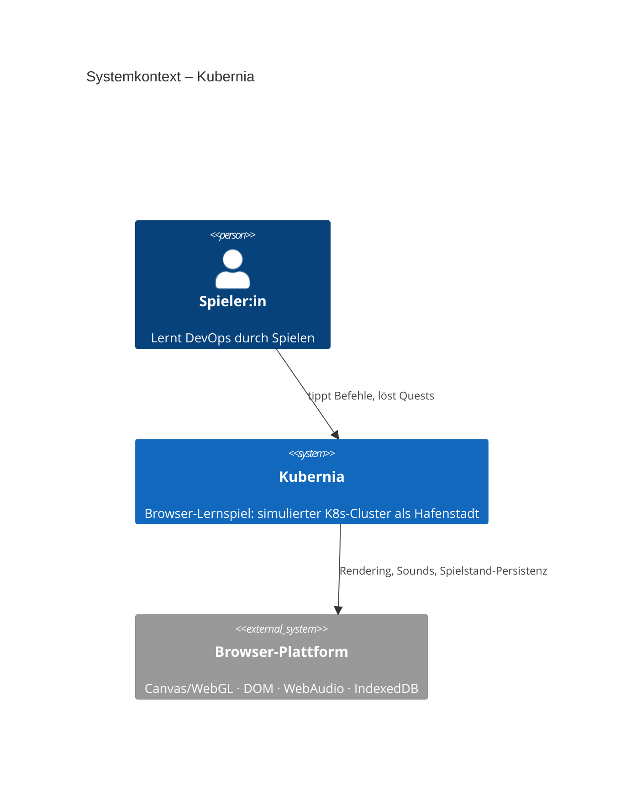
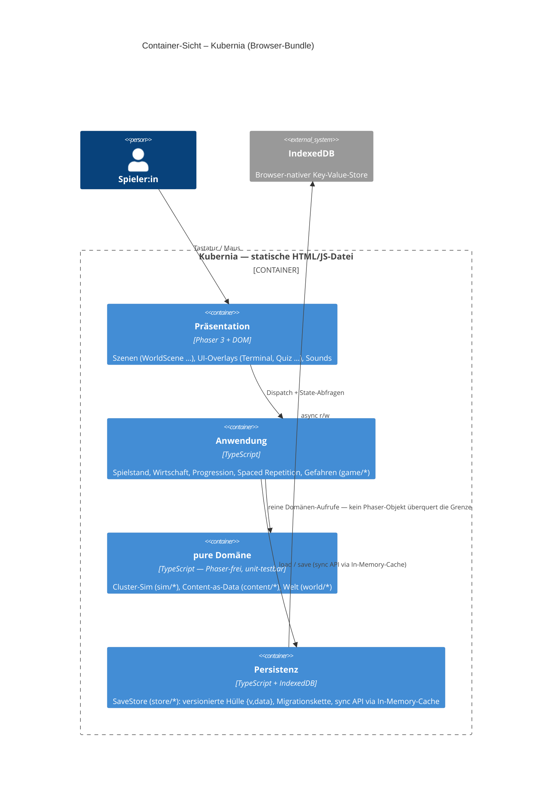
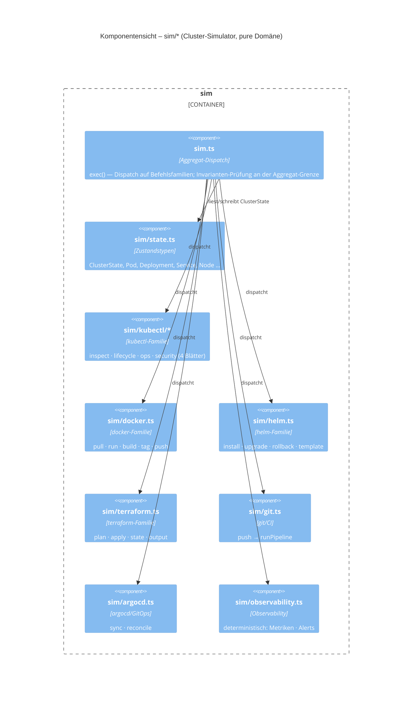

# Kubernia — Architektur-Analyse nach arc42

> **Stand: 2026-07-01** (nach #475; ergänzt um die iSAQB-Analyse #492–#524). Beschreibung + Bewertung der Architektur entlang der arc42-Gliederung (die Vorlage, die iSAQB lehrt).
> Diese Datei ist die aktuelle, versionierte Architektur-**Gesamtsicht**. Sie **ergänzt** (a) die ältere, Infrastruktur-fokussierte [architektur-analyse-2026-06.md](architektur-analyse-2026-06.md) (deren Baustellen #350/#389/#390/#391/#392/#393/#411/#413 inzwischen erledigt sind), (b) die doku-unabhängige **[architektur-analyse-2026-07-iSAQB.md](architektur-analyse-2026-07-iSAQB.md)** (fünf Durchläufe je Schicht → 33 Tickets #492–#524) und (c) die jüngste, doku-unabhängige **[architektur-analyse-2026-07-14-iSAQB.md](architektur-analyse-2026-07-14-iSAQB.md)** (erneut fünf Schicht-Durchläufe + Verifikation der harten Doku-Claims gegen den Code → 19 Tickets #861–880; die verifizierten **Drifts** und neuen Risiken daraus sind unten in §8-Nachtrag/§11 eingearbeitet).
> Ticket-Auswahl (oberstes freies Item der Board-Reihenfolge): [ticket-reihenfolge.md](ticket-reihenfolge.md).

## 1. Einführung und Ziele

Kubernia bringt DevOps-Grundlagen (Docker, Kubernetes, Helm, Terraform, Security) bei, indem Lernende **echte Befehle an einen simulierten Cluster** schicken — sichtbar als Hafenstadt Port Kubernia (Pods = Kisten auf Stegen/Nodes, Services = Laternen, `terraform apply` baut sichtbar neues Land).

**Oberste Qualitätsanforderung (über allen ADRs):** „Trägt jede Entscheidung, wenn Kubernia so groß wie Stardew Valley wird?" (100+ Quests, 50+ NPCs, viele Welten, jahrelange Entwicklung).

**Top-Qualitätsziele:**
1. **Erweiterbarkeit auf Content-Tiefe** — neuer Inhalt darf den Build nicht verlangsamen und keinen Code-Eingriff erzwingen.
2. **Korrektheit & Testbarkeit der Spiellogik** — die Simulation muss ohne die Engine prüfbar sein; ein falsch simuliertes `kubectl` ist ein didaktischer Fehler.
3. **Portabilität & Datensicherheit** — offline lauffähig, als eine Datei weitergebbar; kein Update darf je einen bestehenden Spielstand brechen.
4. **KI-Entwickel-Effizienz** — Weiterbau ist stark KI-Agenten-getrieben, darum ist „eine KI ändert das billig und sicher" selbst ein Architekturziel (siehe §8, Kontext-Grenzen als Token-Grenzen).

## 2. Randbedingungen

| Kategorie | Randbedingung |
|---|---|
| Technisch | Reiner Client, keine Server-Laufzeit. Genau **eine** Laufzeit-Dep (Phaser 3.90). TypeScript durchgängig `strict`. Node ≥ 22. Browser **und** self-contained Doppelklick-HTML. |
| Organisatorisch | Solo-Maintainerin, KI-Agenten-getriebener Weiterbau. Selbstdokumentierendes Repo (AGENTS.md/CLAUDE.md als SSOT). Board-getriebener Ein-Ticket-Workflow mit Worktrees. |
| Fachlich | Der simulierte Cluster muss sich plausibel wie echtes `kubectl`/`helm`/`docker` verhalten (Lerntransfer). Deutsch in Texten/Kommentaren. |
| Rechtlich | Öffentliches, aber **proprietäres** Repo. Fremdbausteine sauber lizenziert (Phaser MIT, Kenney CC0). |

## 3. Kontextabgrenzung

Der fachliche Kontext ist bewusst schmal:
- **Spieler:in** — einzige menschliche Rolle: tippt Befehle, löst Quests, lernt.
- **Browser-Plattform** — Rendering (Canvas/WebGL via Phaser), Eingabe, WebAudio (Sounds synthetisiert), und **IndexedDB** als einziges externes System.
- **Kein Netzwerk, kein Backend, keine echte Cloud** — der „Cluster" ist vollständig in-process simuliert.

> Das einzige echte Fremdsystem ist der Browser-Speicher. Alles, was in einem echten DevOps-Werkzeug ein Netzwerk-Call wäre, ist hier eine Zustandsänderung in der reinen Domäne — deshalb ist die Domäne vollständig deterministisch testbar.

## 4. Lösungsstrategie

| Qualitätsziel | Ansatz |
|---|---|
| Testbarkeit | Strikte **Schichtung**: pure Domäne Phaser-/DOM-frei; Grenze per `dependency-cruiser` **erzwungen**. |
| Erweiterbarkeit | **Content-as-Data**: Quests/NPCs/Dialoge/Drills als validiertes JSON; Quest-Checks als deklarative DSL; Entities als datengesteuerte Registry. |
| Datensicherheit | **Repository-Kapsel** `SaveStore` über IndexedDB, versionierte Hülle `{v,data}`, Migrationskette, Backup-Slot vor jeder Migration. |
| Portabilität | **Zwei Builds aus einer Quelle**: Multi-File-Host-Build + self-contained Offline-Single-File. |
| KI-Wartbarkeit | **Fitness Functions** als CI-Gates: Lint, Schicht-/Zyklen-/Größen-Wächter, **Doku↔Code-Drift-Wächter** (#482, hält die Landkarte als Kontext-Selektor ehrlich), headless Boot-Smoke. |

## 5. Bausteinsicht (Ebene-1-Zerlegung)

Abhängigkeiten zeigen strikt **nach innen** — auf die reine Domäne, die nichts von der Engine weiß.

```
Einstieg/Assets:  main.ts · assets-data.ts   (index.html lädt nur main.ts, Vite bündelt)
────────────────────────────────────────────────────────────────────────────
Präsentation      scenes.ts + scenes/worldscene/* · ui.ts + ui/* · sfx.ts     (Phaser · DOM)
      │  (Abhängigkeit nach unten)
Anwendung         game.ts + game/* (Wirtschaft/XP/Progression/Spaced Repetition) · runtime.ts · devpanel.ts
      │
╌╌╌╌╌╌╌╌╌ dependency-cruiser: Phaser & DOM kommen hier nicht durch ╌╌╌╌╌╌╌╌╌
pure Domäne       sim.ts + sim/* (docker/kubectl/helm/…) · content.ts + content/* (Quests, Checks-DSL, Registry)
                  world · clock · decor · pixelfont …
────────────────────────────────────────────────────────────────────────────
Persistenz (seitlich, von Anwendung genutzt):  store.ts — SaveStore, IndexedDB, sync API via In-Memory-Cache
```

### Systemkontext (C4 Level 1)



### Container-Sicht (C4 Level 2)



### Komponentensicht – sim/* (C4 Level 3)

> Abgestimmt auf [`docs/module/sim.md`](module/sim.md) (Tiefendoc). Hier die Hauptmodule; weitere Familien (glab · net · eviction · s3 · kubeadm · rbac · invariants · workload · nodes) s. Tiefendoc.



Die gestrichelte Linie ist eine **erzwungene Fitness Function**, keine Konvention. Große Familien sind hinter einer **Fassade/Barrel** gesplittet (`sim.ts`, `ui.ts`, `scenes.ts`, `game.ts` spreaden je ihre `*/`-Bündel): öffentliche API stabil, Innenstruktur skaliert. Ein Datei-Budget (800 LOC) meldet neue God-Files früh.

## 6. Laufzeitsicht — „Self-Healing zum Zugucken"

1. **Eingabe:** Spieler:in tippt `kubectl delete pod kasse-0` (Präsentation).
2. **Dispatch:** UI reicht die rohe Zeile an `Sim.exec()` — kein Phaser-Objekt überquert die Grenze, nur ein String.
3. **Zustandsänderung:** Der Simulator entfernt den Pod aus `ClusterState`, markiert das Deployment unter-repliziert; Rückgabe = reines Ergebnis-Objekt.
4. **Reconcile:** Beim nächsten Tick stellt die Domäne den Soll-Zustand wieder her (deterministisch, testbar).
5. **Darstellung:** `clustersync` liest den Snapshot; die Kiste platscht ins Wasser, der Kran setzt Ersatz. Die Präsentation **folgt** der Domäne.

Diese Einbahn-Kopplung macht Schritt 3–4 in Millisekunden testbar, ganz ohne Schritt 1 und 5.

## 7. Verteilungssicht

Ein Quelltext, über Vite-`mode` konfiguriert → zwei Auslieferungen: **Host-Build** (`dist/`, Multi-File, für Webserver) und **Offline-Build** (`dist-offline/index.html`, self-contained, Doppelklick, offline). Der Boot-Smoke-Test (Playwright, headless) prüft genau den Offline-Pfad per `file://`. Betriebs-Docker gibt es bewusst nicht; ein Dev-Container ist reine Entwickler-Tooling.

## 8. Querschnittliche Konzepte & DDD-Bewertung

Vier Konzepte durchziehen den Code: **Schichtung** (§5), **Content-as-Data**, **versionierte Persistenz** und das **Test-Harness** (geteilte Umgebung in `test/support/`, valide Domänen-Eingaben als Factories in `test/factories/`; Tests prüfen Verhalten über die öffentliche API, nicht Interna — #475).

### DDD — ehrliche Einordnung

**Taktisches DDD lebt das Projekt bereits an der teuersten Stelle:** eine framework-freie, *erzwungene* Domänenschicht + eine Repository-Kapsel (`SaveStore`).

**Kein strategisches DDD mit getrennten Deployables/Packages** — das wäre Over-Engineering. **Aber:** Kubernia ist ein **modularer Monolith mit ~2–3 Subdomänen**, deren eigene Sprache real ist. Bounded Contexts sind hier vor allem **Grenzen für kognitive Last = Token-Last** bei KI-Entwicklung (explizites Qualitätsziel):

| Subdomäne | Eigene Sprache | Code |
|---|---|---|
| DevOps-Simulation | echtes K8s (Pod/Node/Deployment/Service) | `sim/*` |
| Lern-/Progression | Pädagogik (Quest/XP/Dublonen/Leitner-Box) | `game/*`, Lern-Teile `content/*` |
| Welt/Präsentation | räumlich/Hafen (Kiste/Steg/Laterne) | `world`, `scenes/*` |

Die Modul-Splits + die on-demand-Tiefendocs der CLAUDE.md **sind** bereits solche Token-Grenzen. *Nuance:* mehr Kontexte ≠ automatisch weniger Tokens — zu viele Nähte erzeugen Übersetzungs-Code; Sweet Spot sind die 2–3, nicht zehn. **Contexts benennen, nicht auseinanderreißen.**

> ✅ **#477 erledigt:** die Subdomänen sind explizit benannt und die Übersetzung Hafen↔K8s (die Anti-Corruption-Layer) als Glossar festgehalten — beides als SSOT in **[docs/glossar.md](glossar.md)** (Glossar mit Code-Ort + Kontext-Landkarte mit Tiefendoc-Zuordnung; die Prüfung dort bestätigt, dass die Tiefendocs schon entlang der Grenzen schneiden, mit `content.md` als bewusstem Shared Kernel).

### Der DDD-Hebel — drei gezielte Schritte

| Muster | Heute | Schritt | Ticket |
|---|---|---|---|
| Ubiquitous Language | Übersetzung Hafen↔K8s nur „im Kopf" | Glossar + Kontext-Landkarte | #477 |
| Aggregat & Invarianten | Prüfungen um `ClusterState` verteilt | `ClusterState` als Aggregat, ungültige Zustände un-konstruierbar | #478 |
| Value Objects | Primitive (`string` Pod-Name, `number` Dublonen) | Value Objects, illegale Zustände un-repräsentierbar | #479 |

### Monolith ≠ schlecht — und hier läuft gar kein Server

„Monolith" meint zwei verschiedene Dinge: einen **Deployment-Monolithen** (ein Server-Prozess macht alles; Gegenteil = Microservices — *das* ist die Kubernetes-/Skalierungsfrage) und einen **modularen Monolithen** (ein Deployable mit sauberen inneren Grenzen; Gegenteil = „Big Ball of Mud"). Kubernia ist Letzteres — und das ist ein Gütesiegel, kein Makel.

Vor allem aber: **Kubernia hat keinen Server.** Es ist ein client-seitiges Browser-Spiel ohne Backend/Container/DB ([ADR 0002](adr/0002-kein-backend-keine-db.md)/[0003](adr/0003-multiplayer-coop-out-of-scope.md)), ausgeliefert als statische Dateien bzw. eine Offline-Datei. Die Frage „Monolith vs. Microservices in Kubernetes" greift hier gar nicht — es gibt nichts zu hosten außer statischen Assets (die *könnten* aus einem Container/CDN kommen, aber das ist ein nginx, kein verteiltes System). **Ironie:** das Spiel *lehrt* die K8s-Welt, ist aber bewusst nicht so gebaut — ein Lernspiel hat andere Qualitätsziele als ein verteiltes Produktionssystem.

iSAQB ist **stil-neutral**: Architektur folgt Qualitätszielen, nicht Mode. Microservices sind ein Trade-off (unabhängiges Deployen/Skalieren gegen hohe Betriebskomplexität), keine Tugend; „Monolith first" ist heute Mainstream-Rat. Die ~2–3 Subdomänen oben sind **Navigations-/Token-Grenzen in einem Bundle, keine künftigen Services**. Ein echter Server — und damit die K8s-Frage — würde erst bei Cloud-Saves/Bestenlisten/Multiplayer relevant; heute per ADR 0003 mit Re-Eval-Trigger ausgeschlossen.

### Weitere Querschnitts-Konzepte (Status)

- **Sicherheit/Supply-Chain:** Dependabot + zweistufiges `npm audit`-CI-Gate (blockt nur ausgelieferte Deps). Dev-Panel aus Prod-Builds gestrippt + passwortgated. **Abgedeckt.**
- **Determinismus/Zufall:** Tests brauchen Determinismus; `observability.ts` macht es per FNV-Hash vor. Die iSAQB-Analyse fand aber **ungeseedeten `Math.random` in 8 puren Domänen-/Content-Dateien** (`sim/util`, `docker`, `helm`, `argocd`, `kubectl/ops|lifecycle|inspect`, `content/util`) — Widerspruch zum eigenen Anspruch, blockiert Golden-/Snapshot-Tests. → **zentrale seedbare RNG + Fitness-Function (#492).** Bewusst ausgeklammert ist die Präsentation (`src/ui/**`, `src/scenes/**`): dort ist Zufall rein optisch (Quiz-Optionen-Reihenfolge, Dialog-Antwort-Reihenfolge, Möwen-Spawns, Tween-Jitter) und berührt keinen persistierten Zustand — dokumentiert in `core/rng.ts` (#876).
- **Fehlerbehandlung/Diagnostik:** EIN globaler `window.onerror`/`unhandledrejection`-Handler in `main.ts` fängt jeden unbehandelten Laufzeitfehler zentral ab, loggt ihn an einer Stelle und zeigt statt eines stillen schwarzen Canvas ein lesbares Fallback-Overlay mit „Neu laden"-Knopf; die reine Aufbereitung des geworfenen Werts liegt DOM-frei/testbar in `src/crashreport.ts` (`buildCrashReport`). In JEDEM Build aktiv (auch der ausgelieferten Offline-Datei). Fitness-Function: `e2e/crash-overlay.spec.ts` feuert einen synthetischen Fehler gegen den Offline-Build und prüft das Overlay; der Boot-Smoke (#391) bleibt das Gegenstück (sauberer Boot ⇒ kein Fehler, kein Overlay). **Abgedeckt (#504).**

### Der rote Faden der iSAQB-Analyse 2026-07: struktur- vs. verhaltensbezogene Governance

Die **strukturellen** Querschnittskonzepte sind exzellent mechanisiert (Schichtung, Zyklen-/Orphan-/Größen-/Doku-Drift-Wächter). Was fehlt, sind **verhaltensbezogene** Gates — obwohl die Infrastruktur je zur Hälfte existiert:

| Verhaltens-Governance | Heute | Gate-Ticket |
|---|---|---|
| Determinismus | ~~`Math.random` in der Domäne~~ ✅ Domäne + Anwendung durch seedbare RNG abgedeckt; Präsentation bewusst ausgenommen (`core/rng.ts`) | #492 ✓ / #876 ✓ |
| Coverage | 91 Tests, **0 Messung** | #495 |
| Komplexität | nur LOC-Deckel (800), keine `complexity`-Regel | #502 |
| Bundle-Größe | nur Warnung, kein Fail | #503 |
| Fehler-Diagnostik | ✅ globaler Handler + Fallback-Overlay + e2e-Smoke | #504 (erledigt) |

Dazu kommt: an einzelnen **Grenzen hört die sonst konsequente Disziplin auf** — `scenario`/`applyEffects` ungeprüft (#494), `importData` umgeht die Migrationskette (#493), `WorldSceneLike = any` (#496). Kein Umbau, sondern Absicherung des bereits richtig Angelegten.

### Nachtrag iSAQB 2026-07-14 — verifizierte Drifts (Doku ≠ Code)

Eine erneute doku-freie Runde hat gezielt die harten „erledigt/erzwungen"-Claims gegen den Code geprüft. Die meisten halten (Schichtung, Determinismus-SSOT in der Domäne, `any`-Disziplin, Coverage-Messung). Vier **Drifts** — die Doku behauptet mehr, als der Code einlöst — sind zu korrigieren:

| Drift | Beleg | Ticket |
|---|---|---|
| ~~**Invarianten laufen nur in Dev/Test, nicht im Prod-Build**~~ → **erledigt (#862)**: Prod loggt via `console.error` statt zu werfen; `invariantChecks = true` immer aktiv. | ~~`sim.ts:235` `!import.meta.env.PROD`~~ | #862 ✓ |
| **ACL „nur an zwei Stellen" verletzt** — die UI mappt Sim-interne Fehlertypen direkt (dritter Leak neben clustersync/markup). | `ui/hud.ts:320-327` | #872 |
| **Stale Ticket-Referenz** — der sim.ts-Split wird als „#545 (Split offen)" geführt, #545 ist geschlossen; der Split ist untracked (`check:doctickets` non-blocking). | `scripts/check-size.mjs:39` | #864/#877 |
| **`tsconfig.strict.json` ist ein No-op-Alias** — `typecheck` und `typecheck:strict` prüfen identisch. | `tsconfig.strict.json` | #877 |

**Supply-Chain-Präzisierung:** §8 oben nennt Supply-Chain „abgedeckt" — das gilt für npm-Deps, **nicht** für das ausgelieferte Container-Image (`release.yml` pusht ohne Test-Gate/Scan/SBOM, #861) und **nicht** für den eigenen Code (kein SAST/CodeQL/Secret-Scanning, #875). Volle Herleitung: [architektur-analyse-2026-07-14-iSAQB.md](architektur-analyse-2026-07-14-iSAQB.md).

## 9. Architekturentscheidungen (ADRs)

| ADR | Entscheidung | Status |
|---|---|---|
| 0001 | Engine Phaser 3 (kein Godot/Unity) | bestätigt |
| 0002 | Kein Backend, keine DB — client-only | bestätigt |
| 0003 | Kein Multiplayer / Co-op | bestätigt |
| 0004 | Skalierungs-Fundament (Content-as-Data, Entity-Registry, IndexedDB) | umgesetzt |
| 0005 | Auslieferungsform Web vs. Desktop | **offen gehalten** ([ADR 0005](adr/0005-auslieferungsform.md), #355/#606) — ergebnisoffener Grundsatz-ADR + Re-Eval-Trigger; bündelt die Single-File-Präzisierung aus 0006. |
| 0006 | Persistenz-Präzisierung: Engpass ist Eviction, nicht Kapazität → `storage.persist()` | präzisiert |
| 0007 | Spielsystem-Fundamente (Quest-Modell, Checks-als-Daten, Zeit-Achse) | umgesetzt |
| 0008 | **KI-Agenten-Harness** als Entwicklungsmodell (autonomer Ein-Ticket-Worktree-Workflow + Fitness-Functions als Leitplanken + selbstdokumentierendes Repo) | **akzeptiert** ([ADR 0008](adr/0008-ki-agenten-harness.md), #530) — die prägendste Entscheidung, jetzt als ADR festgehalten (Kontext/Alternativen/Re-Eval-Trigger). Kanonische Erklärung des Harness: [agent-harness.md](agent-harness.md) (#526). Integrationsweg seit #592 durch 0009 präzisiert. |
| 0009 | **PR-Gating mit Required-Checks** auf `main` (`enforce_admins` an) statt Direkt-Push | **akzeptiert** ([ADR 0009](adr/0009-pr-gating-required-checks.md), #592) — der dritte Re-Eval-Trigger von 0008 ist eingetreten; Gate-Durchsetzung jetzt server-seitig und nicht mehr per `--no-verify` umgehbar. |
| 0010 | **Karten-Modell:** zwei Pipelines bewusst nebeneinander (Tiled-Daten für bespoke Karten, Code-Builder für prozedurale Regionen) statt Konvergenz | **akzeptiert** ([ADR 0010](adr/0010-karten-modell-tiled-vs-code-builder.md), #957) — folgt derselben Content-as-Data-Logik wie 0004 auf die Karten-Ebene. |

iSAQB-konform: jeder ADR trägt einen expliziten **Re-Evaluierungs-Trigger** — Entscheidungen sind an nachprüfbare Bedingungen geknüpft, nicht „für immer".

## 10. Qualitätsanforderungen (Qualitätsbaum)

Konkrete Szenarien (Reiz → Reaktion) statt vager Adjektive:

| Qualität | Szenario | Status |
|---|---|---|
| Erweiterbarkeit | Neue Quest → eine JSON-Datei + Reihenfolge-Eintrag, kein Code; Loader validiert beim Start | erfüllt |
| Testbarkeit | Sim-Regel ändern → Unit-Test gegen pure Domäne ohne Engine; Suite < 3 s | erfüllt |
| Datensicherheit | Save-Format ändert sich → Migrationskette + Backup-Slot; Alt-Stand bricht nie | erfüllt |
| Portabilität | Spiel weitergeben → ein Doppelklick-HTML, offline | erfüllt |
| Wartbarkeit (KI) | Agent ändert Modul → Lint/Arch/Größe/**Doku-Drift** (#482)/Smoke fangen Fehler vor dem Merge | erfüllt |
| Testbarkeit (Messung) | „Welche Teile sind untertestet?" → Coverage messbar mit Per-Verzeichnis-Schwellen | **offen (#495)** |
| Determinismus | Domäne + Anwendung reproduzierbar → seedbare RNG, kein `Math.random` in `sim/`/`content/`/`game/`; Präsentation bewusst ausgenommen (Display-only, `core/rng.ts`) | **erfüllt (#492/#876)** |
| Zuverlässigkeit | Laufzeitfehler/Save-Fehler → sichtbarer Fallback statt schwarzem Canvas / stillem Verlust | Laufzeitfehler abgedeckt (#504); Save-Fehler-Hinweis offen (#497) |
| Performance | Viele Inseln/Sprites → Culling greift, aber Assets werden noch eager geladen; kein Bundle-Budget | teilweise (#503) |

## 11. Risiken und technische Schulden

| Befund | Wirkung bei Stardew-Scope | Schwere | Ticket |
|---|---|---|---|
| Assets eager geladen, kein Lazy-Loading / Texture-Atlas | Lade-/Draw-Call-Problem bei vielen Welten/Sprites | mittel | #198/#339 |
| ~~Ubiquitous Language nur implizit (kein Glossar/ACL-Doku)~~ → **erledigt**: [glossar.md](glossar.md) | Übersetzung Hafen↔K8s driftet mit mehr Beitragenden/Agenten | ~~mittel~~ | #477 ✓ |
| Präsentation ohne Regressionsnetz (nur 1 Boot-Smoke + manuell) | Interaktions-Regressionen kommen durch | mittel | #480 |
| Auslieferungsform (ADR 0005) offen | Färbt save-/asset-/build-nahe Entscheidungen | mittel | #355 |
| Barrierefreiheit ungeprüft (Farb-Status, Tastatur, Kontraste) | Lernspiel schließt Nutzer:innen aus | niedrig | #481 |
| Invarianten um `ClusterState` verstreut | Neue Sim-Befehle können Zustandsregeln umgehen | niedrig | #478 |
| Primitive statt Value Objects | Verwechslungs-/Validierungsfehler skalieren mit Befehlszahl | niedrig | #479 |
| Deutsch fest verdrahtet (i18n) | Kein „gratis später" — bewusste Randbedingung (Content-Strings sind Daten, Code-Strings der teure Rest) | niedrig | — |
| NPC-Routinen (#420) & Inventar (#421) zurückgestellt | Bekannte Scope-Fragen, bewusst geparkt | bekannt | #420/#421 |
| **`Math.random` in der puren Domäne** | Widerspricht Determinismus-Anspruch; keine Golden-/Snapshot-Tests, kein „Seed teilen" | hoch | #492 |
| **`importData` umgeht Migration + schreibt hüllenlos** | Wiederherstellungspfad bricht bei künftigen echten Migrationen („Save nie brechen") | hoch | #493 |
| **`scenario`/`applyEffects` ungeprüft (as-Cast)** | Mechanik-nahe Struktur ohne Validierung → stille Fehler bei mehr Content | hoch | #494 |
| **Coverage nirgends gemessen** | „untertestet?" ist Vermutung; Präsentation wächst ungemessen | hoch | #495 |
| **`WorldSceneLike = any`** | 6 Systemmodule ungetypt → Renames/Tippfehler brechen zur Laufzeit | hoch | #496 |
| Verhaltens-Governance fehlt (Komplexität/Bundle) | ungemessene Erosion bei Scale | mittel | #502/#503 (Fehler-Diagnostik #504 erledigt) |
| Spiel-/Bewertungslogik in DOM-Methoden; `events.ts` ungetestet | Kernlogik nur e2e-testbar; `economyTick` läuft nicht in RegionScene | mittel | #500/#512/#501 |
| Value Objects/Invarianten/Workload nur teilverdrahtet | Namensgrenzen/Aggregat-Mutationen umgangen | mittel | #507/#508/#509 |
| **Release-Image ohne Test-Gate + ohne Image-Scan/SBOM** (iSAQB 2026-07-14) | Ungeprüftes/verwundbares Artefakt kommt nach außen | hoch | #861 |
| ~~**Invarianten im Prod-Build aus**~~ → **erledigt (#862)**: Prod loggt `console.error` statt zu werfen; `warnClusterInvariants` immer aktiv. | ~~Zustands-Korruption erreicht Spieler:innen still~~ | ~~hoch~~ | #862 ✓ |
| **WorldScene hafen-monolithisch trotz `mapId`-Fassade** | Zweite Überwelt-Karte nicht real möglich | hoch | #863 |
| **Ressourcentyp-Erweiterung nicht Open-Closed** (3× reset/merge/snapshot, sim.ts God-File, #545-Split untracked) | sim.ts wächst mit jedem Typ; Haupt-Fehlerquelle | hoch | #864/#865 |
| Monolithischer 5s-Vollserialisierungs-Autosave | CPU/GC-Bremse bei Stardew-Stand-Größe (Serialisierungs-, nicht Kapazitätskosten) | mittel | #869 |
| ~~Zwei divergente Karten-Modelle~~ → **entschieden ([ADR 0010](adr/0010-karten-modell-tiled-vs-code-builder.md), #957)**: bewusst zwei Pipelines mit Grenzregel; die Renderer-Duplizierung (zwei `renderGround`) und die fragile Bodencode-Import-Kopplung bleiben als eigene Tickets offen | Doppelte Pipeline war die offene Weiche, jetzt per ADR geschlossen; Renderer-Duplizierung/Kopplung als Rest-Risiko | mittel | #958/#959 |
| NPCs ohne Entitäts-/System-Modell (Sprite+`splice(6)`) | Stardew-NPCs (Verhalten/Beziehungen) haben kein Zuhause | mittel | #871 |
| ESLint `recommended` statt `recommendedTypeChecked` | typed-lint-Kosten ohne Ertrag; `no-unsafe-*` aus | mittel | #868 |
| Präsentation faktisch ungetestet (Floor 3 %, nur Chromium) + Copy-Paste-Minispiele | größte Codemenge im schwächsten Netz; UI skaliert nicht | mittel | #873/#874 |

> **Ergänzung 2026-07-14 (Details: [architektur-analyse-2026-07-14-iSAQB.md](architektur-analyse-2026-07-14-iSAQB.md)):** Die strategischen ADRs (0001–0007) tragen auch unter unabhängiger Neubewertung — **keine Umkehr**. Neu ist die Erkenntnis, dass die exzellente Disziplin **an der Präsentations-/Auslieferungs-Grenze aussetzt** (Release-Härtung, Präsentations-Tests, WorldScene-/Karten-/NPC-Schicht) und dass einige „erledigt/erzwungen"-Claims gedriftet sind (§8-Nachtrag). Neu-Entscheidungen (kein Widerspruch, sondern fehlende explizite ADRs): Präsentations-Test-Strategie (#874) und Karten-Modell-Festlegung — inzwischen entschieden, siehe [ADR 0010](adr/0010-karten-modell-tiled-vs-code-builder.md) (#957).

**Gesamtverdikt (aktualisiert nach der iSAQB-Analyse 2026-07):** Das Infrastruktur-Fundament trägt — Schichtung, Content-as-Data und versionierte Persistenz sind die richtigen, automatisch bewachten Weichen. Die frische Analyse bestätigt das, findet aber zwei konkrete Arbeitsstränge: (1) **verhaltensbezogene Governance** als Gate nachrüsten (Determinismus/Coverage/Komplexität/Bundle/Fehler — #492/#495/#502/#503/#504), und (2) die **wenigen Grenzen schließen, an denen die Disziplin aussetzt** (`scenario`-Validierung #494, `importData` #493, `WorldSceneLike` #496, VO/Invarianten/Workload #507–#509). Dazu zwei verifizierte latente Bugs (#501 economyTick, #493 hüllenloser Import). Alles **Präzisierung + Absicherung**, kein Umbau. Volle Details: [architektur-analyse-2026-07-iSAQB.md](architektur-analyse-2026-07-iSAQB.md).

## 12. Glossar & Kontext-Landkarte

Die ubiquitäre Sprache (Glossar Hafen ↔ K8s ↔ Code — die explizit gemachte Anti-Corruption-Layer aus §8) **und** die Kontext-Landkarte der Subdomänen leben seit #477 als eigene, aus [CLAUDE.md](../CLAUDE.md) verlinkte SSOT — hier nicht doppeln:

> 📖 **[docs/glossar.md](glossar.md)** — Glossar (Cluster-als-Hafen + Lern-als-Seefahrer-Karriere, je mit Code-Ort) + Kontext-Landkarte (DevOps-Simulation / Lern-Progression / Welt-Präsentation, je mit Sprache + Verzeichnissen + Tiefendoc) + die Prüfung „schneiden die Tiefendocs schon entlang dieser Grenzen?".
