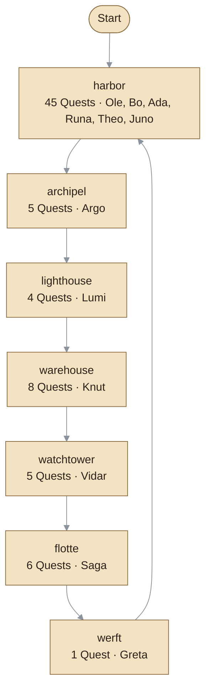
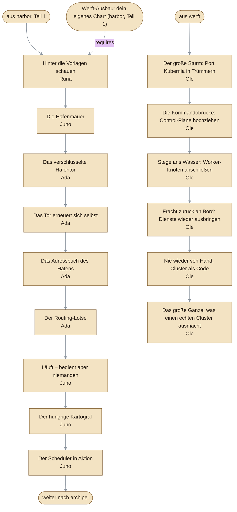
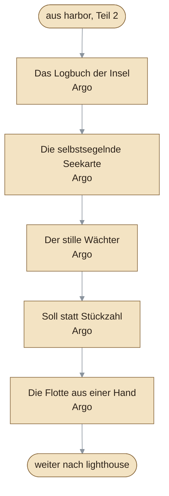
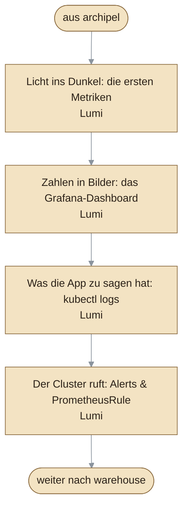
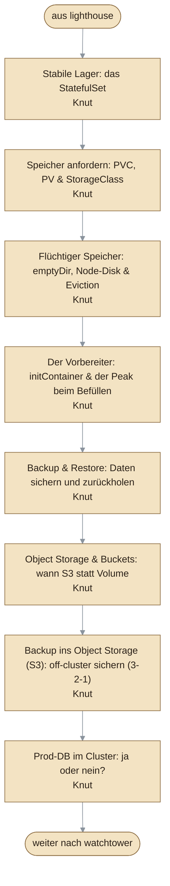
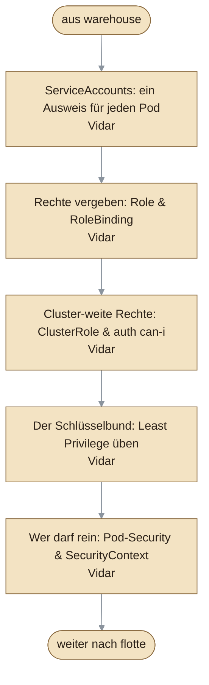
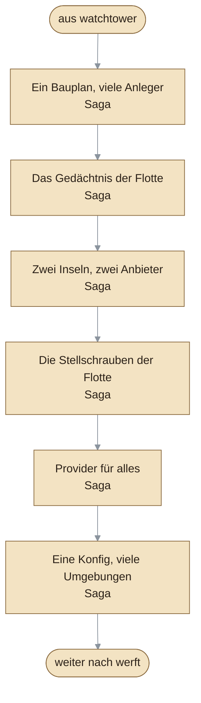
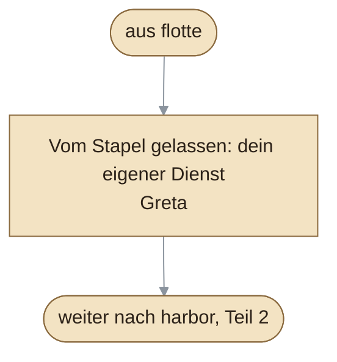

# Quest-Landkarte (generiert)

> Regionen-/Quest-Graph aus den Content-Daten: je Region ein Diagramm. Quelle sind `src/content/data/quests/*.json`, `quest-order.json` (Lernpfad), `entities.json` (Standplatz des Gebers, daraus die Region) und `npcs.json` (Namen). Der Abschnitt entsteht mit `npm run docs:gen`; `npm run check:docgen` ist rot, sobald er veraltet. Fehlt eine Quest in `quest-order.json` oder hat ein Geber keinen Standplatz, meldet der Generator das statt ein Loch zu zeichnen. Gestrichelte Pfeile sind `requires` (Voraussetzung), durchgezogene der Lernpfad. Zur Content-Schicht: [content.md](content.md).

<!-- GEN:quest-graph START -->
<!-- Generiert von npm run docs:gen – nicht von Hand ändern. -->

## Überblick

## Regionen

### Region `harbor`

45 Quests · Geber: Ole, Bo, Ada, Runa, Theo, Juno

#### Teil 1 von 2 (30 Quests)

```mermaid
---
config:
  theme: base
  look: classic
  layout: dagre
  themeVariables:
    lineColor: "#8b949e"
    primaryColor: "#f3e3c3"
    primaryTextColor: "#2b2118"
    primaryBorderColor: "#8a6a3f"
---
flowchart TB
  q_onboarding_sign_on["Anheuern in Port Kubernia<br/>Ole"]
  q_docker_first_container["Die erste Kiste<br/>Bo"]
  q_docker_common_images["Warenkunde: nginx, BusyBox, Redis, Postgres<br/>Bo"]
  q_docker_list_containers["Den Überblick behalten<br/>Bo"]
  q_docker_stack_minigame["Bos Stapel-Spiel<br/>Bo"]
  q_docker_run_options["Namen und Hintergrund<br/>Bo"]
  q_docker_build_image["Dein eigener Bauplan<br/>Bo"]
  q_docker_registry["Woher die Baupläne kommen<br/>Bo"]
  q_docker_rabbitmq["Die Posthalle am Kai<br/>Bo"]
  q_k8s_first_deployment["Der Hafen wird ein Cluster<br/>Ole"]
  q_k8s_inspect_pods["Genauer hinsehen<br/>Ole"]
  q_k8s_service["Der Dauerauftrag<br/>Ole"]
  q_k8s_self_healing["Der Sturm-Test<br/>Ole"]
  q_k8s_apply_manifests["Adas Seekarten<br/>Ada"]
  q_k8s_configmap_secret["Truhe trifft Kombüse<br/>Ole"]
  q_k8s_yaml_struct_minigame["Adas Bausteine<br/>Ada"]
  q_helm_intro["Das Steuerrad<br/>Runa"]
  q_helm_release_install["Flagge hissen<br/>Runa"]
  q_helm_upgrade_rollback["Auf und ab<br/>Runa"]
  q_terraform_intro["Neues Land<br/>Theo"]
  q_terraform_state_destroy["Gedächtnis und Abriss<br/>Theo"]
  q_kraken_boss["Die Hacker-Krake<br/>Ole"]
  q_k8s_debug_imagepull["Sturmwarnung am Leuchtturm<br/>Juno"]
  q_k8s_debug_crashloop["Das Flackern<br/>Juno"]
  q_k8s_node_capacity["Kein Platz im Hafen<br/>Juno"]
  q_git_version_control["Seekarten versionieren<br/>Ada"]
  q_git_feature_branch["Ein eigener Zweig<br/>Ada"]
  q_git_pipeline["Die Pipeline-Passage<br/>Ada"]
  q_git_merge_branches["Zwei Karten, eine Linie<br/>Ada"]
  q_helm_umbrella_chart["Werft-Ausbau: dein eigenes Chart<br/>Runa"]
  nach_harbor__Teil_2(["weiter nach harbor, Teil 2"])
  q_onboarding_sign_on --> q_docker_first_container
  q_docker_first_container --> q_docker_common_images
  q_docker_common_images --> q_docker_list_containers
  q_docker_list_containers --> q_docker_stack_minigame
  q_docker_stack_minigame --> q_docker_run_options
  q_docker_run_options --> q_docker_build_image
  q_docker_build_image --> q_docker_registry
  q_docker_registry --> q_docker_rabbitmq
  q_docker_rabbitmq --> q_k8s_first_deployment
  q_k8s_first_deployment --> q_k8s_inspect_pods
  q_k8s_inspect_pods --> q_k8s_service
  q_k8s_service --> q_k8s_self_healing
  q_k8s_self_healing --> q_k8s_apply_manifests
  q_k8s_apply_manifests --> q_k8s_configmap_secret
  q_k8s_configmap_secret --> q_k8s_yaml_struct_minigame
  q_k8s_yaml_struct_minigame --> q_helm_intro
  q_helm_intro --> q_helm_release_install
  q_helm_release_install --> q_helm_upgrade_rollback
  q_helm_upgrade_rollback --> q_terraform_intro
  q_terraform_intro --> q_terraform_state_destroy
  q_terraform_state_destroy --> q_kraken_boss
  q_kraken_boss --> q_k8s_debug_imagepull
  q_k8s_debug_imagepull --> q_k8s_debug_crashloop
  q_k8s_debug_crashloop --> q_k8s_node_capacity
  q_k8s_node_capacity --> q_git_version_control
  q_git_version_control --> q_git_feature_branch
  q_git_feature_branch --> q_git_pipeline
  q_git_pipeline --> q_git_merge_branches
  q_git_merge_branches --> q_helm_umbrella_chart
  q_helm_umbrella_chart --> nach_harbor__Teil_2
  q_helm_intro -. requires .-> q_helm_umbrella_chart
```

#### Teil 2 von 2 (15 Quests)

### Region `archipel`

5 Quests · Geber: Argo

### Region `lighthouse`

4 Quests · Geber: Lumi

### Region `warehouse`

8 Quests · Geber: Knut

### Region `watchtower`

5 Quests · Geber: Vidar

### Region `flotte`

6 Quests · Geber: Saga

### Region `werft`

1 Quest · Geber: Greta

<!-- GEN:quest-graph END -->
